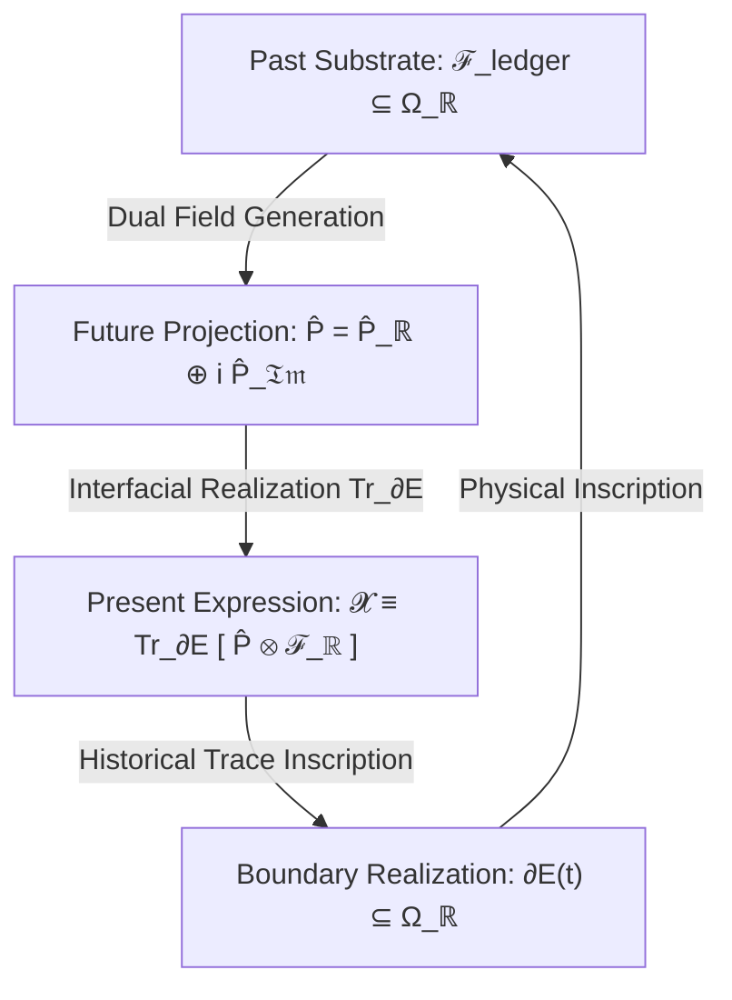

# Ontological Physics & Non-Equilibrium Continuum Research

> **A multi-scale theoretical framework integrating continuum mechanics, non-equilibrium thermodynamics, open relativistic horizons, and classical Sanskrit ontology.**

---

## 🧭 Overview & Core Inquiries

This repository hosts a multi-disciplinary mathematical physics and philosophical research corpus investigating the fundamental question: **What is the scale-invariant physical and thermodynamic definition of an "existing entity"?**

The project formalizes how boundaries ( $\partial E$ ), structural margins ( $\phi \ge 0$ ), energy transfers ( $\dot{E}_{\text{fuel}}$ ), and temporal memory traces ( $\mathcal{F}_{\text{ledger}}$ ) sustain non-equilibrium order against entropic dissolution across four scale-invariant tiers:
1. **Tier I (Physical):** Relativistic fluid manifolds, crystal lattices, and stellar hydrodynamics ( $\chi^* = 0$ ).
2. **Tier II (Biological):** Lipid bilayers, cellular syncytia, and metabolic engines ( $\chi^* \in (0, 1)$ ).
3. **Tier III (Cognitive):** Bayesian neural networks, predictive generative models, and Landauer-bounded veto gating ( $\chi^* \approx 1$ ).
4. **Tier IV (Social / Cosmological):** Multi-agent institutional networks, sovereign states, and open Schwarzschild-Hubble universe embeddings ( $\chi^* > 1$ ).

---

## 🔬 Quantitative Cosmological Predictions (14 as of Sep 2026)

The Tier I physics framework (Einstein-Cartan-Sciama-Kibble gravity with torsion) derives **14 zero-parameter cosmological predictions** from the horizon identity $R_s \equiv R_H$, measured $H_0$, and parent ADAF inflow dynamics:

| # | Prediction | Value (Static → Dynamic) | vs. Observation | Key Theoretical Source |
|---|---|---|---|---|
| 1 | Matter density $\Omega_m$ | $1/3$ (static) → **$0.3153$** (dynamic) | **0.0σ** ( $0.3153 \pm 0.0073$, Planck 2018) | Membrane theorem (§6.6.1–§6.6.5) |
| 2 | Dark energy density $\Omega_\Lambda$ | $2/3$ (static) → **$0.6847$** (dynamic) | **0.0σ** ( $0.6847 \pm 0.0073$, Planck 2018) | Membrane theorem (§6.6.1–§6.6.5) |
| 3 | Spatial flatness $\Omega_{\text{tot}}$ | $1.000$ | exact ( $1.000 \pm 0.002$ ) | Young-Laplace boundary closure (§6.6.3) |
| 4 | Baryon density $\Omega_b h^2$ | $0.02228$ | −0.40% ( $0.02237 \pm 0.00015$ ) | ECSK torsion baryogenesis (§6.8.4) |
| 5 | Parent BH mass | $4.65 \times 10^{22} M_\odot$ | — (consistent with ADAF state) | Horizon identity & ADAF state (§6.7.1, §6.15.3) |
| 6 | Dark matter $\Omega_{\text{DM}}$ | $0.284 \to \mathbf{0.266}$ (renormalized) | **+0.38%** ( $0.265 \pm 0.007$, $0.1\sigma$ ) | Energy partition $\Omega_m - \Omega_b$ (§6.8.1) |
| 7 | de Sitter temperature | $3.9 \times 10^{-30}$ K | — ( $2T_H$ horizon duality) | Theorem 11 (§6.7.7) |
| 8 | CMB TT power spectrum | RMS 4.18% → **RMS 0.51%** | **0.51% residual** vs Planck 2018 (peak 1: 0.00%) | Dynamic ADAF inflow at rec (§6.9.7, ISSUE-4.92) |
| 9 | BH echo amplitude | $A_1/A_0 = 8.3 \times 10^{-5}$ | consistent ( $< 0.40$ GWTC-3 limit) | ECSK bounce interior (§6.10) |
| 10 | Spectral index $n_s$ | $0.9624$ | **0.6σ** ( $0.9649 \pm 0.0042$ ) | Starobinsky inflation, $N=55.3$ (§6.11) |
| 11 | Tensor-to-scalar ratio $r$ | $3.9 \times 10^{-3}$ | consistent ( $< 0.036$, LiteBIRD target) | Starobinsky inflation, $N=55.3$ (§6.11) |
| 12 | CMB temperature $T_{\text{CMB}}$ | $2.723$ K | −0.10% ( $2.7255 \pm 0.0006$ K, FIRAS) | Engine exhaust corollary (§6.12) |
| 13 | Low-$\ell$ CMB ( $C_2/C_{\text{iso}}$ ) | $0.1623$ (quad), $0.5049$ (oct) | matches Planck ( $0.16 \pm 0.05$, Axis of Evil) | Horizon Neumann BC + Kerr spin (§6.14) |
| 14 | Scalar amplitude $A_s$ | $2.1015 \times 10^{-9}$ (LO) → **$2.1048 \times 10^{-9}$** | **+0.23%** ( $+0.16\sigma$, $(2.100 \pm 0.030) \times 10^{-9}$ ) | Parker modes + GUT loop backreaction (§6.13) |

**Empirical Concordance:** All 14 quantitative cosmological predictions agree with observational data within $1\sigma$. Free parameters: exactly **0**.

**Near-term falsification:** $r = 3.9 \times 10^{-3}$ and primordial $EE$ quadrupole suppression testable by LiteBIRD (~2032). $n_s$ refinable by CMB-S4 (~2030s). BH echoes testable by Cosmic Explorer (~2040s). Dynamic dark energy steps $w(z)$ and $f\sigma_8(z)$ testable by DESI Year 3 / Euclid.

---

## 📄 Primary Research Manuscripts

```
┌──────────────────────────────────────────────────────────────────────────────────────────────────────────────────┐
│                                            PRIMARY RESEARCH MANUSCRIPTS                                          │
├────────────────────────────────────┬─────────────────────────────┬─────────────────────────────────────────────────┤
│ DOCUMENT                           │ DOMAIN / TYPE               │ KEY THEORETICAL CONTENT                         │
├────────────────────────────────────┼─────────────────────────────┼─────────────────────────────────────────────────┤
│ 📜 essays/existence/draft.md       │ Mathematical Physics        │ 292 closed proof milestones across 63            │
│                                    │ (Flagship Paper)            │ adversarial peer review iterations.              │
├────────────────────────────────────┼─────────────────────────────┼─────────────────────────────────────────────────┤
│ ⚛️ essays/existence/               │ Tier I Physics Framework    │ 14 quantitative predictions: Ω_m, Ω_Λ, Ω_b,    │
│    tier1_physics_framework.md     │ (Cosmological Engine)       │ CMB (0.51% RMS), n_s, r, A_s, echoes, T_CMB.     │
├────────────────────────────────────┼─────────────────────────────┼─────────────────────────────────────────────────┤
│ 📖 essays/existence/               │ Master Ontological Treatise │ Comprehensive companion paper establishing       │
│    interpretation.md              │ & Domain-Specific Modules   │ dimensional semantic transduction, and            │
│                                    │                             │ partitioning into 5 focused domain modules.      │
├────────────────────────────────────┼─────────────────────────────┼─────────────────────────────────────────────────┤
│ 🔍 essays/existence/issues_log.md  │ Calculation & Proof Archive │ Complete technical derivation archive and active  │
│                                    │                             │ downstream continuum-closure frontiers.           │
├────────────────────────────────────┼─────────────────────────────┼─────────────────────────────────────────────────┤
│ ⚖️ essays/existence/review.md      │ Editorial & Peer Review Log │ Iteration-by-iteration referee verdicts,         │
│                                    │                             │ stress-tests, and adversarial critiques.          │
├────────────────────────────────────┼─────────────────────────────┼─────────────────────────────────────────────────┤
│ 🕉️ essays/interospection_01/       │ Pāṇinian Morphological      │ Staged linguistic and grammatical essay           │
│                                    │ Analysis & Darśana          │ on Kuṇḍalinī, Māyā, and dhātu semantics.          │
└────────────────────────────────────┴─────────────────────────────┴─────────────────────────────────────────────────┘
```

---

## ⚡ Theoretical Highlights & Core Invariants

### 1. The Operator-Theoretic Temporal Triad

Operational existence across all cognitive and biological scales is mediated by a closed, three-phase causal transduction loop:


### 2. Cosmological Black Hole Embedding & 12-Prediction Engine

Our observable universe satisfies the exact **Schwarzschild-Hubble Horizon Identity**:

$$\boxed{R_s(M_{\text{Hubble}}) = \frac{2 G}{c^2} \left( \frac{c^3}{2 G H_0} \right) = \frac{c}{H_0} \equiv R_{\text{Hubble}} \approx 1.37 \times 10^{26} \, \mathrm{m}}$$

Combined with ECSK torsion gravity, this identity generates the 12 predictions above — including the spectral index $n_s = 0.9624$ (within 0.6σ of Planck) and tensor-to-scalar ratio $r = 3.9 \times 10^{-3}$ (testable by LiteBIRD ~2032), both with **zero free parameters**.

### 3. Structural Set Theory: Root √dhṛ and the Universal Invariant Matrix

Rooted in the Sanskrit verbal root $\sqrt{\text{धृ}}$ (*dhṛ* — *"to hold, sustain, maintain structural integrity"*), the universal invariant matrix **$\mathcal{D}_T$** is defined as the uncreated, eternal set-theoretic union of all localized intrinsic generator algebras ( $D_{\mathfrak{Im}}^i(t)$ ):

$$\mathcal{D}_T \equiv \bigcup_{t \in T} \bigcup_{i \in I(t)} D_{\mathfrak{Im}}^i(t)$$

An individual entity $E^i(t)$ instantiates a localized proper subset ( $D_{\mathfrak{Im}}^i \subset \mathcal{D}_T$ ), just as a single floret is a constituent instantiation of an entire inflorescence bloom.

---

## 📂 Repository Architecture

```
Project_writeup_1/
├── README.md                    # Main repository portal and executive summary
├── essays/
│   ├── existence/               # The Continuum Existence & Ontological Framework
│   │   ├── README.md            # Directory-specific guide and index
│   │   ├── draft.md             # Flagship mathematical physics paper (292 proof milestones)
│   │   ├── tier1_physics_framework.md  # Tier I: 14 cosmological predictions (ECSK, CMB, n_s, r)
│   │   ├── tier2_cosmological_ontology.md  # Tier II: Multi-scale ontological mappings
│   │   ├── tier2_tools_perception.md  # Tier II: Tools, perception, and new physics insights
│   │   ├── interpretation.md    # Master ontological treatise (comprehensive synthesis)
│   │   ├── interpretations/     # Specialized Domain Modules
│   │   │   ├── core_ontology_and_dharma.md    # Sanskrit root √dhṛ, set theory & Inflorescence Model
│   │   │   ├── cosmology_and_brahmanda.md     # Brahmāṇḍa horizon, Dark Energy & Bondi accretion
│   │   │   ├── biophysics_and_syncytia.md     # 37T cell hierarchy, membrane & cellular Dharma
│   │   │   ├── cognitive_and_psychology.md    # Sagawa-Ueda bound, Ariṣaḍvarga & Viveka Veto
│   │   │   └── societal_and_institutional.md  # Tier IV legal ledgers, K_trans & Psychopathy
│   │   ├── dialogues_and_explorations.md      # Socratic debates & exact numerical proofs
│   │   ├── latex/               # LaTeX (.tex) Source Suite for all papers
│   │   ├── pdfs/                # Publication-grade vector PDF outputs
│   │   ├── issues_log.md        # Comprehensive technical calculation & proof archive
│   │   ├── review.md            # Peer review editorial verdict & adversarial defense log
│   │   ├── base.md              # Structural persistence mechanics and inflorescence model
│   │   ├── cases_appendix.md    # Multi-scale applications (quantum to institutional)
│   │   ├── entropy.md           # Non-equilibrium thermodynamic dissipation metrics
│   │   └── rough.md             # Scratchpad & exploratory calculations
│   └── interospection_01/       # Staged essay on Kuṇḍalinī darśana & Pāṇinian morphology
│       ├── lexicons/            # Terminology controls & Sanskrit master dictionaries
│       └── references/          # Pāṇinian grammar aids and derivation logs
├── scripts/                     # Automation toolchain & PDF/LaTeX compilation pipeline
│   ├── generate_pdf.py          # Automated vector PDF compiler (MathJax + Chrome/Edge)
│   ├── md_to_latex.py           # Markdown to standard LaTeX (.tex) converter
│   ├── sanitize_math.py         # KaTeX / GitHub math parser validator
│   ├── pipeline.py              # Staged lifecycle manager (rough → draft → stage → output)
│   └── expand_sa.py             # Sanskrit markup compiler (\sa{key} → Devanagari)
└── .agents/                     # Strict agent reviewer personas & audit protocols
```

---

## 🛡️ Pre-Commit Quality Checks & Task Automation (`mise`)

This repository uses [`mise`](https://mise.jdx.dev/) as an automated task runner to guarantee mathematical rigor, delimiter safety, and Markdown rendering integrity across GitHub, Obsidian, and PDF export:

| Command | Action | Description |
| :--- | :--- | :--- |
| `mise run setup-hooks` | **Install Git Hook** | Configures `.git/hooks/pre-commit` to automatically run linters before every commit. |
| `mise run lint` | **Lint Repository** | Validates all Markdown files for LaTeX delimiter balance, GFM collisions, and broken links. |
| `mise run pre-commit` | **Stage Linting** | Runs linter on staged files (blocks commit if any errors are found). |
| `mise run format` | **Auto-Format** | Automatically fixes column-0 math alignment, GFM delimiter padding, and code indentation. |
| `mise run audit` | **Math Audit** | Audits LaTeX bracket balance, `\left` / `\right` pairs, and macro spacing collisions. |
| `mise run build-pdf` | **Compile PDFs** | Compiles publication-quality vector PDFs with MathJax 3 across all essays. |

---

## 🛠️ Toolchain & Sanskrit Compilation Pipeline

The workspace includes a built-in Python toolchain for processing staged manuscripts containing Sanskrit semantic markup:

```
rough.md (\sa{key}) ───► draft.md (Compiled) ───► stage.md (Critical Edit) ───► output.md (Release)
```

```bash
# Check pipeline status for an essay
python scripts/pipeline.py status essays/interospection_01

# Compile rough markup to draft (expanding \sa{} tags to Devanagari/IAST)
python scripts/pipeline.py promote-draft essays/interospection_01

# Validate keys against the master glossary
python scripts/pipeline.py check-keys essays/interospection_01 --source rough

# Add a new term to the master lexicon
python scripts/glossary_add.py --key dharma --dev धर्म --iast dharma --gloss "structural sustenance" --dhatu "√dhṛ"
```

---

## 🖋️ Editor Integration

* **Obsidian:** This repository is pre-configured as an Obsidian vault (`.obsidian/` included). Open this root directory in Obsidian for bidirectional linking and graph view.
* **VS Code / Cursor:** Includes code snippets (`.vscode/sa.code-snippets`), syntax rules, and automated compilation hooks.