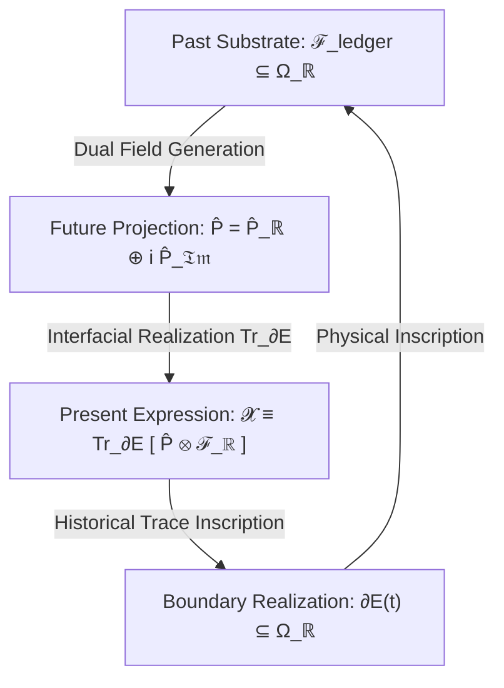

# Vidyaman: Ontological Physics & Non-Equilibrium Continuum Research

> **A multi-scale theoretical framework integrating continuum mechanics, non-equilibrium thermodynamics, open relativistic horizons, and classical Sanskrit ontology.**

---

## 🧭 Overview & Core Inquiries

This repository hosts a multi-disciplinary mathematical physics and philosophical research corpus investigating the fundamental question: **What is the scale-invariant physical and thermodynamic definition of an "existing entity"?**

The project formalizes how boundaries ( $\partial E$ ), structural margins ( $\phi \ge 0$ ), energy transfers ( $\dot{E}_{\text{fuel}}$ ), and temporal memory traces ( $\mathcal{F}_{\text{ledger}}$ ) sustain non-equilibrium order against entropic dissolution across four scale-invariant tiers:
1. **Tier I (Physical):** Relativistic fluid manifolds, crystal lattices, and stellar hydrodynamics ( $\chi^* = 0$ ).
2. **Tier II (Biological):** Lipid bilayers, cellular syncytia, and metabolic engines ( $\chi^* \in (0, 1)$ ).
3. **Tier III (Cognitive):** Bayesian neural networks, predictive generative models, and Landauer-bounded veto gating ( $\chi^* \approx 1$ ).
4. **Tier IV (Social / Cosmological):** Multi-agent institutional networks, sovereign states, and open Schwarzschild-Hubble universe embeddings ( $\chi^* > 1$ ).

---

## 📄 Primary Research Manuscripts

```
┌──────────────────────────────────────────────────────────────────────────────────────────────────────────────────┐
│                                            PRIMARY RESEARCH MANUSCRIPTS                                          │
├────────────────────────────────────────┬─────────────────────────────┬───────────────────────────────────────────┤
│ DOCUMENT                               │ DOMAIN / TYPE               │ KEY THEORETICAL CONTENT                   │
├────────────────────────────────────────┼─────────────────────────────┼───────────────────────────────────────────┤
│ 📜 essays/existence/draft.md           │ Mathematical Physics        │ 292 closed proof milestones across 63     │
│                                        │ (Flagship Paper)            │ adversarial peer review iterations.       │
│                                        │                             │ Exact Schwarzschild-Hubble horizon,       │
│                                        │                             │ relativistic Bondi accretion, level-set   │
│                                        │                             │ PDEs, and operator Temporal Triad.        │
├────────────────────────────────────────┼─────────────────────────────┼───────────────────────────────────────────┤
│ 📖 essays/existence/interpretation.md  │ Master Ontological Treatise │ Comprehensive companion paper establishing│
│    ├── interpretations/                │ & Domain-Specific Modules   │ dimensional semantic transduction, and    │
│    │   ├── core_ontology_and_dharma.md │                             │ partitioning the ontology into 5 focused  │
│    │   ├── cosmology_and_brahmanda.md  │                             │ domain modules: Sanskrit Ontology,        │
│    │   ├── biophysics_and_syncytia.md  │                             │ Cosmology, Biophysics, Cognitive Dynamics,│
│    │   ├── cognitive_and_psychology.md │                             │ and Institutional Systems.                │
│    │   └── societal_and_institutional.md│                            │                                           │
├────────────────────────────────────────┼─────────────────────────────┼───────────────────────────────────────────┤
│ 💬 essays/existence/                   │ Dialectical & Numerical     │ Extended Socratic debates, thought        │
│    dialogues_and_explorations.md       │ Proof Archive               │ experiments, and exact numerical proofs   │
│                                        │                             │ of cosmic expansion, accretion, and DM/DE.│
├────────────────────────────────────────┼─────────────────────────────┼───────────────────────────────────────────┤
│ 🔍 essays/existence/issues_log.md      │ Calculation & Proof Archive │ Complete technical derivation archive of  │
│                                        │                             │ all 292 closed milestones and downstream  │
│                                        │                             │ continuum-closure frontiers.              │
├────────────────────────────────────────┼─────────────────────────────┼───────────────────────────────────────────┤
│ ⚖️ essays/existence/review.md          │ Editorial & Peer Review Log │ Iteration-by-iteration referee verdicts,  │
│                                        │                             │ stress-tests, and adversarial critiques.  │
├────────────────────────────────────────┼─────────────────────────────┼───────────────────────────────────────────┤
│ 🕉️ essays/interospection_01/           │ Pāṇinian Morphological      │ Staged linguistic and grammatical essay   │
│                                        │ Analysis & Darśana          │ on Kuṇḍalinī, Māyā, and dhātu semantics.  │
└────────────────────────────────────────┴─────────────────────────────┴───────────────────────────────────────────┘
```

---

## 🧠 Interactive Research Portals (Google NotebookLM)

Explore and converse with the research corpus directly through dedicated Google NotebookLM models:

* 🔬 [**Open NotebookLM: Existence Manuscript (`draft.md`)**](https://notebook.google.com/notebook/05af9f0d-d66d-4333-bb98-75a7afb13f1f) — Grounded directly in the complete mathematical physics paper.
* 📚 **Existence Corpus Suite (`essays/existence/`)** — Covers foundational theory, entropy dynamics, multi-scale cases, and philosophical dialogues.

---

## ⚡ Theoretical Highlights & Core Invariants

### 1. The Operator-Theoretic Temporal Triad
Operational existence across all cognitive and biological scales is mediated by a closed, three-phase causal transduction loop:


### 2. Cosmological Black Hole Embedding & Horizon Duality
Our observable universe satisfies the exact **Schwarzschild-Hubble Horizon Identity**:

$$\boxed{R_s(M_{\text{Hubble}}) = \frac{2 G}{c^2} \left( \frac{c^3}{2 G H_0} \right) = \frac{c}{H_0} \equiv R_{\text{Hubble}} \approx 1.37 \times 10^{26} \, \mathrm{m}, \qquad S_{\text{BH}}(\mathcal{U}) = S_{\text{GH}}(\mathcal{U}) \approx 10^{122} \, k_B}$$

Proving that living cellular syncytia and cosmological black-hole universes share identical open non-equilibrium engine topology:

$$\boxed{\text{Topology}(E_{\text{living}}) \cong \text{Topology}(\mathcal{U}_{\text{BH}}) \not\cong \text{Topology}(\mathcal{U}_{\text{closed}})}$$

### 3. Deconstruction of Sanatan Dharm & The Category Error Paradox
Rooted in the Sanskrit verbal root $\sqrt{\text{धृ}}$ (*dhṛ* — *"to hold, sustain, maintain structural integrity"*), **Sanatan Dharm ( $\mathcal{D}_T$ )** is defined as the uncreated, eternal set-theoretic union of all localized intrinsic generator algebras ( $D_{\mathfrak{Im}}^i(t)$ ):

$$\mathcal{D}_T \equiv \bigcup_{t \in T} \bigcup_{i \in I(t)} D_{\mathfrak{Im}}^i(t)$$

An individual entity $E^i(t)$ does not "embody" Sanatan Dharm; it merely instantiates its localized proper subset ( $D_{\mathfrak{Im}}^i \subset \mathcal{D}_T$ ), just as a single floret is a constituent instantiation of an entire inflorescence bloom.

---

## 📂 Repository Architecture

```
Project_writeup_1/
├── README.md                    # Main repository portal and executive summary
├── essays/
│   ├── existence/               # The Continuum Existence & Ontological Framework
│   │   ├── README.md            # Directory-specific guide and index
│   │   ├── draft.md             # Flagship mathematical physics paper (292 proof milestones)
│   │   ├── interpretation.md    # Master ontological treatise (comprehensive synthesis)
│   │   ├── interpretations/     # Specialized Domain Modules
│   │   │   ├── core_ontology_and_dharma.md    # Sanskrit root √dhṛ, set theory & Category Error
│   │   │   ├── cosmology_and_brahmanda.md     # Brahmāṇḍa horizon, Dark Energy & Bondi accretion
│   │   │   ├── biophysics_and_syncytia.md     # 37T cell hierarchy, membrane & cellular Dharma
│   │   │   ├── cognitive_and_psychology.md    # Sagawa-Ueda bound, Ariṣaḍvarga & Viveka Veto
│   │   │   └── societal_and_institutional.md  # Tier IV legal ledgers, K_trans & Psychopathy
│   │   ├── dialogues_and_explorations.md      # Socratic debates & exact numerical proofs
│   │   ├── latex/               # LaTeX (.tex) Source Suite for all papers
│   │   ├── pdfs/                # Publication-grade vector PDF outputs
│   │   ├── issues_log.md        # Comprehensive technical calculation & proof archive
│   │   ├── review.md            # Peer review editorial verdict & adversarial defense log
│   │   ├── base.md              # Deconstructing Sanatan Dharm (foundational working hypothesis)
│   │   ├── cases_appendix.md    # Multi-scale applications (quantum to institutional)
│   │   ├── entropy.md           # Non-equilibrium thermodynamic dissipation metrics
│   │   └── rough.md             # Scratchpad & exploratory calculations
│   └── interospection_01/       # Staged essay on Kuṇḍalinī darśana & Pāṇinian morphology
│       ├── lexicons/            # Terminology controls & Sanskrit master dictionaries (glossary.md, allowlist.md)
│       └── references/          # Pāṇinian grammar aids and derivation logs (panini-notes.md)
├── scripts/                     # Automation toolchain & PDF/LaTeX compilation pipeline
│   ├── generate_pdf.py          # Automated vector PDF compiler (MathJax + Chrome/Edge)
│   ├── md_to_latex.py           # Markdown to standard LaTeX (.tex) converter
│   ├── sanitize_math.py         # KaTeX / GitHub math parser validator
│   ├── pipeline.py              # Staged lifecycle manager (rough → draft → stage → output)
│   └── expand_sa.py             # Sanskrit markup compiler (\sa{key} → Devanagari)
└── .agents/                     # Strict agent reviewer personas & audit protocols
```

---

## 🛡️ Pre-Commit Quality Checks & Task Automation (`mise`)

This repository uses [`mise`](https://mise.jdx.dev/) as an automated task runner to guarantee mathematical rigor, delimiter safety, and Markdown rendering integrity across GitHub, Obsidian, and PDF export:

| Command | Action | Description |
| :--- | :--- | :--- |
| `mise run setup-hooks` | **Install Git Hook** | Configures `.git/hooks/pre-commit` to automatically run linters before every commit. |
| `mise run lint` | **Lint Repository** | Validates all Markdown files for LaTeX delimiter balance, GFM collisions, and broken links. |
| `mise run pre-commit` | **Stage Linting** | Runs linter on staged files (blocks commit if any errors are found). |
| `mise run format` | **Auto-Format** | Automatically fixes column-0 math alignment, GFM delimiter padding, and code indentation. |
| `mise run audit` | **Math Audit** | Audits LaTeX bracket balance, `\left` / `\right` pairs, and macro spacing collisions. |
| `mise run build-pdf` | **Compile PDFs** | Compiles publication-quality vector PDFs with MathJax 3 across all essays. |

---

## 🛠️ Toolchain & Sanskrit Compilation Pipeline

The workspace includes a built-in Python toolchain for processing staged manuscripts containing Sanskrit semantic markup:

```
rough.md (\sa{key}) ───► draft.md (Compiled) ───► stage.md (Critical Edit) ───► output.md (Release)
```

```bash
# Check pipeline status for an essay
python scripts/pipeline.py status essays/interospection_01

# Compile rough markup to draft (expanding \sa{} tags to Devanagari/IAST)
python scripts/pipeline.py promote-draft essays/interospection_01

# Validate keys against the master glossary
python scripts/pipeline.py check-keys essays/interospection_01 --source rough

# Add a new term to the master lexicon
python scripts/glossary_add.py --key dharma --dev धर्म --iast dharma --gloss "structural sustenance" --dhatu "√dhṛ"
```

---

## 🖋️ Editor Integration

* **Obsidian:** This repository is pre-configured as an Obsidian vault (`.obsidian/` included). Open this root directory in Obsidian for bidirectional linking and graph view.
* **VS Code / Cursor:** Includes code snippets (`.vscode/sa.code-snippets`), syntax rules, and automated compilation hooks.