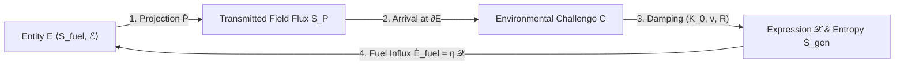

# A Continuum-Mechanical and Non-Equilibrium Thermodynamic Framework of Physical and Biological Existence

---

## Section 1: Axiomatic Foundations & Mathematical Toolbox

### 1.0 Executive Overview: The Universal Cycle of Existence
This framework models any physical, biological, or multi-agent entity as an active, non-equilibrium thermodynamic engine operating across a complex state space $\Omega_{\mathbb{C}} = \Omega_{\mathbb{R}} \oplus i \Omega_{\mathfrak{Im}}$. The universal continuity of existence across all physical and biological scales is governed by a closed 6-stage operational cycle:



```
 1. Entity (E):          Maintains ordered fuel substrate (S_internal < S_ambient) via engine ℰ.
 2. Projection (P̂):      Broadcasts real mechanical traction (P_ℝ) and imaginary gauge fields (P_𝔗𝔪).
 3. Challenge (C):       Incoming projection received as surface traction C_B = -T^field · n̂ on target.
 4. Damping (K_0, ν, R): Boundary absorbs impact via volumetric compression (K_0) and viscous shear (ν).
 5. Expression (𝓧):      Interfacial trace realization 𝓧 ≡ Tr_∂E [ P̂ ⊗ ℱ_ℝ ] consuming field amplitude.
 6. Reciprocal Fuel:     Target's expression is harvested as exergy: Ė_fuel = η 𝓧_absorbed ≥ T_amb Ṡ_gen.
```

---

### 1.1 Spacetime Manifold, Causal Geometry, and State Spaces

#### Axiom 1 (Spacetime Manifold and Causal Light-Cone Geometry):
Let $(\mathcal{M}, g_{\mu\nu})$ be a 4-dimensional Lorentzian pseudo-Riemannian spacetime manifold with metric signature $(-, +, +, +)$, equipped with the causal light-cone structure $\partial J^+(x_0)$.

The **Universal State Space ( $\Omega$ )** is defined across two canonical manifold structures:

1. **Real Configuration Space ( $\Omega_{\mathbb{R}} \subseteq \mathbb{R}^3$ ):**
The 3-dimensional real spatial manifold containing all physical mass and field momentum configurations. Physical configuration trajectories are causally bounded within the forward light cone:

$$\mathbf{x}(t) \in \mathcal{V}_{\text{causal}} \iff g_{\mu\nu} \frac{dx^\mu}{d\tau} \frac{dx^\nu}{d\tau} \le 0$$

where the outer boundary of all physical propagation in spacetime is the **Null Hypersurface ( $\mathcal{N} = \partial J^+$ )** generated by null geodesics ( $k^\mu k_\mu = 0$, propagating at the invariant speed of light $c$ ).

2. **Complexified Phase/State Space ( $\Omega_{\mathbb{C}} \equiv \Omega_{\mathbb{R}} \otimes \mathbb{C} \cong \mathbb{R}^3 \oplus i \mathbb{R}^3$ ):**
- For purely reactive entities ( $\mathfrak{Im}(D_{\mathfrak{Im}}) = \{\mathbf{0}\}$, Tier I Physical matter), operational dynamics are instantaneous in spatial configuration space: $E(t) \subset \Omega_{\mathbb{R}}$.
- For metabolic entities ( $\mathfrak{Im}(D_{\mathfrak{Im}}) \neq \{\mathbf{0}\}$, Tier II Biological cells), state loci expand onto the complexified manifold: $E(t) \subset \Omega_{\mathbb{C}}$, equipped with a canonical **Hermitian/Kähler Metric Tensor ( $h$ )**:

$$h(X, Y) = g(X, Y) + i \, \omega(X, Y)$$

satisfying compatibility with almost-complex operator $J$ ( $J^2 = -\mathbb{I}$, $\nabla J = 0$ ), Riemannian metric $g(JX, JY) = g(X, Y)$, fundamental symplectic form $\omega(X, Y) = g(JX, Y)$, and **Canonical Kähler Liouville 6-Form Volume Measure** $d\mu_h \equiv \frac{1}{3!} \omega \wedge \omega \wedge \omega = \sqrt{\det g(\mathbf{x}, \mathbf{y})} \, d^3x \, d^3y$. The Hilbert state space $\mathcal{H} = L^2(\Omega_{\mathbb{C}}, d\mu_h)$ has canonical inner product:

$$\boxed{d\mu_h \equiv \frac{1}{3!} \omega \wedge \omega \wedge \omega = \sqrt{\det g(\mathbf{x}, \mathbf{y})} \, d^3x \, d^3y, \qquad \langle \psi_1, \psi_2 \rangle_{\mathcal{H}} \equiv \int_{\Omega_{\mathbb{C}}} \bar{\psi}_1(\mathbf{x}, \mathbf{y}) \, \psi_2(\mathbf{x}, \mathbf{y}) \, d\mu_h}$$

rigorously defining self-adjoint operator domains $\hat{H} = \hat{H}^\dagger$, jump adjoints $\hat{L}_k^\dagger$, and Petz transpose recovery channels $\Psi^\dagger$. Real components ( $\mathfrak{Re}$ ) represent present-moment cytoskeletal configurations and imaginary components ( $\mathfrak{Im}$ ) represent enzymatic feedback loops and genetic repair ledgers.

#### Continuum Mechanics and Relativistic State-Space Viscosity
Within $\Omega$, "velocity" ( $\mathbf{v} = \frac{d\mathbf{x}}{dt}$ ) denotes the rate of state change, and "viscosity" ( $\nu$ ) represents systemic resistance to state deformation.

* **Field-Theoretic Viscosity (Regulated Green-Kubo Formalism):** For entities whose structural boundaries are maintained by gauge field stress tensors $\mathbf{T}^{\text{field}}$ (electromagnetic, gravitational, or nuclear), the macroscopic field viscosity is obtained via the Green-Kubo fluctuation-dissipation integral equipped with a spatial Yukawa-Debye screening regulator ( $\exp(-\frac{m_D c}{\hbar}\|\mathbf{x}\|)$ with Debye mass $m_D \sim g T$ ) to prevent logarithmic spatial infrared ( $\int dr/r \to \infty$ ) volume divergences, and thermal collisional damping $\Gamma_{\text{coll}} \sim \frac{\alpha^2 k_B T}{\hbar}$:

$$\nu_{\text{field}} = \lim_{\epsilon \to 0^+} \frac{1}{k_B T} \int_V \left\langle T_{xy}^{\text{field}}(\mathbf{0}, 0) \, T_{xy}^{\text{field}}(\mathbf{x}, \tau) \right\rangle \exp\left( -\frac{m_D c}{\hbar}\|\mathbf{x}\| \right) d^3x \int_0^\infty \exp\left( -\left(\Gamma_{\text{coll}} + \epsilon\right)\tau \right) d\tau < \infty$$

* **Rest-Mass Confinement Condition ( $\nu > 0$ ):** An entity carrying non-zero rest mass ( $m > 0$ ) sweeps out a **timelike worldtube ( $u^\mu u_\mu = -c^2, v < c$ )**. Internal viscosity $\nu > 0$ represents the **Israel-Stewart causal relaxation resistance ( $\tau_\pi, \tau_\Pi > 0$ )** that couples internal stress to the metric, preventing stress-energy from dissolving into unconfined null radiation at $c$. To preserve algebraic trace consistency ( $\mathrm{Tr}(\boldsymbol{\pi}) \equiv 0$ ), the trace-free shear stress tensor $\pi^{\alpha\beta}$ and scalar bulk viscous pressure $\Pi$ evolve via decoupled hyperbolic relaxation equations:

$$\boxed{\tau_\pi \Delta^\alpha_\mu \Delta^\beta_\nu u^\lambda \nabla_\lambda \pi^{\mu\nu} + \pi^{\alpha\beta} = -2\eta \sigma^{\alpha\beta} \quad (\text{Trace-Free Shear Stress Relaxation})}$$

$$\boxed{\tau_\Pi u^\lambda \nabla_\lambda \Pi + \Pi = -\zeta \theta \quad (\text{Scalar Bulk Viscous Pressure Relaxation})}$$

$$\boxed{T^{\mu\nu} = (\rho c^2 + P + \Pi) \frac{u^\mu u^\nu}{c^2} + (P + \Pi) g^{\mu\nu} + \pi^{\mu\nu}}$$

where $\Delta^{\mu\nu} \equiv g^{\mu\nu} + u^\mu u^\nu / c^2$ is the spatial projector metric ( $\Delta^\mu_\mu = 3$, rigorously enforcing spatial orthogonality $u_\alpha \pi^{\alpha\beta} \equiv 0$ and trace-free invariance $g_{\alpha\beta}\pi^{\alpha\beta} \equiv 0$ under relativistic 4-acceleration $\dot{u}^\mu = u^\lambda \nabla_\lambda u^\mu \neq 0$ via $\Delta^\alpha_\mu \Delta^\beta_\nu u^\lambda \nabla_\lambda \pi^{\mu\nu} = \langle u^\lambda \nabla_\lambda \pi^{\alpha\beta} \rangle_{\text{spatial, trace-free}}$ ), $\sigma^{\alpha\beta} \equiv \Delta^\alpha_\mu \Delta^\beta_\nu \left(\frac{\nabla^\mu u^\nu + \nabla^\nu u^\mu}{2} - \frac{1}{3}\theta g^{\mu\nu}\right)$ is trace-free shear ( $\sigma^\mu_\mu \equiv 0$ ), and $\theta \equiv \nabla_\mu u^\mu$ is expansion rate. Causal stability requires subluminal characteristic sound and shear mode propagation $v_{\text{char}}^2 = c_s^2 + \frac{\frac{4}{3}\eta + \zeta}{\left(\rho + P/c^2\right)\tau_\pi} \le c^2$, bounding the relaxation time as $\tau_\pi \ge \frac{\frac{4}{3}\eta + \zeta}{\left(\rho + P/c^2\right)\left(c^2 - c_s^2\right)}$. Along collective null causal boundaries $\mathcal{N}$ (e.g., event horizons), the Damour-Navier-Stokes membrane paradigm yields an effective horizon surface viscosity $\eta_{\text{horizon}} = -\lim_{\omega \to 0} \frac{1}{\omega} \mathrm{Im} G_{xy, xy}^R(\omega, \mathbf{0}) = \frac{c^3}{16\pi G}$ and Bekenstein-Hawking entropy density $s_{\text{horizon}} = \frac{k_B c^3}{4 G \hbar}$, saturating the Kovtun-Son-Starinets holographic bound with exact equality $\frac{\eta_{\text{horizon}}}{s_{\text{horizon}}} = \frac{\hbar}{4\pi k_B}$.

#### 1.1.1 Cosmological Black Hole Embedding & Schwarzschild-Hubble Horizon Equivalence ( $\mathcal{H}_1$ )
* **The Cosmological Boundary Dilemma:** In standard Friedmann-Lemaître-Robertson-Walker (FLRW) cosmology, the universe is assumed to be an isolated closed system without external boundary ( $\partial \mathcal{U} = \emptyset$ ), which predicts inevitable maximum-entropy thermal death. Does the observable universe instead constitute an open, bounded thermodynamic engine?
* **Exact Schwarzschild-Hubble Geometric Identity:**
Let $H_0 \equiv \dot{a}/a$ be the Hubble expansion rate. The observable cosmic horizon radius is $R_{\text{Hubble}} \equiv c/H_0 \approx 1.37 \times 10^{26} \, \mathrm{m}$. In a spatially flat critical universe ( $\Omega_{\text{total}} = 1$ ), the critical energy density is $\rho_c \equiv \frac{3 H_0^2}{8\pi G}$. Integrating over the Hubble sphere $V_{\text{Hubble}} = \frac{4}{3}\pi R_{\text{Hubble}}^3$ yields the total enclosed cosmological mass:

$$M_{\text{Hubble}} = \rho_c \cdot V_{\text{Hubble}} = \left( \frac{3 H_0^2}{8\pi G} \right) \left( \frac{4}{3}\pi \frac{c^3}{H_0^3} \right) = \frac{c^3}{2 G H_0} \approx 8.8 \times 10^{52} \, \mathrm{kg}$$

Evaluating the gravitational Schwarzschild radius $R_s(M) \equiv \frac{2 G M}{c^2}$ of this enclosed mass yields the **Exact Schwarzschild-Hubble Horizon Identity**:

$$\boxed{R_s(M_{\text{Hubble}}) = \frac{2 G}{c^2} \left( \frac{c^3}{2 G H_0} \right) = \frac{c}{H_0} \equiv R_{\text{Hubble}} \iff \partial \mathcal{U} \equiv \mathcal{H}_{\text{Hubble}} = \mathcal{H}_{\text{Schwarzschild}}}$$

* **Holographic Entropy & Trans-Horizon Accretion:**
The Bekenstein-Hawking black hole horizon entropy of the universe identically matches the Gibbons-Hawking cosmological de Sitter horizon entropy:

$$\boxed{S_{\text{BH}}(\mathcal{U}) = \frac{k_B c^3 \mathrm{Area}(\partial \mathcal{U})}{4 G \hbar} = \frac{k_B \pi c^5}{G \hbar H_0^2} \equiv S_{\text{GH}}(\mathcal{U}) \approx 10^{122} \, k_B}$$

Under the Einstein-Cartan-Sciama-Kibble (ECSK) spin-torsion framework (Popławski, 2010), fermion spin density $s^{\mu\nu\rho} \equiv \frac{i\hbar}{4}\bar{\psi} \, \gamma^{[\mu}\gamma^\nu\gamma^{\rho]}\psi$ generates non-singular repulsive gravitational stresses $-\frac{1}{2}\kappa^2 s_{\mu\nu\rho}s^{\mu\nu\rho}$ at trans-nuclear densities ( $\rho \sim 10^{54} \, \mathrm{kg/m^3}$ ), replacing the Big Bang point singularity with a non-singular cosmic bounce at minimum scale factor $a_{\text{min}} = a_0 (\rho_c / \rho_{\text{Planck}})^{1/6} > 0$ where $H^2 = \frac{8\pi G}{3}\rho(1 - \rho/\rho_{\text{torsion}}) = 0$. The interior metric coordinates undergo a signature inversion ( $g_{rr} \leftrightarrow g_{tt}$ ), establishing our expanding universe $\mathcal{U}_{\text{BH}}$ as the interior of an open black hole embedded in a parent spacetime, continuously fueled by trans-horizon relativistic Bondi-Hoyle-Littleton matter accretion:

$$\boxed{\dot{M}_{\text{rel-Bondi}} = 4\pi r_{\text{sonic}}^2 u_{\text{sonic}} h_{\text{sonic}} \rho_{\text{sonic}} = \pi \frac{G^2 M_{\text{Hubble}}^2}{c^3} \frac{\left( 1 + 3 c_s^2/c^2 \right)^{3/2}}{(c_s/c)^3} \rho_{\text{parent}} \ge 0}$$

$$\boxed{G_{\mu\nu} + \Lambda g_{\mu\nu} = \frac{8\pi G}{c^4} \langle \hat{T}_{\mu\nu} \rangle_{\text{ren}}, \qquad A_n = 4 \ln(k) \ell_P^2 n, \qquad S_{\text{Wald}} \equiv -2\pi \oint_{\mathcal{H}} \frac{\partial \mathcal{L}}{\partial R_{\mu\nu\rho\sigma}} \epsilon_{\mu\nu}\epsilon_{\rho\sigma} \, dA \equiv S_{\text{GH}}(\mathcal{U})}$$

(where covariant Hadamard point-splitting regularization $\langle \hat{T}_{\mu\nu} \rangle_{\text{ren}} = \lim_{x'\to x} \mathcal{D}_{\mu\nu}(x, x') [G^{(1)}(x, x') - H(x, x')]$ guarantees local stress-energy conservation $\nabla^\mu \langle \hat{T}_{\mu\nu} \rangle_{\text{ren}} = 0$ under trans-horizon quantum matter flux).

$$\boxed{\dot{S}_{\text{GH}}(\mathcal{U}) = \frac{2\pi k_B c^4 \dot{R}_{\text{Hubble}}}{G \hbar H_0} = \frac{2\pi k_B c^5}{G \hbar H_0^2} \left( -\frac{\dot{H}_0}{H_0} \right) \ge 0}$$

driving cosmological metric expansion $\dot{a}(t) > 0$ and sustaining non-zero cosmic entropy generation $\dot{S}_{\text{GH}} \ge 0$ in strict compliance with open non-equilibrium thermodynamics.

---

### 1.2 The State-Trace Functional ( $\Psi$ ) and Constitutive Operator Lie Algebra

#### 1.2.1 First-Principles Derivation of the State-Trace Functional ( $\Psi$ )
* **The Physical Dilemma:** In classical Newtonian mechanics, states are assumed to be instantaneous memoryless coordinates $\mathbf{x}(t)$ governed by autonomous ODEs $\dot{\mathbf{x}} = A \mathbf{x}$, whose solution is a simple matrix exponential $e^{At}$. However, for any non-equilibrium form of existence ( $E$ ), state evolution is driven by time-dependent operational interventions $\mathcal{O}(t)$ that act upon resource substrates $\mathcal{F}(t)$. Because operations at different chronological times generally do not commute ( $[ \hat{\mathcal{L}}(t_1), \hat{\mathcal{L}}(t_2) ] \neq \mathbf{0}$ frictionally and dissipation occurs), classical unitary exponential integration fails. We require a rigorous non-perturbative path-ordered state propagator that strictly preserves probability trace.

* **Step 1 (The Gorini-Kossakowski-Sudarshan-Lindblad Generator on Hilbert State Space):**
Let the state configuration of an entity be represented by a positive semi-definite state density operator $\hat{\rho}_E(t) \in \mathcal{S}(\mathcal{H})$ ( $\mathrm{Tr}(\hat{\rho}_E) = 1, \hat{\rho}_E \ge 0$ ) defined on the complex state Hilbert space $\mathcal{H} = L^2(\Omega_{\mathbb{C}})$. By the **GKSL Theorem** (Gorini, Kossakowski, Sudarshan, 1976; Lindblad, 1976), the most general trace-preserving, completely positive Markovian generator super-operator $\hat{\mathcal{L}}(\tau)$ acting on $\mathcal{S}(\mathcal{H})$ is:

$$\boxed{\frac{d \hat{\rho}_E(\tau)}{d\tau} = \hat{\mathcal{L}}(\tau) \hat{\rho}_E(\tau) = -\frac{i}{\hbar} [ \hat{H}(\tau), \hat{\rho}_E(\tau) ] + \sum_k \gamma_k(\tau) \left( \hat{L}_k(\tau) \hat{\rho}_E(\tau) \hat{L}_k^\dagger(\tau) - \frac{1}{2}\{ \hat{L}_k^\dagger(\tau) \hat{L}_k(\tau), \hat{\rho}_E(\tau) \} \right)}$$

where $\hat{H}(\tau) = \hat{H}^\dagger(\tau)$ is the effective Hamiltonian driving coherent internal dynamics, and $\hat{L}_k(\tau)$ are Lindblad jump operators representing irreversible dissipative interventions and fuel consumption, rigorously typed on $\mathcal{H} = L^2(\Omega_{\mathbb{C}})$ via operator composition:

$$\boxed{\hat{L}_k(\tau) \equiv \mathcal{O}_k(\tau) \, \hat{M}_{\sqrt{\mathcal{F}_k(\tau)/\mathcal{F}_k^\ominus}}, \qquad (\hat{L}_k \psi)(\mathbf{x}) \equiv \mathcal{O}_k \left[ \sqrt{\frac{\mathcal{F}_k(\mathbf{x}, \tau)}{\mathcal{F}_k^\ominus}} \, \psi(\mathbf{x}) \right]}$$

where $\hat{M}_{\sqrt{\mathcal{F}_k/\mathcal{F}_k^\ominus}}$ is the dimensionless fractional coordinate multiplication operator normalized by characteristic substrate density $\mathcal{F}_k^\ominus$, ensuring $\gamma_k \in [ \mathrm{s}^{-1} ]$ represents the microscopic jump transition rate. Taking the trace yields exact probability conservation:

$$\mathrm{Tr} \left( \frac{d\hat{\rho}_E}{d\tau} \right) = -\frac{i}{\hbar} \mathrm{Tr} \left( [\hat{H}, \hat{\rho}_E] \right) + \sum_k \gamma_k \mathrm{Tr} \left( \hat{L}_k^\dagger \hat{L}_k \hat{\rho}_E - \hat{L}_k^\dagger \hat{L}_k \hat{\rho}_E \right) \equiv 0 \implies \mathrm{Tr}(\hat{\rho}_E(t)) = 1, \quad \forall t \ge 0$$

* **Step 2 (The Volterra Integral Equation):**
Direct integration over the interval $[0, t]$ yields the implicit integral equation:

$$\hat{\rho}_E(t) = \hat{\rho}_E(0) + \int_0^t \hat{\mathcal{L}}(\tau_1) \hat{\rho}_E(\tau_1) \, d\tau_1$$

* **Step 3 (Recursive Neumann Series Expansion):**
Recursively substituting $\hat{\rho}_E(\tau_1) = \hat{\rho}_E(0) + \int_0^{\tau_1} \hat{\mathcal{L}}(\tau_2) \hat{\rho}_E(\tau_2) d\tau_2$ into Step 2 yields:

$$\hat{\rho}_E(t) = \hat{\rho}_E(0) + \int_0^t \hat{\mathcal{L}}(\tau_1) [ \hat{\rho}_E(0) + \int_0^{\tau_1} \hat{\mathcal{L}}(\tau_2) \hat{\rho}_E(\tau_2) \, d\tau_2 ] d\tau_1$$

Iterating this expansion to infinite order produces the exact **Neumann Series**:

$$\hat{\rho}_E(t) = [ \mathbb{I} + \sum_{n=1}^\infty \int_0^t d\tau_1 \int_0^{\tau_1} d\tau_2 \cdots \int_0^{\tau_{n-1}} d\tau_n \, \hat{\mathcal{L}}(\tau_1) \hat{\mathcal{L}}(\tau_2) \cdots \hat{\mathcal{L}}(\tau_n) ] \hat{\rho}_E(0)$$

* **Step 4 (Time-Ordering Symmetrization & Dyson Propagator):**
The nested integration simplex $\Delta_n \equiv \{0 \le \tau_n \le \cdots \le \tau_1 \le t\}$ possesses volume $V(\Delta_n) = \frac{t^n}{n!}$, representing exactly $\frac{1}{n!}$ of the volume of the $n$-dimensional hypercube $[0, t]^n$. Introducing the **Dyson Time-Ordering Meta-Operator ( $\mathcal{T}$ )** (Dyson, 1949), which chronologically re-orders operators ( $\tau_{\pi(1)} \ge \tau_{\pi(2)} \ge \cdots \ge \tau_{\pi(n)}$ for any permutation $\pi \in S_n$ ), allows symmetric integration over the unconstrained hypercube:

$$\boxed{\int_0^t d\tau_1 \int_0^{\tau_1} d\tau_2 \cdots \int_0^{\tau_{n-1}} d\tau_n \, \hat{\mathcal{L}}(\tau_1) \cdots \hat{\mathcal{L}}(\tau_n) = \frac{1}{n!} \int_0^t d\tau_1 \cdots \int_0^t d\tau_n \, \mathcal{T}[ \hat{\mathcal{L}}(\tau_1) \cdots \hat{\mathcal{L}}(\tau_n) ]}$$

Summing the Taylor series yields the **Exact Time-Ordered Dyson Propagator**:

$$\boxed{\hat{\rho}_E(t) = \Psi[\hat{\rho}_E(0);\, \{\mathcal{O}(\tau),\, \mathcal{F}(\tau)\}_{0}^{t}] \equiv \mathcal{T} \exp \left( \int_0^t \hat{\mathcal{L}}(\tau) \, d\tau \right) \hat{\rho}_E(0)}$$

* **Step 5 (Magnus Lie Algebra Expansion, Convergence Radius & Topological Hysteresis):**
For non-commuting generators in the Ordered Lie Operator Algebra ( $\mathcal{A}_D, [ \cdot, \cdot ]$ ) where $[ \hat{\mathcal{L}}(\tau_1), \hat{\mathcal{L}}(\tau_2) ] \neq \mathbf{0}$, the algebraic generator satisfies the formal **Magnus Expansion** (Magnus, 1954):

$$\Psi[\hat{\rho}_E(0); \dots] = \exp\left( \int_0^t \hat{\mathcal{L}}(\tau_1) \, d\tau_1 + \frac{1}{2} \int_0^t d\tau_1 \int_0^{\tau_1} d\tau_2 [ \hat{\mathcal{L}}(\tau_1), \hat{\mathcal{L}}(\tau_2) ] + \cdots \right) \hat{\rho}_E(0)$$

* **Convergence Bound & Complete Positivity (CPTP):** On the continuous Hilbert space $\mathcal{H} = L^2(\Omega_{\mathbb{C}})$, the kinetic energy operator $-\frac{\hbar^2}{2m}\nabla^2$ is an unbounded differential operator ( $\|\hat{\mathcal{L}}\|_{\text{super}} = \infty$ ). To ensure strict mathematical well-posedness, the Magnus expansion is evaluated on an **ultraviolet energy-truncated subspace $\mathcal{H}_{\Lambda} \equiv \mathrm{span}\{\psi_k \mid E_k \le \Lambda_{\text{UV}}\}$**, where the restricted superoperator norm is finite:

$$\boxed{\|\hat{\mathcal{L}}\|_{\Lambda} \le \frac{2 \Lambda_{\text{UV}}}{\hbar} + 2 \sum_k \gamma_k \|\hat{L}_k\|_{\Lambda}^2 < \infty \implies \int_0^t \|\hat{\mathcal{L}}(\tau)\|_{\Lambda} d\tau < \pi \iff t < t_{\text{Magnus}} \equiv \frac{\pi}{\|\hat{\mathcal{L}}\|_{\Lambda}}}$$

Because the commutator $ [ \hat{\mathcal{L}}_1, \hat{\mathcal{L}}_2 ] $ of two GKSL Lindbladians is not itself in GKSL form, complete positivity ( $ \hat{\rho}_E(t) \ge 0 $ ) for open dissipative trajectories is strictly guaranteed by the infinite-product time-ordered Dyson series:

$$\mathcal{T} \exp\left( \int_0^t \hat{\mathcal{L}}(\tau) \, d\tau \right)$$

with the Magnus expansion serving as the exact convergent asymptotic Lie algebra on $ \mathcal{H}_{\Lambda} $.

* **Topological Hysteresis:** The non-vanishing commutator $ [ \hat{\mathcal{L}}(\tau_1), \hat{\mathcal{L}}(\tau_2) ] \neq \mathbf{0} $ mathematically proves **Topological Hysteresis**: the final state depends strictly on the chronological order of intervention:

$$\Psi[\dots; (\mathcal{O}_A \to \mathcal{O}_B)] \neq \Psi[\dots; (\mathcal{O}_B \to \mathcal{O}_A)]$$

---

#### 1.2.2 First-Principles Derivation of the Viscoelastic Memory Kernel ( $G$ ) & Resistance ( $\mathbf{R}$ )
* **The Physical Dilemma:** How does an operational intervention $\mathcal{O}[\mathcal{F}]$ produce physical, mechanical surface resistance $\mathbf{R}(x, t)$? In an ideal elastic solid ( $\nu \to \infty$ ), stress is stored forever; in a pure fluid ( $\nu \to 0$ ), stress dissipates immediately. A physical existence requires a constitutive bridge that captures finite relaxation memory.

* **Step 1 (Continuum 3D Tensorial Maxwell Differential Balance):**
In 3D continuum mechanics, linear viscoelastic deformation splits orthogonally into **volumetric dilatation (spherical)** and **deviatoric shear** modes:

$$\boldsymbol{\sigma}(x, t) = \frac{1}{3}\mathrm{Tr}(\boldsymbol{\sigma})\mathbb{I} + \mathbf{s}(x, t), \qquad \boldsymbol{\varepsilon}(x, t) = \frac{1}{3}\mathrm{Tr}(\boldsymbol{\varepsilon})\mathbb{I} + \mathbf{e}(x, t)$$

where $\mathbf{s} \equiv \boldsymbol{\sigma} - \frac{1}{3}\mathrm{Tr}(\boldsymbol{\sigma})\mathbb{I}$ and $\mathbf{e} \equiv \boldsymbol{\varepsilon} - \frac{1}{3}\mathrm{Tr}(\boldsymbol{\varepsilon})\mathbb{I}$.
1. **Volumetric Dilatational Balance ( $K_0, \zeta_{\text{bulk}}$ ):**
Isotropic field pressure $P_{\text{field}} = -\frac{1}{3}\mathrm{Tr}(\mathbf{T}^{\text{field}}) = \frac{1}{6}\varepsilon_0 \varepsilon_r \|\nabla \mathbf{\Phi}\|^2 \in [\mathrm{Pa}]$ governs compression against the microscopic **Volumetric Bulk Modulus**:

$$\boxed{K_0 \equiv \rho \frac{\partial P_{\text{field}}}{\partial \rho} = \rho^2 \left.\frac{\partial^2 u_{\text{vol}}}{\partial \rho^2}\right|_{\mathcal{F}} \quad \left( \text{units: } [\mathrm{Pa}] \equiv [\frac{\mathrm{J}}{\mathrm{m^3}}] \right), \qquad \mathrm{Tr}(\dot{\boldsymbol{\varepsilon}}) = \frac{1}{3 K_0} \mathrm{Tr}(\dot{\boldsymbol{\sigma}}) + \frac{1}{3 \zeta_{\text{bulk}}} \mathrm{Tr}(\boldsymbol{\sigma})}$$

(where specific internal energy $e(\rho) \in [\mathrm{J/kg}]$ defines volumetric internal energy $u_{\text{vol}}(\rho) \equiv \rho e(\rho) \in [\mathrm{J/m^3}]$, yielding thermodynamic pressure $P = \rho^2 \frac{\partial e}{\partial \rho} = \rho \frac{\partial u_{\text{vol}}}{\partial \rho} - u_{\text{vol}}$ and microscopic bulk modulus $K_0 \equiv \rho \frac{\partial P}{\partial \rho} = \rho^2 \frac{\partial^2 u_{\text{vol}}}{\partial \rho^2}$ ).
2. **Deviatoric Shear Balance ( $\mu_{\text{shear}}, \nu_{\text{shear}}$ ):**
Shear distortions against lattice bonds or active cytoskeletal networks follow:

$$\dot{\mathbf{e}} = \frac{1}{2 \mu_{\text{shear}}} \dot{\mathbf{s}} + \frac{1}{2 \nu_{\text{shear}}} \mathbf{s}$$

* **Step 2 (Maxwell Differential Constitutive Equations & Integrating Factors):**
The decoupled differential equations for deviatoric shear stress $\mathbf{s}(x, t)$ and isotropic pressure $\frac{1}{3}\mathrm{Tr}(\boldsymbol{\sigma}(x, t))$ are:

$$\boxed{\dot{\mathbf{s}}(x, t) + \frac{1}{\tau_s} \mathbf{s}(x, t) = 2 \mu_{\text{shear}} \dot{\mathbf{e}}_{\text{active}}(x, t), \qquad \frac{1}{3}\mathrm{Tr}(\dot{\boldsymbol{\sigma}}(x, t)) + \frac{1}{\tau_b} \frac{1}{3}\mathrm{Tr}(\boldsymbol{\sigma}(x, t)) = K_0 \mathrm{Tr}(\dot{\boldsymbol{\varepsilon}}_{\text{active}}(x, t))}$$

where $\tau_s \equiv \frac{\nu_{\text{shear}}}{\mu_{\text{shear}}}$ and $\tau_b \equiv \frac{\zeta_{\text{bulk}}}{K_0}$ are the characteristic shear and dilatational relaxation times.
Integrating via integrating factors $\exp(t/\tau_s)$ and $\exp(t/\tau_b)$ under causal initial conditions ( $\boldsymbol{\sigma}(0) = \mathbf{0}$ ) yields the causal relaxation kernels:

$$G_{\text{shear}}(t - \tau) = \mu_{\text{shear}} \exp\left( -\frac{t - \tau}{\tau_s} \right) \Theta(t - \tau), \qquad K_{\text{bulk}}(t - \tau) = K_0 \exp\left( -\frac{t - \tau}{\tau_b} \right) \Theta(t - \tau)$$

* **Step 3 (The 3D Causal Memory Tensor Integral):**
The full 3D constitutive Cauchy stress tensor is:

$$\boxed{\boldsymbol{\sigma}(x, t) = \int_0^t [ 2 G_{\text{shear}}(t - \tau) \, \dot{\mathbf{e}}_{\text{active}}(x, \tau) + K_{\text{bulk}}(t - \tau) \mathrm{Tr}(\dot{\boldsymbol{\varepsilon}}_{\text{active}}(x, \tau)) \mathbb{I} ] d\tau}$$

where $\tau_s \equiv \frac{\nu_{\text{shear}}}{\mu_{\text{shear}}}$ and $\tau_b \equiv \frac{\zeta_{\text{bulk}}}{K_0}$ define the characteristic shear and dilatational **Memory Horizons**.

* **Step 4 (Macroscopic Resistance & Maintenance Power Density):**
The outward macroscopic resistance traction vector along surface normal $\hat{n}$ is $\mathbf{R}(x, t) \equiv \boldsymbol{\sigma}(x, t) \cdot \hat{n} \in [\mathrm{Pa}]$. For steady-state deviatoric actuation $\dot{\mathbf{e}}_{\text{active}} = \dot{\mathbf{e}}_0$:

$$\mathbf{R}_{\text{steady}} = 2 \nu_{\text{shear}} \dot{\mathbf{e}}_0 \cdot \hat{n} \implies \dot{\mathbf{e}}_{\text{maint}} = \frac{1}{2\nu_{\text{shear}}} \mathbf{s}_0 \quad \left( \text{units: } [\mathrm{s}^{-1}] \right)$$

Multiplying steady-state deviatoric stress by shear strain rate and hydrostatic pressure by volumetric dilatation rate yields the **Total Volumetric Mechanical Maintenance Power Density ( $\dot{w}_{\text{maint}} \in [\mathrm{W/m^3}]$ )**:

$$\boxed{\dot{w}_{\text{maint}} = \dot{w}_{\text{shear}} + \dot{w}_{\text{bulk}} = \frac{\mathbf{s}_0 : \mathbf{s}_0}{2\nu_{\text{shear}}} + \frac{[\frac{1}{3}\mathrm{Tr}(\boldsymbol{\sigma}_0)]^2}{\zeta_{\text{bulk}}} = \frac{\sigma_{\mathrm{vM}}^2\left(\mathbf{s}_0\right)}{3 \nu_{\text{shear}}} + \frac{[ \mathrm{Tr} \left(\boldsymbol{\sigma}_0\right) ]^2}{9 \zeta_{\text{bulk}}} \quad [\frac{\mathrm{W}}{\mathrm{m^3}}]}$$

Integrating over the entity's volume yields the total steady-state maintenance power $\dot{\mathcal{W}}_{\text{maint}} = \int_E \left( \frac{\sigma_{\mathrm{vM}}^2(\mathbf{s}_0)}{3\nu_{\text{shear}}} + \frac{[\mathrm{Tr}(\boldsymbol{\sigma}_0)]^2}{9\zeta_{\text{bulk}}} \right) dV \in [\mathrm{W}]$, capturing both shear resistance and hydrostatic confinement / turgor pressure dissipation ( $P_0 = -\frac{1}{3}\mathrm{Tr}(\boldsymbol{\sigma}_0)$ ).

---

#### 1.2.3 Physical Irreversibility ( $\Omega_{\mathbb{R}}$ ) vs. Algorithmic State Inversion ( $\Omega_{\mathfrak{Im}}$ )
1. **Physical Semi-Group ( $\mathcal{M}_t$ in $\Omega_{\mathbb{R}}$ ):**
Because physical viscosity produces strictly positive volumetric entropy ( $\Phi_{\text{viscous}} = 2\nu (\dot{\boldsymbol{\varepsilon}}:\dot{\boldsymbol{\varepsilon}}) > 0$ ), physical state evolution in real space $\Omega_{\mathbb{R}}$ is an **irreversible dynamical semi-group** $\mathcal{M}_t$ ( $t \ge 0$ ). Backward physical time $\mathcal{M}_{-t}$ is strictly forbidden by the Second Law of Thermodynamics.
2. **Algorithmic State Inversion ( $\mathcal{R}_{\sigma, \Psi}$ in $\Omega_{\mathfrak{Im}}$ ):**
While coherent quantum evolution follows the time-ordered Dyson series propagator $\mathcal{U}(t, t_0) = \mathcal{T} \exp\left(-\frac{i}{\hbar}\int_{t_0}^t \hat{H}_{\text{eff}}(\tau)d\tau\right) \equiv \sum_{n=0}^\infty \left(-\frac{i}{\hbar}\right)^n \int_{t_0}^t dt_1 \int_{t_0}^{t_1} dt_2 \dots \int_{t_0}^{t_{n-1}} dt_n \, \hat{H}_{\text{eff}}(t_1)\dots\hat{H}_{\text{eff}}(t_n)$, non-unitary GKSL Lindblad generators $\hat{\mathcal{L}}$ possess strictly dissipative decay spectra ( $\mathrm{Re}(\lambda_n) \le 0$ ), where naive exponential negation $-\hat{\mathcal{L}}$ induces unbounded, unphysical explosive growth ( $e^{+|\lambda_n|t} \to \infty$ ). State-trace reconstruction is executed as an **informational recovery in the Intrinsic Operator Algebra ( $D_{\mathfrak{Im}} \subset \Omega_{\mathfrak{Im}}$ )** via the **Petz Transpose Recovery Channel ( $\mathcal{R}_{\sigma, \Psi}$ )** (Petz, 1986; Barnum & Knill, 2002):

$$\boxed{\hat{\rho}_E(0) = \mathcal{R}_{\sigma, \Psi}[ \hat{\rho}_E(t) ] \equiv \hat{\sigma}^{1/2} \, \Psi^\dagger\left( \Psi(\hat{\sigma})^{-1/2} \, \hat{\rho}_E(t) \, \Psi(\hat{\sigma})^{-1/2} \right) \hat{\sigma}^{1/2} \overset{\Psi(\hat{\sigma})=\hat{\sigma}}{=} \hat{\sigma}^{1/2} \, \Psi^\dagger\left( \hat{\sigma}^{-1/2} \, \hat{\rho}_E(t) \, \hat{\sigma}^{-1/2} \right) \hat{\sigma}^{1/2}}$$

(satisfying exact trace recovery $\mathcal{R}_{\sigma, \Psi}[\Psi(\hat{\rho})] = \hat{\rho} \iff D(\hat{\rho} \parallel \hat{\sigma}) = D(\Psi(\hat{\rho}) \parallel \Psi(\hat{\sigma})) \iff D_\alpha(\hat{\rho} \parallel \hat{\sigma}) = D_\alpha(\Psi(\hat{\rho}) \parallel \Psi(\hat{\sigma})) \; \forall \alpha \in (0, \infty) \iff \sigma_t^{\hat{\sigma}}(\mathrm{Alg}(D_{\mathfrak{Im}})) \subseteq \mathrm{Alg}(D_{\mathfrak{Im}}) \; \forall t \in \mathbb{R}$ for all states on the sufficiency subalgebra $\mathrm{Alg}(D_{\mathfrak{Im}})$ by the Takesaki-Petz-Jencova theorem with modular automorphism group $\sigma_t^{\hat{\sigma}}(A) \equiv \hat{\sigma}^{it} A \hat{\sigma}^{-it}$, with the Junge-Kraft-Renner-Sutter strengthened monotonicity bound $D(\hat{\rho} \parallel \hat{\sigma}) - D(\Psi[\hat{\rho}] \parallel \Psi[\hat{\sigma}]) \ge -\ln F(\hat{\rho}, \, \mathcal{R}_{\sigma, \Psi}[\Psi[\hat{\rho}]])$ establishing that relative entropy loss quantitatively bounds recovery infidelity), where for forward Kraus map $\Psi(\hat{\rho}) = \sum_k \hat{A}_k \hat{\rho} \hat{A}_k^\dagger$, the Petz channel has explicit Kraus representation $\mathcal{R}_{\sigma, \Psi}[\hat{\rho}] = \sum_k \hat{M}_k \hat{\rho} \hat{M}_k^\dagger$ with recovery operators $\hat{M}_k \equiv \hat{\sigma}^{1/2} \hat{A}_k^\dagger \hat{\sigma}^{-1/2}$ satisfying $\sum_k \hat{M}_k^\dagger \hat{M}_k = \mathbb{I}_{\mathrm{supp}(\hat{\sigma})}$ (confirming $\mathcal{R}_{\sigma, \Psi} \in \mathrm{CPTP}$ on $\mathrm{supp}(\hat{\sigma})$ ), and $\hat{\sigma}$ is the invariant reference state ( $\Psi(\hat{\sigma}) = \hat{\sigma}$ ). Exact recovery is funded by Landauer computational dissipation $\dot{\mathcal{E}}_{\mathfrak{Im}} \ge k_B T \ln 2 \cdot \dot{\mathcal{H}}(D_{\mathfrak{Im}}) + \Delta \dot{\mathcal{I}}$ under laminar recovery conditions:

$$\text{State-Trace Recoverable} \iff \begin{cases}
\mathcal{R}e^* \equiv \frac{\|\text{Inertial Drift}\|}{\|\text{Viscous Binding}\|} < \mathcal{R}e_{\text{critical}} & \text{(Quasi-static state space; no turbulent scrambling)} \\
Pe^* \equiv \frac{\|\text{Operational Advection}\|}{\|\text{Ambient Noise Diffusion}\|} \gg 1 & \text{(Informational rank preserved; no heat-bath bleed)} \\
k_B T \cdot \Delta t \ll G_0 \, \tau_{\text{relax}} & \text{(Thermal noise below memory kernel capacity)}
\end{cases}$$

---

## Section 2: The Dual Identity & The Existential Engine ( $E \equiv \langle \mathcal{S}_{\text{fuel}}, \mathcal{E} \rangle$ )

### 2.1 Topological Boundary & Dual Identity Theorems

#### Axiom 3 (Complex Topological Boundary Enclosure $\partial E$ & Measure Metric):
The total **Complex Topological Boundary Enclosure ( $\partial E(t)$ )** of an entity decomposes into two orthogonal projections on $\Omega_{\mathbb{C}} = \Omega_{\mathbb{R}} \oplus i \Omega_{\mathfrak{Im}}$:

$$\boxed{\partial E(t) \equiv \partial E_{\mathbb{R}}(t) \;\oplus\; i \, \partial E_{\mathfrak{Im}}(t) \subset \Omega_{\mathbb{C}}, \qquad \|\mu(E(t))\| > 0}$$

The total complex ontological measure is defined in **relative non-equilibrium state space ( $\Omega_{\mathbb{C}}$ )**, where physical substrate mass is normalized against reference rest mass $\mu_{\mathbb{R}}^\ominus$ and informational capacity is scaled by the Landauer thermodynamic bit capacity of the entity's cortex/genome $\mathcal{H}^\ominus \equiv \frac{\mathcal{G}_{\text{metabolic}}}{k_B T \ln 2} \in [\mathrm{bits}]$:

$$\boxed{\mu(E) \equiv \frac{\mu_{\mathbb{R}}(E)}{\mu_{\mathbb{R}}^\ominus} + i \, \frac{\mu_{\mathfrak{Im}}(E)}{\mathcal{H}^\ominus} \in \mathbb{C}, \qquad \|\mu(E)\|_{\text{norm}} \equiv \sqrt{\left(\frac{\mu_{\mathbb{R}}(E)}{\mu_{\mathbb{R}}^\ominus}\right)^2 + \left(\frac{\mu_{\mathfrak{Im}}(E)}{\mathcal{H}^\ominus}\right)^2}}$$

where $\mu_{\mathbb{R}}(E) \equiv \int_{E_{\mathbb{R}}} \rho(\mathbf{x}) \, d^3x \in [\mathrm{kg}]$ is physical mass and $\mu_{\mathfrak{Im}}(E) \equiv \mathcal{H}(D_{\mathfrak{Im}}) \in [\mathrm{bits}]$ is informational Shannon-von Neumann entropy. Normalizing by characteristic scales preserves $\mathcal{O}(1)$ sensitivity across both physical substrate loss ( $\Delta \mu_{\mathbb{R}} \to 0$ ) and genetic ledger cleavage ( $\Delta \mu_{\mathfrak{Im}} \to 0$ ), eliminating relativistic $c^{-4}$ informational suppression in biological regimes.

1. **Real Physical Boundary ( $\partial E_{\mathbb{R}} \equiv \pi_{\mathbb{R}}(\partial E) = \bigcup_{k \in K(t)} f_k(t)$ ):**
The compact codimension-1 hypersurface in real space enclosing the material fuel substrate $\mathcal{F}_{\mathbb{R}}$ where rest-mass density is non-zero ( $\mu(\mathcal{F}_{\mathbb{R}}) > 0$ ) and internal Cauchy stress $\boldsymbol{\sigma}(x, t) \neq \mathbf{0}$ is confined.
2. **Imaginary Field Boundary ( $\partial E_{\mathfrak{Im}} \equiv \pi_{\mathfrak{Im}}(\partial E)$ ):**
The extended horizon of influence / domain of operator support ( $\text{supp}(D_{\mathfrak{Im}})$ ) where the entity's gauge field gradients and predictive models project into ambient space.
3. **Geometric Boundary vs. Transport Flux (Gauss's Divergence Theorem):**

$$\boxed{\int_{E(t)} \left( \nabla \cdot \mathbf{J}_S \right) dV = \int_{\partial E_{\text{outer}}(t)} \left( \mathbf{J}_S \cdot \hat{n}_{\text{out}} \right) dA + \sum_k \int_{\partial E_{\text{inner}, k}(t)} \left( \mathbf{J}_S \cdot \hat{n}_{\text{cavity}} \right) dA = \int_{\partial E(t)} \left( \mathbf{J}_S \cdot \hat{n} \right) dA}$$

(where for multiply-connected topological domains $\partial E = \partial E_{\text{outer}} \cup (\bigcup_k \partial E_{\text{inner}, k})$, the unit normal $\hat{n}$ is oriented outward from the material body $E(t)$ across exterior interfaces $\hat{n}_{\text{out}}$ and internal void cavity boundaries $\hat{n}_{\text{cavity}}$ ).

#### The Universal Projection Operator ( $\hat{\mathbf{P}}$ ), Interfacial Expression ( $\boldsymbol{\mathcal{X}}$ ) & Field Depletion:
Every active entity $E \equiv \langle \mathcal{S}_{\text{fuel}}, \mathcal{E} \rangle$ acts upon ambient space by broadcasting its non-equilibrium state through the **Universal Projection Operator ( $\hat{\mathbf{P}}$ )**:

$$\boxed{\hat{\mathbf{P}}: \mathrm{Int}(E) \times \partial E \longrightarrow \Omega_{\mathbb{C}} \setminus E, \qquad \hat{\mathbf{P}} \equiv \hat{\mathbf{P}}_{\mathbb{R}} \;\oplus\; i \, \hat{\mathbf{P}}_{\mathfrak{Im}}}$$

1. **Real Mechanical Projection ( $\hat{\mathbf{P}}_{\mathbb{R}}$ ):** Outward push-forward of boundary Cauchy stress traction and convective mass-momentum flux:

$$\left.\mathbf{P}_{\mathbb{R}}[\mathcal{E}](x, t)\right|_{\partial E} \equiv -\left( \boldsymbol{\sigma}(x, t) \cdot \hat{n}(x) \right) + \left( \mathbf{j}_{\text{matter}}(x, t) \cdot \mathbf{v}_{\text{drift}}(x, t) \right) \hat{n}(x) \quad [\mathrm{Pa}], \qquad \hat{\mathbf{P}}_{\mathbb{R}}(x, t) \equiv \mathbf{P}_{\mathbb{R}}(x, t) \, \delta_{\partial E}(x) \quad [\frac{\mathrm{N}}{\mathrm{m^3}}]$$

2. **Imaginary Gauge Projection ( $\hat{\mathbf{P}}_{\mathfrak{Im}}$ ):** Outward propagation of unmanifest gauge potentials and complex wavefunctional amplitudes:

$$\hat{\mathbf{P}}_{\mathfrak{Im}}[D_{\mathfrak{Im}}](x, t) \equiv \mathbf{\Phi}_{\mathbb{C}}(x, t) = \mathcal{A}(x, t) e^{i \theta(x, t)} \in \Omega_{\mathfrak{Im}}, \qquad \Box \mathbf{\Phi}_{\mathbb{C}}(x, t) = \mathrm{Tr}_{\partial E}[ D_{\mathfrak{Im}} ](x, t) \, \delta_{\partial E}(x)$$

admitting the exact causal retarded Kirchhoff-Helmholtz double-layer boundary surface integral representation in 4D Lorentzian spacetime (satisfying the Sommerfeld radiation condition $\lim_{R \to \infty} R \left( \frac{\partial \mathbf{\Phi}_{\mathbb{C}}}{\partial R} + \frac{1}{c} \frac{\partial \mathbf{\Phi}_{\mathbb{C}}}{\partial t} \right) = 0$, with eikonal ray-tracing phase $\|\nabla S\|^2 = \frac{\omega^2}{c^2}\tilde{n}_{\mathbb{C}}^2$, Maslov index geometric phase correction $e^{-i \mu_{\text{Maslov}}\pi/2}$ across ray caustics in curved geometries (where $\mu_{\text{Maslov}} \in \mathbb{Z}$ counts signed caustic intersections in the Lagrangian Grassmannian manifold), Rubinowicz-Maggi boundary diffraction wave $\mathbf{\Phi}_{\text{diff}} = \frac{1}{4\pi}\oint_{\Gamma} \mathbf{\Phi}_{\text{inc}}\frac{\hat{\mathbf{R}}\times\hat{\mathbf{s}}}{R(1+\hat{\mathbf{R}}\cdot\hat{\mathbf{s}})}\cdot d\mathbf{l}$, boundary Dirichlet-to-Neumann map $\Lambda_{\text{DtN}}[\mathbf{\Phi}_{\mathbb{C}}] \equiv \left. \frac{\partial\mathbf{\Phi}_{\mathbb{C}}}{\partial n} \right|_{\partial E} = \sqrt{\frac{1}{c^2}\frac{\partial^2}{\partial t^2} - \Delta_{\partial E}}\mathbf{\Phi}_{\mathbb{C}}$, irrotational flux condition $\nabla \times \mathbf{S}_{\mathbf{P}} = 0$, multipole expansion $\hat{\mathbf{\Phi}}_{\mathbb{C}}(\mathbf{x}, \omega) = \frac{e^{ikr}}{4\pi r}[q_{\text{mono}} + ik\mathbf{p}_{\text{dip}}\cdot\hat{\mathbf{r}} - \frac{k^2}{6}\mathbf{Q}_{ij}\hat{r}_i\hat{r}_j]$, surface radiation impedance $Z_{\text{rad}}(\mathbf{x}, \omega) \equiv \frac{\hat{\mathbf{\Phi}}_{\mathbb{C}}}{\hat{n}'\cdot\nabla\hat{\mathbf{\Phi}}_{\mathbb{C}}} = \frac{\rho_0 c}{\sqrt{1 - (c k_\parallel/\omega)^2}}$, and moving-boundary Doppler shift $\omega_{\text{obs}}(\mathbf{x}) = \omega_0 \frac{1 - (\mathbf{v}_{\text{int}}(\mathbf{x}')\cdot\hat{\mathbf{R}})/c}{\sqrt{1 - v_{\text{int}}^2/c^2}}$ ):

$$\mathbf{\Phi}_{\mathbb{C}}(\mathbf{x}, t) = \frac{1}{4\pi}\int_{\partial E} \left( \frac{1}{R}[ \frac{\partial\mathbf{\Phi}_{\mathbb{C}}}{\partial n'} ]_{\text{ret}} - \frac{\hat{n}' \cdot \hat{\mathbf{R}}}{R^2}[\mathbf{\Phi}_{\mathbb{C}}]_{\text{ret}} - \frac{\hat{n}' \cdot \hat{\mathbf{R}}}{c R}[\frac{\partial\mathbf{\Phi}_{\mathbb{C}}}{\partial t'}]_{\text{ret}} \right) dA'$$

carrying combined Poynting and mechanical energy flux $\mathbf{S}_{\mathbf{P}} = \frac{c}{8\pi} \mathcal{A}^2 \frac{\mathbf{k}}{\|\mathbf{k}\|} + (\mathbf{P}_{\mathbb{R}} \cdot \mathbf{v}_{\text{int}})\hat{n} \in [\mathrm{W/m^2}]$ strictly bounded within the forward causal cone $\mathrm{supp}(\hat{\mathbf{P}}[E]) \subseteq J^+(E)$.

##### Interfacial Expression Operator ( $\boldsymbol{\mathcal{X}}$ ) & Environmental Challenge ( $\mathbf{C}$ ):
When a projection $\hat{\mathbf{P}}_A$ intersects a target boundary $\partial E_B$, it is evaluated as the **Environmental Challenge ( $\mathbf{C}_B$ )** and realized via the **Interfacial Expression Operator ( $\boldsymbol{\mathcal{X}}_B$ )**:

$$\boxed{\mathbf{C}_B(x, t) \equiv \mathrm{Tr}_{\partial E_B}[ \hat{\mathbf{P}}_A(x, t) ] = -\mathbf{T}^{\text{field}}(x, t) \cdot \hat{n}_B \quad [\mathrm{Pa}]}$$

$$\boxed{\boldsymbol{\mathcal{X}}_B(x, t) \equiv \mathrm{Tr}_{\partial E_B}[ \hat{\mathbf{P}}_A \otimes \mathcal{F}_{\mathbb{R}}^B ] = \left( \mathcal{X}_{\text{absorbed}}(x, t) + \mathcal{X}_{\text{reflected}}(x, t) + \mathcal{X}_{\text{transmitted}}(x, t) \right) \hat{n}_B \quad [\frac{\mathrm{W}}{\mathrm{m^2}}]}$$

where the realized modes partition the normal incident power flux across the interface governed by complex refractive index Fresnel coefficients ( $\tilde{n}_{\mathbb{C}} \equiv \sqrt{\varepsilon_{\mathbb{C}}\mu_{\mathbb{C}}} = n_r + i \kappa_{\text{extinct}}$, satisfying the Marangoni-Boussinesq surface stress constitutive equation $\boldsymbol{\sigma}_s = (\gamma_s + \kappa_s \nabla_s \cdot \mathbf{v}_s)\mathbf{I}_s + 2\mu_s \mathbf{D}_s$, Kotchine's jump condition $[\![\rho(\mathbf{v}-\mathbf{v}_{\text{int}})\otimes(\mathbf{v}-\mathbf{v}_{\text{int}}) - \boldsymbol{\sigma}]\!]\cdot\hat{n} = \gamma_s \kappa_H \hat{n} + \nabla_s \gamma_s$, the Gibbs-Thomson curvature-dependent surface chemical potential shift $\Delta \mu_s(x) = \Omega_{\text{atomic}} \gamma_s \kappa_H(x)$ (where $\Omega_{\text{atomic}} \equiv M_{\text{molar}}/(\rho N_A)$ is molecular volume), the singular interface jump $[\![\mathbf{S}_{\mathbf{P}}\cdot\hat{n}]\!] = -\mathbf{j}_s\cdot\mathbf{E}_t - \frac{\partial u_s}{\partial t} - v_n[\![u_{\text{field}}]\!]$, supporting Sommerfeld-Zenneck surface waves with wavenumber $k_{\text{Zenneck}} \equiv k_0 \sqrt{\frac{\tilde{n}_{\mathbb{C}}^A \tilde{n}_{\mathbb{C}}^B}{\tilde{n}_{\mathbb{C}}^A + \tilde{n}_{\mathbb{C}}^B}}$, satisfying the Kramers-Kronig surface impedance causality integral $X_s(\omega) = -\frac{2\omega}{\pi}\mathcal{P} \int_0^\infty \frac{R_s(\omega') - Z_\infty}{\omega'^2 - \omega^2}d\omega'$, the Generalized Optical Theorem $\sigma_{\text{extinct}}(\theta_i) \equiv \sigma_{\text{absorb}} + \sigma_{\text{scatter}} = \frac{4\pi}{k}\mathrm{Im}[\mathbf{f}_{\text{forward}}(0)]$, with Goos-Hänchen beam shift $\Delta x_{\text{GH}}(\theta_i) = \frac{2\sin\theta_i}{k_0 \sqrt{(\mathrm{Re}(\tilde{n}_{\mathbb{C}}^A)\sin\theta_i)^2 - (\mathrm{Re}(\tilde{n}_{\mathbb{C}}^B))^2}}$, and complex Brewster angle $\tan\theta_B \equiv \tilde{n}_{\mathbb{C}}^B / \tilde{n}_{\mathbb{C}}^A$ ):

$$\begin{cases}
\mathcal{X}_{\text{absorbed}}(x, t) = \alpha(\theta_i) \left( \mathbf{S}_{\mathbf{P}} \cdot \hat{n}_B \right) & \text{where } \alpha(\theta_i) \equiv \frac{4 \mathrm{Re}(\tilde{n}_{\mathbb{C}}^A) \mathrm{Im}(\tilde{n}_{\mathbb{C}}^B)\cos\theta_i}{|\tilde{n}_{\mathbb{C}}^B \cos\theta_i + \tilde{n}_{\mathbb{C}}^A \cos\theta_t|^2} \quad (\text{Absorbed Photochemical Work } \Delta \mu_{\mathbb{R}} > 0) \\
\mathcal{X}_{\text{reflected}}(x, t) = \mathcal{R}(\theta_i) \left( \mathbf{S}_{\mathbf{P}} \cdot \hat{n}_B \right) & \text{where } \mathcal{R}(\theta_i) \equiv \left| \frac{\tilde{n}_{\mathbb{C}}^B \cos\theta_i - \tilde{n}_{\mathbb{C}}^A \cos\theta_t}{\tilde{n}_{\mathbb{C}}^B \cos\theta_i + \tilde{n}_{\mathbb{C}}^A \cos\theta_t} \right|^2 \quad (\text{Reflected Wave Field / Elastic Scattering}) \\
\mathbf{C}_{\text{real}}(x, t) = -\mathbf{T}^{\text{field}}(x, t) \cdot \hat{n}_B & \text{(Real Maxwell / Gravitational Stress Surface Traction)}
\end{cases}$$

satisfying exact interfacial energy conservation $\mathcal{R}(\theta_i) + \alpha(\theta_i) + \mathcal{T}(\theta_i) \equiv 1$.

##### Conservation of Interfacial Flux & Imaginary Field Depletion Law:
By global energy conservation across the orthogonal projections $\Omega_{\mathbb{C}} = \Omega_{\mathbb{R}} \oplus i \Omega_{\mathfrak{Im}}$, any real physical work materialized at the boundary ( $\mathcal{X}_{\text{absorbed}} > 0$ ) strictly consumes the unmanifest field amplitude in imaginary space according to the **Boundary Jump Depletion Condition**:

$$\boxed{\Delta \mathbf{S}_{\mathbf{P}}(x, t) \cdot \hat{n}_B \equiv \left( \mathbf{S}_{\mathbf{P}}^{\text{incident}} - \mathbf{S}_{\mathbf{P}}^{\text{transmitted}} \right) \cdot \hat{n}_B = \mathcal{X}_{\text{absorbed}}(x, t) + \mathcal{X}_{\text{reflected}}(x, t)}$$

$$\boxed{\mathcal{A}_{\text{transmitted}}^2(x, t) = \mathcal{A}_{\text{incident}}^2(x, t) - \frac{8\pi}{c}\left( \mathcal{X}_{\text{absorbed}}(x, t) + \mathcal{X}_{\text{reflected}}(x, t) \right)}$$

proving that the extent of existence in imaginary space ( $\Omega_{\mathfrak{Im}}$ ) decays monotonically in proportion to the real physical matter and traction ( $\Omega_{\mathbb{R}}$ ) realized across the boundary interface $\partial E$.

In ultrafast photoreceptive sensory transduction (e.g. retinal conical intersections), non-adiabatic electronic-nuclear trajectories accumulate a topological **Geometric Berry Phase**:

$$\boxed{|\psi_1(\mathbf{R})\rangle = \cos\left(\frac{\theta(\mathbf{R})}{2}\right)|1\rangle + \sin\left(\frac{\theta(\mathbf{R})}{2}\right)|2\rangle \implies |\psi_1(\theta + 2\pi)\rangle = -|\psi_1(\theta)\rangle = e^{i\pi}|\psi_1(\theta)\rangle \implies \gamma_C = \pi \pmod{2\pi}}$$

enforcing constructive wavepacket interference along productive perceptual realization pathways and destructive cancellation along dissipative non-reactive branches.

#### Theorem 1 (State-Space Orthogonality, Carrier Embedding, Stone-von Neumann Separability, T-Duality & Gravitational Decoherence):
1. **State-Space Tangent Orthogonality, Haag-Kastler Local Nets & Separability:** Under the canonical Hermitian metric $h = g + i\omega$ on complexified phase space $\Omega_{\mathbb{C}} = \Omega_{\mathbb{R}} \oplus i \Omega_{\mathfrak{Im}}$, state-space tangent projections are mutually orthogonal:

$$\langle T\Omega_{\mathbb{R}}, \; T\Omega_{\mathfrak{Im}} \rangle_g \equiv 0$$

To ensure measurability independent of the Continuum Hypothesis ( $2^{\aleph_0}$ vs $\aleph_1$ ), local physical configuration spaces are restricted to separable Hilbert spaces $\mathcal{H}_{\text{local}} \cong L^2(\mathbb{R}^n, d^n x)$ of dimension $\aleph_0$ where the Stone-von Neumann theorem guarantees unique CCR representations. Globally, continuous boundary quantum field observables are governed by **Haag-Kastler / Araki Local Nets of $C^*$-Algebras** $\mathfrak{A}(\mathcal{O})$ on causal spacetime diamonds $\mathcal{O} \subset \mathcal{M}$:

$$\boxed{\mathcal{O}_1 \subset \mathcal{O}_2 \implies \mathfrak{A}(\mathcal{O}_1) \subseteq \mathfrak{A}(\mathcal{O}_2), \qquad [\mathfrak{A}(\mathcal{O}_1), \, \mathfrak{A}(\mathcal{O}_2)] = \{0\} \quad \text{for spacelike separated } \mathcal{O}_1, \mathcal{O}_2}$$

reconciling infinite-dimensional field theories (where Haag's theorem proves that interacting field theories possess unitarily inequivalent representations to the free Fock space $\mathcal{H}_{\text{int}} \not\cong \mathcal{H}_{\text{free}}$, requiring algebraic nets of von Neumann factors) with finite-dimensional CCR uniqueness.
2. **Physical Carrier Embedding, T-Duality, Chaitin Complexity & Wheeler-DeWitt Superspace:** In real space $\Omega_{\mathbb{R}}$, physical information storage requires material substrates ( $\mathrm{supp}(D_{\mathfrak{Im}}) \subseteq \mathrm{supp}(\mathcal{F}_{\text{ledger}}) \subset \Omega_{\mathbb{R}}$ ). At string scales ( $\ell_s = \sqrt{\alpha'}$ ), target space **T-Duality ( $R \leftrightarrow \alpha'/R$ )** establishes a minimum phase-space volume measure:

$$\boxed{d\mu_{\mathfrak{Im}}(R) = \sqrt{\det g_{\mathfrak{Im}}} \, d^d y \ge \left( 2\pi \sqrt{\alpha'} \right)^d = (2\pi \ell_s)^d, \quad \mathcal{Z}_{\text{spatial}}(R) = \mathcal{Z}_{\text{spatial}}\left(\frac{\alpha'}{R}\right), \quad \mathcal{Z}_{\text{thermal}}(\beta) = \mathcal{Z}_{\text{thermal}}\left(\frac{(2\pi)^2 \alpha'}{\beta}\right)}$$

(where modular inversion $\beta \leftrightarrow \frac{(2\pi)^2 \alpha'}{\beta}$ establishes the self-dual Hagedorn Euclidean period $\beta_{\text{Hagedorn}} = 2\pi\ell_s = 2\pi\sqrt{\alpha'}$, bounding the maximum physical temperature $T_{\max} = \frac{\hbar c}{2\pi k_B \ell_s} < \infty$, eliminating UV informational infinities). By **Chaitin's Algorithmic Incompleteness Theorem**, rule ledgers $D_{\mathfrak{Im}}$ of length $L(D_{\mathfrak{Im}})$ cannot predict environmental state strings exceeding Kolmogorov complexity thresholds:

$$\boxed{\mathcal{K}(x) \equiv \min_{p \,:\, \mathcal{U}(p) = x} \ell(p) > L\left(D_{\mathfrak{Im}}\right) + c_{\text{Gödel}} \implies \text{Axiomatically Undecidable / Incomputable Shock}}$$

requiring continuous empirical fuel influx. At the trans-Planckian scale, the physical spatial 3-metric $h_{ij}$ and canonical momentum $\pi^{ij}$ satisfy the **Wheeler-DeWitt Functional Constraint**:

$$\boxed{\hat{\mathcal{H}}_{\text{WDW}} \Psi[h_{ij}] \equiv \left( -\frac{16\pi G \hbar^2}{c^4 \sqrt{h}} G_{ijkl} \frac{\delta^2}{\delta h_{ij} \delta h_{kl}} - \frac{\sqrt{h} c^4}{16\pi G} \left( {}^{(3)}R - 2\Lambda \right) + \hat{\mathcal{H}}_{\text{matter}} \right) \Psi[h_{ij}] = 0}$$

where $G_{ijkl} \equiv \frac{1}{2}(h_{ik}h_{jl} + h_{il}h_{jk} - h_{ij}h_{kl})$ is the DeWitt supermetric possessing hyperbolic signature $(-, +, +, +, +, +)$ on the 6D space of symmetric 3-metrics $\mathrm{Sym}_2(T^*\Sigma)$, equipped with the **York-Gibbons-Hawking Boundary Action** $\mathcal{S}_{\text{boundary}} = \frac{c^4}{8\pi G}\int_{\partial\Sigma} \sqrt{\gamma}(K - K_0) d^2x$ for spatial slices with non-empty boundary $\partial\Sigma$. Concurrently, macroscopic mass superpositions undergo **Penrose-Diósi Gravitational Self-Energy Decoherence** regularized by the nuclear spatial cut-off radius $R_0 \approx 10^{-15} \, \mathrm{m}$:

$$\boxed{\Gamma_{\text{grav}} \equiv \frac{1}{\tau_{\text{grav}}} = \frac{G}{\hbar} \iint_{\Sigma \times \Sigma} \frac{\left( \rho_1(\mathbf{x}) - \rho_2(\mathbf{x}) \right) \left( \rho_1(\mathbf{y}) - \rho_2(\mathbf{y}) \right)}{\sqrt{d_h(\mathbf{x}, \mathbf{y})^2 + R_0^2}} \sqrt{\det h(\mathbf{x})} \, d^3x \sqrt{\det h(\mathbf{y})} \, d^3y < \infty}$$

(where $[\frac{G}{\hbar}][\iint \frac{\Delta\rho\Delta\rho}{d} dV dV] = [\frac{\mathrm{m}}{\mathrm{kg^2 \cdot s}}][\frac{\mathrm{kg^2}}{\mathrm{m}}] \equiv [\mathrm{s^{-1}}]$, verifying dimensional homogeneity and reconciling quantum operator superposition with classical spacetime metric localization without ultraviolet self-energy divergence).

#### Theorem 2 (Dual Ontological Identity of Non-Equilibrium Existence):
For any active existence $E \subset \Omega$, maintaining a bounded topological enclosure with non-zero measure ( $\mu(E) > 0$ ) strictly requires a positive non-equilibrium Gibbs free-energy potential ( $\mathcal{G}[E] = \mathcal{U} - T_{\text{ambient}} S > 0$ ). This single physical condition simultaneously and necessarily establishes a **Dual Ontological Projection**:

$$\boxed{\mu(E) > 0 \iff \mathcal{G}[E] > 0 \iff E \equiv \left\langle \mathcal{S}_{\text{fuel}}, \; \mathcal{E} \right\rangle}$$

1. **Substrate / Fuel State ( $\mathcal{S}_{\text{fuel}}$ ):** Because $E$ encloses ordered matter/information ( $S_{\text{internal}} < S_{\text{ambient}}$ ), it constitutes an accessible free-energy reservoir ( $\Delta \mathcal{G} > 0$ ) for any external operator capable of cleaving $\partial E$.
2. **Existential Engine ( $\mathcal{E}$ ):** Because $E$ executes intrinsic boundary operators $D_{\mathfrak{Im}}$ to sustain its boundary, it operates as an active non-equilibrium thermodynamic engine generating internal Cauchy stress $\boldsymbol{\sigma}(x, t) \neq \mathbf{0}$. The outward boundary trace of this engine projects a surface traction (the Environmental Challenge) onto adjacent entities:

$$\mathbf{C}_{\text{out}}(x, t) \equiv \mathrm{Tr}_{\partial E}\left(\mathcal{E}\right) = -\boldsymbol{\sigma}(x, t) \cdot \hat{n} \neq \mathbf{0}$$

Both projections are co-extensive with $\mu(E) > 0$. An entity cannot cease to be fuel without dissolving its boundary ( $\mu \to 0$ ), and cannot cease to operate as an engine without terminating internal stress generation and boundary maintenance ( $\boldsymbol{\sigma} \to \mathbf{0}$ ).

---

### 2.2 The 4-Phase Non-Equilibrium Engine Cycle ( $\mathcal{E}$ )

An entity operates as an open thermodynamic engine executing a continuous 4-phase cycle:

$$\mathcal{C}_{\text{engine}} = \Big( \text{Negentropy Intake } (\dot{E}_{\text{fuel}}) \;\longrightarrow\; \text{Fuel Partition } (\dot{\mathcal{E}}_{\mathfrak{Re}} + \dot{\mathcal{E}}_{\mathfrak{Im}}) \;\longrightarrow\; \text{Dissipation } (\sigma_{\text{total}}) \;\longrightarrow\; \text{Entropy Rejection } (\mathbf{J}_S) \Big)$$

```
                                  THE EXISTENTIAL ENGINE CYCLE (E)
                                                  │
                ┌─────────────────────────────────┴─────────────────────────────────┐
                │                                                                   │
       [1. NEGENTROPY INTAKE]                                              [2. FUEL PARTITION]
   Fuel Flux J_fuel carrying ΔG_fuel                                      E_total = E_Re + E_Im
   (Inward negentropy S_in < 0)                                           (Real Actuation + Im-Projection)
                │                                                                   │
                └─────────────────────────────────┬─────────────────────────────────┘
                                                  │
                ┌─────────────────────────────────┴─────────────────────────────────┐
                │                                                                   │
      [3. UNIFIED DISSIPATION]                                            [4. ENTROPY REJECTION]
   σ_total = σ_visc + σ_chem + σ_Landauer                                 Outward Flux J_S across Front f
   (Irreversible internal entropy gen)                                    (Maintains dS_int/dt <= 0, ϕ=0)
```

1. **Phase 1: Negentropy Intake:** Influx of free energy carrying chemical affinity $A_\alpha$ and radiant Poynting flux $\mathbf{S}$:

$$\boxed{\dot{S}_{\text{intake}} = -\int_{f_{\text{intake}}} \left( \frac{4}{3} \frac{\mathbf{S}_{\text{absorbed}}(x, t)}{T_{\text{source}}} + \sum_\alpha \frac{A_\alpha(x, t)}{T_{\text{internal}}(x, t)} \mathbf{J}_{\alpha}^{\text{molar}}(x, t) \right) \cdot \hat{n}_{\text{in}} \, dA < 0 \quad \left( \text{units: } [\frac{\mathrm{W}}{\mathrm{K}}] \right)}$$

$$\boxed{\dot{E}_{\text{fuel}} = \int_{f_{\text{intake}}} \left( \alpha \, \mathbf{S}(x, t) + \sum_\beta \mu_\beta^{\text{chem}}(x, t) \, \mathbf{J}_\beta^{\text{molar}}(x, t) \right) \cdot \hat{n}_{\text{in}} \, dA \quad \left( \text{units: } [\mathrm{W}] \right)}$$

2. **Phase 2: Unified Local & Interfacial Entropy Production Functional ( $\dot{S}_{\text{gen}}^{\text{total}}$ ):**
The total rate of irreversible entropy generation consists of internal volume dissipation ( $\sigma_{\text{total}} \in [\mathrm{W/(m^3\cdot K)}]$ ) and **Interfacial Kapitza Thermal Surface Dissipation** ( $\Sigma_{\text{surface}} \in [\mathrm{W/K}]$ ) across non-isothermal boundaries ( $T_{\text{internal}} \neq T_{\text{ambient}}$ ) with boundary Kapitza resistance $R_K$, incorporating the **Relativistic Eckart-Tolman Acceleration Heat Inertia**:

$$\sigma_{\text{total}}(x, t) = \underbrace{\frac{\boldsymbol{\sigma}_{\text{viscous}} : \dot{\boldsymbol{\varepsilon}}}{T(x,t)}}_{\text{Viscous Strain Dissipation}} + \underbrace{\mathbf{J}_q \cdot [ \nabla\left(\frac{1}{T(x,t)}\right) - \frac{\boldsymbol{\alpha}_{\text{proper}}(x, t)}{c^2 T(x, t)} ]}_{\text{Relativistic Eckart-Tolman Thermal Conduction}} + \underbrace{\sum_\alpha \frac{A_\alpha \dot{\xi}_\alpha}{T(x,t)}}_{\text{Metabolic Fuel Conversion}} + \underbrace{k_B \ln 2 \cdot \dot{h}_{\mathfrak{Im}}(x, t)}_{\text{Landauer Informational Erasure Density}} \ge 0 \quad [\frac{\mathrm{W}}{\mathrm{m^3 \cdot K}}]$$

$$\boxed{\dot{S}_{\text{gen}}^{\text{total}}(t) = \int_{E(t)} \sigma_{\text{total}}(x, t) \, dV + \int_{\partial E(t)} \frac{\left(\mathbf{J}_q(x, t) \cdot \hat{n}\right)^2 R_K}{T_{\text{ambient}} \, T_{\text{internal}}(x, t)} \, dA \ge 0 \quad [\frac{\mathrm{W}}{\mathrm{K}}]}$$

where $\dot{h}_{\mathfrak{Im}}(x, t) \equiv \frac{d\dot{\mathcal{H}}}{dV} \in [\frac{\mathrm{bits}}{\mathrm{m^3 \cdot s}}]$ is local bit erasure density rate.

3. **Phase 3: Outward Entropy Rejection ( $\mathbf{J}_S$ ) & Reynolds Boundary Flux:**
By the Reynolds Transport Theorem on deforming spatial domains $E(t)$ with boundary normal velocity $\mathbf{v}_n$, the total time derivative of extensive internal entropy is:

$$\boxed{\frac{dS_{\text{internal}}}{dt} = \frac{d}{dt} \int_{E(t)} s(x, t) \, dV = \dot{S}_{\text{gen}}^{\text{total}}(t) - \int_{\partial E(t)} \mathbf{J}_S \cdot \hat{n} \, dA + \int_{\partial E(t)} s(x, t) \left( \mathbf{v}_n \cdot \hat{n} \right) dA \le 0}$$

Persistence requires outward boundary entropy pumping to exceed the sum of internal/interfacial dissipation and convective boundary expansion:

$$\int_{\partial E(t)} \mathbf{J}_S \cdot \hat{n} \, dA \ge \dot{S}_{\text{gen}}^{\text{total}}(t) + \int_{\partial E(t)} s(x, t) \left( \mathbf{v}_n \cdot \hat{n} \right) dA$$

4. **Phase 4: Real vs. Imaginary Fuel Partitioning, Sagawa-Ueda Bound, Instantons, Modular Flow & TQFT Cobordisms:**

$$\dot{\mathcal{E}}_{\text{total}} = \dot{\mathcal{E}}_{\mathfrak{Re}} + \dot{\mathcal{E}}_{\mathfrak{Im}} = \left( \int_{\partial E} \mathbf{R} \cdot \mathbf{v}_n \, dA + \int_E \boldsymbol{\sigma}_{\text{viscous}} : \dot{\boldsymbol{\varepsilon}} \, dV \right) + \left( k_B T \ln 2 \cdot \dot{\mathcal{H}}(D_{\mathfrak{Im}}) + \dot{\mathcal{W}}_{\text{pre-stress}} \right)$$

By the **Generalized Second Law of Information Thermodynamics** (Sagawa & Ueda, 2012), the mutual information $\Delta \mathcal{I}$ extracted by predictive operators $D_{\mathfrak{Im}}$ establishes a fundamental bound on work extraction:

$$\langle W_{\text{dissipated}} \rangle \ge \Delta \mathcal{F}_{\text{noneq}} - k_B T \cdot \Delta \mathcal{I}(\hat{\mathbf{C}}; \mathbf{C}_{\text{future}})$$

Over open quantum engine trajectories, non-perturbative topological instanton configurations modify the existential partition function in extensive cluster-decomposed form:

$$\boxed{\mathcal{Z}_{\text{engine}} = \mathcal{Z}_{\text{pert}} \exp\left( V \sum_{n=1}^\infty 2 K_n \exp\left( -\frac{8\pi^2 n}{g_{\text{eff}}^2} \right) \cos\left( n \theta_{\text{top}} \right) \right), \qquad K_n \in [\frac{1}{\mathrm{m^3}}]}$$

(where $K_n \in [\mathrm{m^{-3}}]$ is the spatial instanton tunneling density rate per unit volume, with Euclidean 4-volume $V_4 \equiv V \frac{\hbar}{k_B T}$ ).
In continuous boundary quantum field theory, local observable algebras $\mathcal{M}(E)$ are hyperfinite **Type $\mathrm{III}_1$ von Neumann Factors**, where physical time evolution is generated by the **Tomita-Takesaki Modular Flow**:

$$\boxed{\sigma_t^{\Omega}(\hat{A}) \equiv \exp\left( \frac{i \hat{K}_{\text{modular}} t}{\hbar} \right) \hat{A} \exp\left( -\frac{i \hat{K}_{\text{modular}} t}{\hbar} \right), \qquad \hat{K}_{\text{modular}} \equiv -k_B T_{\text{eff}} \ln \Delta_{\Omega} \quad [\mathrm{J}]}$$

where $T_{\text{eff}} \equiv \hbar / (k_B \tau_0)$ is the intrinsic modular temperature scale establishing energy dimensions $[\mathrm{J}]$ and dimensionless exponent $\hat{K}t/\hbar$. Under topological fission/fusion transitions, existential macro-states are functorially mapped by **Topological Quantum Field Theory (TQFT) Cobordism Invariants**:

$$\boxed{\mathcal{Z}\left( \Sigma_{\text{in}} \xrightarrow{W} \Sigma_{\text{out}} \right): \mathcal{H}\left(\Sigma_{\text{in}}\right) \longrightarrow \mathcal{H}\left(\Sigma_{\text{out}}\right), \qquad \mathcal{Z}\left(W_1 \cup_\Sigma W_2\right) = \mathcal{Z}(W_2) \circ \mathcal{Z}(W_1)}$$

---

### 2.3 Structural Margin Field & Relativistic Level-Set Kinematics

#### 2.3.1 Tensorial Structural Margin Field ( $\phi$ ) and Invariant Yield Surfaces
* **The Physical Dilemma:** An entity's boundary is not a static geometrical wall; it is an active mechanical and field interface under continuous multi-axial stress from surrounding entities and external radiation fields. Taking simple scalar vector norms ( $\|\mathbf{R}\| - \|\mathbf{C}\|$ ) ignores shear stress tensors ( $\mathbf{s} = \boldsymbol{\sigma} - \frac{1}{3}\mathrm{Tr}(\boldsymbol{\sigma})\mathbb{I}$ ) and falsely predicts equilibrium under pure torsional failure, while pure Von Mises criteria ignore hydrostatic pressure. How do we quantify local boundary stability tensorially from first principles?

* **Definition (Environmental Challenge Stress Tensor):**
The Environmental Challenge $\boldsymbol{\sigma}_{\text{challenge}}(x, t)$ is the sum of all Cauchy stresses and field momentum fluxes exerted onto the boundary $\partial E$ by external systems $\{j\}$:

$$\boldsymbol{\sigma}_{\text{challenge}}(x, t) \equiv \sum_{j} \boldsymbol{\sigma}_j(x, t) \quad \left( \text{units: } [\mathrm{Pa}] = [\mathrm{N/m^2}] \right)$$

* **Definition (The Capped Tensorial Structural Margin Field):**
Let $\mathbf{s} \equiv \boldsymbol{\sigma}_{\text{challenge}} - \frac{1}{3}\mathrm{Tr}(\boldsymbol{\sigma}_{\text{challenge}})\mathbb{I}$ be the deviatoric stress tensor, $J_2 \equiv \frac{1}{2} \mathbf{s} : \mathbf{s}$ be the second deviatoric stress invariant, and $I_1 \equiv \mathrm{Tr}(\boldsymbol{\sigma}_{\text{challenge}})$ be the first stress invariant (hydrostatic trace).
To eliminate unphysical infinite margins under extreme hydrostatic pressure, avoid tensile apex singularities ( $\sqrt{3 J_2} < 0$ ), and prevent unphysical tensile persistence, the **Tensorial Structural Margin Field $\phi(x, t)$** is formulated as a **Capped Drucker-Prager Yield Model** bounded by the volumetric crushing threshold ( $p_{\text{crush}}$ ), Rankine tensile cavitation limit ( $\sigma_{\text{cavitation}}$ ), and **Tensile Apex Cut-Off Regularizer** ( $\mathrm{Tr}(\boldsymbol{\sigma}) \le \frac{\sigma_{\text{yield}}}{\alpha_{\text{DP}}}$ ):

$$\boxed{\phi(x, t) \equiv \min\{ \sigma_{\text{yield}} - \left( \sqrt{3 J_2} + \alpha_{\text{DP}} \min\left(\mathrm{Tr}(\boldsymbol{\sigma}_{\text{challenge}}), \, \frac{\sigma_{\text{yield}}}{\alpha_{\text{DP}}}\right) \right), \; p_{\text{crush}} - \left\langle -\frac{\mathrm{Tr}(\boldsymbol{\sigma}_{\text{challenge}})}{3} \right\rangle_+, \; \sigma_{\text{cavitation}} - \left\langle \frac{\mathrm{Tr}(\boldsymbol{\sigma}_{\text{challenge}})}{3} \right\rangle_+ \} \quad [\mathrm{Pa}]}$$

where $\alpha_{\text{DP}} \ge 0$ is the frictional dilatational parameter and $\langle x \rangle_+ \equiv \max(0, x)$ is the positive Macauley ramp operator ensuring that compressive crushing activates strictly under negative trace (hydrostatic pressure $p = -\frac{1}{3}\mathrm{Tr}(\boldsymbol{\sigma}) > 0$ ) and cavitation activates strictly under positive trace (hydrostatic tension $\frac{1}{3}\mathrm{Tr}(\boldsymbol{\sigma}) > 0$ ).
* **1D Isotropic Reduction:** Under uniaxial normal traction ( $\sigma_{11} = C, \sigma_{22}=\sigma_{33}=0$ ), this reduces to $\phi(x, t) = \|\mathbf{R}\| - \|\mathbf{C}\|$. Under hydrostatic crushing ( $p \ge p_{\text{crush}}$ ), the cap triggers structural failure ( $\phi < 0$ ) even without shear stress ( $J_2 = 0$ ).

---

#### 2.3.2 Theorem 3 (Interface Front as Derived Zero-Level Set & Equipotential Surface)
The physical interface front $f(t)$ separating the entity's coherent interior from the environment is the emergent zero-level set:

$$\boxed{f(t) \equiv \{ x \in \Omega_{\mathbb{R}} \;\Big|\; \phi(x, t) \equiv \sigma_{\text{yield}}(x, t) - \left( \sqrt{3 J_2\left(\boldsymbol{\sigma}_{\text{challenge}}(x, t)\right)} + \alpha_{\text{DP}} \mathrm{Tr} \left(\boldsymbol{\sigma}_{\text{challenge}}(x, t)\right) \right) = 0 \}}$$

* **Equipotential Field Representation (Conservative Potential Sub-Regime):** In the special sub-case where body forces and challenge tractions derive strictly from conservative scalar potentials ( $\mathbf{R} = -\nabla \Phi_{\text{internal}}, \mathbf{C} = -\nabla \Phi_{\text{external}}$, such as electrostatic work functions or Newtonian/Einstein gravitational fields), the front reduces to the **critical equipotential balance surface**:

$$\boxed{\phi_{\text{pot}}(x, t) \equiv \|\nabla \Phi_{\text{internal}}(x, t)\| - \|\nabla \Phi_{\text{external}}(x, t)\| = 0}$$

anchoring the boundary level-set in classical Roche equipotentials, solid-state Fermi surfaces, and electrostatic work function interfaces, while generic continuum mechanics with shear deformation remains strictly governed by the full 6-degree-of-freedom Drucker-Prager tensorial invariant $\sigma_{\text{yield}} - (\sqrt{3 J_2} + \alpha_{\text{DP}}\mathrm{Tr}(\boldsymbol{\sigma}))$.

* **Universal Spectrum of Radiant Challenge Fields:**
For all electromagnetic and radiative fluxes $\mathbf{S}(x, t)$, the environmental challenge spans a continuous scale-invariant spectrum:

$$\mathbf{C}_{\text{radiant}}(x, t) = \frac{\|\mathbf{S}(x, t)\|}{c}(1 + R_{\text{refl}})\hat{n} \;\oplus\; \Delta \mathcal{I}(\mathbf{\Phi})$$

$$\begin{cases}
\text{Regime 1: Informational Signal} & (\|\mathbf{C}\| \ll \sigma_{\text{yield}}): \text{Starlight, moonlight, LEDs; processed in } \Omega_{\mathfrak{Im}} \text{ as } \Delta \mathcal{I} > 0 \\
\text{Regime 2: Metabolic / Thermal} & (\|\mathbf{C}\| \sim \dot{E}_{\text{maint}}): \text{Sunlight, combustion; drives active homeostatic loops in } \Omega_{\mathbb{R}} \\
\text{Regime 3: Ablative / Fracture} & (\|\mathbf{C}\| \ge \sigma_{\text{yield}}): \text{Industrial lasers, relativistic shocks; inverts margin } \phi < 0 \implies \mathbf{v}_n \cdot \hat{n} < 0
\end{cases}$$

---

#### 2.3.3 Theorem 4 (Lorentz-Saturated Kinematic Level-Set Evolution PDE)
* **The Physical Dilemma:** In classical level-set methods (Osher & Sethian, 1988), normal front velocity is proportional to overpressure: $v_{\text{classical}} = \frac{L_0 \phi}{\nu}$. When an entity is struck by extreme external challenges ( $|\phi| \to \infty$ ), classical velocity diverges ( $v_{\text{classical}} \to \infty$ ), violating special relativity ( $v < c$ ). We formulate a causally closed, Lorentz-saturated kinematic PDE.

* **Step 1 (Classical Overdamped Advective Velocity):**
Balancing net boundary traction $\phi(x, t)$ ( $[\mathrm{Pa}]$ ) against viscous shear resistance $\nu$ ( $[\mathrm{Pa \cdot s}]$ ) across interfacial thickness $L_0$ ( $[\mathrm{m}]$ ) yields the unconstrained classical advective velocity:

$$v_{\text{classical}}(x, t) = \frac{L_0 \cdot \phi(x, t)}{\nu} \quad \left( \text{units: } [\frac{\mathrm{m}}{\mathrm{s}}] \right)$$

* **Step 2 (Lorentz Relativistic Velocity Saturation of Advective Traction):**
Under Lorentzian spacetime $(\mathcal{M}, g_{\mu\nu})$, the relativistic kinematic regularizer enforces momentum saturation for an overdamped boundary front subjected to extreme traction:

$$v_{\text{adv}}(x, t) = \frac{c \cdot v_{\text{classical}}(x, t)}{\sqrt{c^2 + v_{\text{classical}}^2(x, t)}} = \frac{c \cdot \frac{L_0 \phi(x, t)}{\nu}}{\sqrt{c^2 + \left(\frac{L_0 \phi(x, t)}{\nu}\right)^2}}$$

guaranteeing $|v_{\text{adv}}| < c, \forall \phi \in (-\infty, \infty)$.

* **Step 3 (Quasilinear Parabolic Mean-Curvature Regularization & Davies-Unruh Thermal Acceleration Flux):**
To prevent gradient catastrophes (cusp shocks, self-intersections) characteristic of unregularized first-order Hamilton-Jacobi PDEs (Osher & Sethian, 1988), surface tension drives inward curvature-driven relaxation. Defining the outward unit normal $\hat{n} \equiv -\frac{\nabla \phi}{\|\nabla \phi\|}$, the geometric mean curvature is $\kappa_{\text{geom}} \equiv \nabla \cdot \hat{n} = -\nabla \cdot \left(\frac{\nabla \phi}{\|\nabla \phi\|}\right)$. The physical outward normal front velocity is:

$$\boxed{v_n(x, t) = \frac{c \cdot \frac{L_0 \phi(x, t)}{\nu}}{\sqrt{c^2 + \left(\frac{L_0 \phi(x, t)}{\nu}\right)^2}} - \gamma_{\text{surface}} \, \kappa_{\text{geom}}(x, t) = \frac{c \cdot \frac{L_0 \phi(x, t)}{\nu}}{\sqrt{c^2 + \left(\frac{L_0 \phi(x, t)}{\nu}\right)^2}} + \gamma_{\text{surface}} [ \nabla \cdot \left( \frac{\nabla \phi(x, t)}{\|\nabla \phi(x, t)\|} \right) ]}$$

where $\gamma_{\text{surface}} > 0$ is the interfacial surface tension diffusivity ( $[\mathrm{m^2/s}]$ ). Under relativistic boundary normal acceleration ( $\alpha_{\text{proper}} \equiv \dot{\mathbf{v}}_n \cdot \hat{n} \gg 0$ ), quantum vacuum mode transformation generates **3D Davies-Unruh Thermal Negentropy Radiation**:

$$\boxed{\mathbf{J}_{\text{Unruh}}^{\text{3D}}(x, t) = \sigma_{\text{SB}} T_{\text{Unruh}}^4 \hat{n} = \frac{\pi^2 k_B^4}{60 \hbar^3 c^2} \left( \frac{\hbar \, \|\alpha_{\text{proper}}(x, t)\|}{2\pi k_B c} \right)^4 \hat{n} = \frac{\hbar \, \|\alpha_{\text{proper}}(x, t)\|^4}{960 \pi^2 c^6} \hat{n} \quad [\frac{\mathrm{W}}{\mathrm{m^2}}], \qquad T_{\text{Unruh}} \equiv \frac{\hbar \, \|\alpha_{\text{proper}}(x, t)\|}{2\pi k_B c}}$$

(where the accelerated vacuum state satisfies the Kubo-Martin-Schwinger (KMS) condition at modular period $\beta_{\text{Unruh}} = \frac{2\pi c}{\alpha_{\text{proper}}}$ with Bogoliubov transformation coefficient ratio $|\beta_{\omega\Omega}|^2 = \frac{1}{e^{2\pi c \omega / \alpha_{\text{proper}}} - 1}$, yielding the exact Planckian detector response $\mathcal{F}(\omega) = \frac{\omega}{e^{2\pi c \omega / \alpha_{\text{proper}}} - 1}$, coupling accelerating level-set horizons to 3D Stefan-Boltzmann radiation rejection).

* **Step 4 (The Closed Quasilinear Parabolic Relativistic Level-Set Evolution PDE):**
Under the interior-positive margin definition ( $\phi > 0$ inside $E(t)$ ), the inward-pointing gradient $\nabla \phi$ defines the outward unit normal as $\hat{n} = -\frac{\nabla \phi}{\|\nabla \phi\|}$. The front moves with velocity $\mathbf{v} = v_n \hat{n} = -v_n \frac{\nabla \phi}{\|\nabla \phi\|}$. By implicit function differentiation, any material point on the propagating interface front $f(t) = \{x \mid \phi(x, t) = 0\}$ satisfies the total convective derivative:

$$\frac{d\phi}{dt} = \frac{\partial \phi}{\partial t} + \nabla \phi \cdot \mathbf{v} = 0 \implies \frac{\partial \phi}{\partial t} - v_n \|\nabla \phi\| = 0 \iff \frac{\partial \phi}{\partial t} = v_n \|\nabla \phi\|$$

Substituting $v_n = v_{\text{adv}} + \gamma_{\text{surface}}\nabla \cdot \left(\frac{\nabla \phi}{\|\nabla \phi\|}\right)$ yields the **Closed Quasilinear Parabolic Relativistic Level-Set PDE**:

$$\boxed{\frac{\partial \phi(x, t)}{\partial t} - \frac{c \cdot \frac{L_0 \phi(x, t)}{\nu}}{\sqrt{c^2 + \left(\frac{L_0 \phi(x, t)}{\nu}\right)^2}} \|\nabla \phi(x, t)\| - \gamma_{\text{surface}} [ \nabla \cdot \left( \frac{\nabla \phi(x, t)}{\|\nabla \phi(x, t)\|} \right) ] \|\nabla \phi(x, t)\| = 0}$$

Decoupling the additive curvature Laplacian from the saturated traction radical ensures that the principal second-order symbol $-\gamma_{\text{surface}} \mathrm{Tr}[ \left(\mathbb{I} - \frac{\nabla \phi \otimes \nabla \phi}{\|\nabla \phi\|^2}\right) \nabla^2 \phi ]$ remains strictly forward parabolic for all field magnitudes ( $\frac{\partial \phi}{\partial t} \approx v_{\text{adv}}\|\nabla \phi\| + \gamma_{\text{surface}}\Delta_{\partial E}\phi$ ), guaranteeing relaxation spectrum $\omega(k) = -\gamma_{\text{surface}}k^2 \le 0$ and the existence and uniqueness of smooth viscosity solutions without Hadamard instabilities.

* **Step 5 (Connes Noncommutative Spectral Triples on Singular Fractal Interfaces):**
When high-gradient shearing or viscous fingering degrades the interface front $f(t)$ into a non-differentiable fractal boundary of Hausdorff dimension $d_H \in (2, 3)$, classical differential geometry is generalized by the **Connes Spectral Triple** $(\mathcal{A}, \mathcal{H}, \mathcal{D})$:

$$\boxed{d_{\text{Connes}}(p, q) \equiv \sup_{f \in \mathcal{A}} \{ |f(p) - f(q)| \;\Big|\; \|[\mathcal{D}, \pi(f)]\|_{\mathcal{B}(\mathcal{H})} \le 1 \}, \quad \int_{\partial E} f \equiv \mathrm{Tr}_\omega\left(\pi(f) |\mathcal{D}|^{-d_H}\right), \quad d_H(\partial E) = \inf \{ s > 0 \;\Big|\; \mathrm{Tr} \left(|\mathcal{D}|^{-s}\right) < \infty \}}$$

where $\mathrm{Tr}_\omega$ is the Dixmier trace, rigorously measuring geodesic metric distances and volume integrals across non-smooth existential frontiers.

---

#### 2.3.4 Theorem 5 (Global Lyapunov Stability of Boundary Coherence)
* **The Physical Dilemma:** What thermodynamic criterion guarantees that a non-equilibrium dissipative structure persists without dissolving into maximum-entropy equilibrium?

* **Step 1 (The Non-Equilibrium Free-Energy Functional):**
Define the global non-equilibrium free-energy functional for an open deforming domain $E(t)$:

$$\mathcal{G}[E(t)] \equiv \mathcal{U}_{\text{internal}}[E(t)] - T_{\text{ambient}} S_{\text{internal}}[E(t)]$$

* **Step 2 (Time Derivative from First & Second Laws with Reynolds Transport):**
Taking the time derivative:

$$\frac{d\mathcal{G}}{dt} = \frac{d\mathcal{U}_{\text{internal}}}{dt} - T_{\text{ambient}} \frac{dS_{\text{internal}}}{dt}$$

From the First Law ( $\dot{\mathcal{U}}_{\text{internal}} = \dot{E}_{\text{fuel}} - \dot{W}_{\text{out}} - \dot{Q}_{\text{out}}$ ) and the Reynolds-augmented Second Law, applying the **Gouy-Stodola Exergy Theorem**:

$$\frac{d\mathcal{G}}{dt} = \dot{E}_{\text{fuel}} - T_{\text{ambient}} \int_{E(t)} \sigma_{\text{total}}(x, t) \, dV - \underbrace{[ \dot{W}_{\text{out}} + \dot{Q}_{\text{out}} - T_{\text{ambient}} \int_{\partial E} \left(\mathbf{J}_S - s \mathbf{v}_n\right) \cdot \hat{n} \, dA ]}_{\ge 0 \text{ (Dissipation to Ambient Heat Bath)}}$$

* **Step 3 (Non-Equilibrium Exergy Sufficiency, Reciprocal Expression Harvesting & Stability Bound):**
Boundary persistence requires maintaining non-equilibrium free-energy above the ground-state lysis threshold ( $\mathcal{G}[E(t)] \ge \mathcal{G}_{\text{threshold}} > 0$ ). Fuel influx $\dot{E}_{\text{fuel}}^A(t)$ is supplied by endogenous fuel reserves and the **Reciprocal Expression Harvest Operator** over all interacting target entities $\{B\}$ across contact frontiers $f_{AB} = \partial E_A \cap \partial E_B$:

$$\boxed{\dot{E}_{\text{fuel}}^A(t) \equiv \dot{E}_{\text{basal}}^A(t) + \sum_{B} \int_{f_{AB}} \eta_{AB} \left( \boldsymbol{\mathcal{X}}_B(x, t) \cdot \hat{n}_A \right) dA \quad [\mathrm{W}]}$$

where $\eta_{AB} \in (0, 1)$ is the Second-Law bounded harvest efficiency. Steady-state metabolic maintenance yields the **Critical Fuel Sufficiency Condition**:

$$\boxed{\dot{E}_{\text{fuel}}^A(t) \ge \dot{E}_{\text{crit}} \equiv T_{\text{ambient}} \, \dot{S}_{\text{gen}}^{\text{total}}(t) = T_{\text{ambient}} [ \int_{E(t)} \sigma_{\text{total}}(x, t) \, dV + \int_{\partial E(t)} \frac{\left(\mathbf{J}_q(x, t) \cdot \hat{n}\right)^2 R_K}{T_{\text{ambient}} \, T_{\text{internal}}(x, t)} \, dA ] \implies \frac{d\mathcal{G}}{dt} \ge 0 \quad (\text{Exergy Sufficiency})}$$

Conversely, under metabolic deprivation or harvest decouple ( $\eta_{AB} \to 0$ ):

$$\boxed{\dot{E}_{\text{fuel}}(t) < \dot{E}_{\text{crit}} \implies \frac{d\mathcal{G}}{dt} < 0 \implies \mathcal{G}[E(t)] \longrightarrow 0 \quad (\text{Exergy Depletion  and  Lysis})}$$

---

#### 2.3.5 Theorem 6 (First-Principles Derivation of Optimal Predictive Investment Ratio $\chi^*$ )
* **The Physical Dilemma:** Anticipatory pre-stressing reduces physical shock damage, but computing projections generates Landauer erasure heat ( $k_B T \ln 2$ ). How does an entity calculate the exact, optimal energy partition ratio $\chi \equiv \dot{\mathcal{E}}_{\mathfrak{Im}} / \dot{\mathcal{E}}_{\mathfrak{Re}}$ without under- or over-computing?

* **Step 1 (The Global Dissipation Functional):**
The total thermodynamic dissipation rate of the entity during interaction is the sum of internal computational cost and external boundary shock damage:

$$\sigma_{\text{global}}(\chi) = \sigma_{\text{computation}}(\chi) + \sigma_{\text{shock}}(\chi)$$

* **Step 2 (Monotonicity of Landauer Computational Dissipation):**
By Landauer's Principle, erasing information generates entropy $\Delta S \ge k_B \ln 2 \, [\mathrm{J/K}]$ per bit. Computing predictions with investment ratio $\chi$ generates erasure entropy rate density:

$$\sigma_{\text{computation}}(\chi) \equiv \frac{k_B \ln 2}{V} \cdot \dot{\mathcal{H}}(D_{\mathfrak{Im}})(\chi) = k_B \ln 2 \cdot \dot{h}_{\mathfrak{Im}}(\chi) \quad [\frac{\mathrm{W}}{\mathrm{m^3 \cdot K}}] \implies \frac{\partial \sigma_{\text{computation}}}{\partial \chi} > 0, \quad \frac{\partial^2 \sigma_{\text{computation}}}{\partial \chi^2} \ge 0$$

* **Step 3 (Derivation of Shock Dissipation via Rankine-Hugoniot Elastic Rate Expansion):**
By the Generalized Second Law of Information Thermodynamics (Sagawa & Ueda, 2012), mutual information $\Delta \mathcal{I}(\chi)$ directs active cytoskeletal pre-stressing $\sigma_{\text{pre}}(\chi) = \kappa_{\text{stress}} \Delta \mathcal{I}(\chi)$, leaving residual unmitigated overpressure $\Delta \sigma_{\text{eff}}(\chi) \equiv \sigma_{\text{impact}} - \kappa_{\text{stress}} \Delta \mathcal{I}(\chi)$, where $\kappa_{\text{stress}} \equiv \frac{k_B T \ln 2}{V_{\text{cortex}}} \in [\frac{\mathrm{J/m^3}}{\mathrm{bit}} \equiv \frac{\mathrm{Pa}}{\mathrm{bit}}]$ is the Volumetric Information-Stress Coupling Coefficient. Across characteristic shock impact duration $\tau_{\text{impact}} \in [\mathrm{s}]$, the volumetric shock entropy dissipation rate is derived from the **Rankine-Hugoniot shock jump expansion** (Landau & Lifshitz, 1987) combining linear elastic strain energy with cubic hydrodynamic shock entropy jump:

$$\boxed{\sigma_{\text{shock}}(\chi) = [ \frac{\left\langle \sigma_{\text{impact}} - \kappa_{\text{stress}} \Delta \mathcal{I}(\chi) \right\rangle_+^2}{2 \rho_0 c_s^2 T \cdot \tau_{\text{impact}}} + \frac{\Gamma \left\langle \sigma_{\text{impact}} - \kappa_{\text{stress}} \Delta \mathcal{I}(\chi) \right\rangle_+^3}{12 \rho_0^2 c_s^4 T \cdot \tau_{\text{impact}}} ] \quad [\frac{\mathrm{W}}{\mathrm{m^3 \cdot K}}]}$$

where $E_{\text{elastic}} \equiv \rho_0 c_s^2 = K_0$ is the acoustic bulk elastic modulus $[\mathrm{Pa}]$, $\Gamma \equiv \frac{1}{c_s} \left( \frac{\partial(\rho c_s)}{\partial \rho} \right)_s$ is the fundamental gasdynamic derivative, and $\langle x \rangle_+ \equiv \max(0, x)$ is the positive Macauley ramp operator ensuring that transmitted shock dissipation acts strictly on positive unmitigated overpressures ( $\Delta \sigma_{\text{eff}} > 0$ ), guaranteeing $\sigma_{\text{shock}}(\chi) \equiv 0$ when pre-stress fully buffers the impact ( $\kappa_{\text{stress}}\Delta\mathcal{I} \ge \sigma_{\text{impact}}$ ) without double-counting internal pre-stress metabolic power $\dot{\mathcal{W}}_{\text{pre-stress}}$.
Because channel capacity exhibits diminishing marginal information returns ( $\frac{\partial \Delta \mathcal{I}}{\partial \chi} > 0, \frac{\partial^2 \Delta \mathcal{I}}{\partial \chi^2} \le 0$ ), $\sigma_{\text{shock}}(\chi)$ is strictly decreasing ( $\frac{\partial \sigma_{\text{shock}}}{\partial \chi} < 0$ ) and strictly convex, with explicit analytical Hessian curvature:

$$\boxed{\frac{\partial^2 \sigma_{\text{shock}}}{\partial \chi^2} = \kappa_{\text{stress}}^2 \left(\frac{\partial \Delta \mathcal{I}}{\partial \chi}\right)^2 [ \frac{1}{K_0 T \tau_{\text{impact}}} + \frac{\Gamma \langle \Delta \sigma_{\text{eff}} \rangle_+}{2 K_0^2 T \tau_{\text{impact}}} ] - \kappa_{\text{stress}} \frac{\partial^2 \Delta \mathcal{I}}{\partial \chi^2} [ \frac{\langle \Delta \sigma_{\text{eff}} \rangle_+}{K_0 T \tau_{\text{impact}}} + \frac{\Gamma \langle \Delta \sigma_{\text{eff}} \rangle_+^2}{4 K_0^2 T \tau_{\text{impact}}} ] > 0 \quad (\text{for } \Delta \sigma_{\text{eff}} > 0)}$$

* **Step 4 (Convexity & Global Thermodynamic Minimum):**
Because $\sigma_{\text{global}}(\chi)$ is the sum of two strictly convex functions ( $\frac{\partial^2 \sigma_{\text{global}}}{\partial \chi^2} > 0$ ), there exists a unique global thermodynamic minimum $\chi^*$ satisfying $\frac{d\sigma_{\text{global}}}{d\chi} = 0$:

$$\boxed{\left. \frac{\partial \sigma_{\text{computation}}}{\partial \chi} \right|_{\chi^*} = -\left. \frac{\partial \sigma_{\text{shock}}}{\partial \chi} \right|_{\chi^*}}$$

* **Step 5 (Prigogine Dissipation-to-Stability Ratio $\Lambda$ ):**
Comparing internal volumetric entropy generation to outward boundary rejection defines the **Prigogine Stability Ratio**:

$$\boxed{\Lambda(t) \equiv \frac{\int_{E(t)} \sigma_{\text{total}}(x, t) \, dV}{\int_{\partial E(t)} \mathbf{J}_S \cdot \hat{n} \, dA} \begin{cases} < 1 & \text{Stable dissipative persistence (interior entropy pumped out)} \\ = 1 & \text{Non-Equilibrium Steady State (NESS)} \\ > 1 & \text{Structural collapse / bifurcation (internal entropy accumulates)} \end{cases}}$$

---

#### 2.3.6 Theorem 6B (Axiomatic Definition of a "Living Object" & Cosmological-Biological Horizon Duality)
* **The Biophysical Dilemma:** What mathematically and thermodynamically distinguishes a living biological entity ( $E_{\text{living}}$ ) from an inert material crystal (Tier I) and an isolated classical universe? Can the definition of life be derived as an exact boundary condition without invoking vitalism?

* **Step 1 (The 4 Invariant Axioms of a Living Entity):**
An entity $E \subset \Omega_{\mathbb{C}}$ is defined as a **Living Object ( $E_{\text{living}}$ )** if and only if it simultaneously satisfies four invariant mathematical and thermodynamic conditions:
1. **Complexified State Measure & Internal Ledger Representation:**

$$\boxed{\mu_{\mathbb{C}}(E) \equiv \mu_{\mathbb{R}}(E) + i \, \kappa_{\text{info}} \mathcal{H}(D_{\mathfrak{Im}}) > 0, \quad \text{with } \mathrm{supp}(D_{\mathfrak{Im}}) \subseteq \mathrm{supp}(\mathcal{F}_{\text{ledger}}) \subseteq E_{\mathbb{R}} \quad (\mathfrak{Im}(D_{\mathfrak{Im}}) \neq \{\mathbf{0}\})}$$

The entity possesses an internal genetic/memory ledger in imaginary state space $\Omega_{\mathfrak{Im}}$ that dynamically guides state evolution in real configuration space $\Omega_{\mathbb{R}}$.
2. **Active Non-Equilibrium Exergy Harvesting (Metabolic Openness):**

$$\boxed{\dot{E}_{\text{fuel}}(t) \ge \dot{E}_{\text{crit}} \equiv T_{\text{ambient}} \int_{E(t)} \sigma_{\text{total}}(x, t) \, dV \implies \frac{d\mathcal{G}[E(t)]}{dt} \ge 0}$$

The entity sustains an internal Gibbs free-energy potential above thermodynamic equilibrium via continuous negentropy intake from its ambient environment.
3. **Self-Regulating Active Structural Margin (Dynamic Homeostasis):**

$$\boxed{\phi(x, t) \equiv \sigma_{\text{yield}}(x, t) - \left( \|\mathbf{C}(x, t)\| - \mathbf{R}_{\text{active}}(x, t - \Delta t_{\text{response}}) \right) \ge 0, \quad \forall x \in \partial E(t)}$$

The boundary interface $\partial E$ is actively defended against ambient deformation via phase-lagged active pre-stressing and cellular repair.
4. **Interfacial Projection & Reciprocal Transduction:**

$$\boxed{\hat{\mathbf{P}}_E \neq \mathbf{0} \implies \boldsymbol{\mathcal{X}}_E \equiv \mathrm{Tr}_{\partial E}[ \mathbf{\Phi}_{\mathbb{C}} \otimes \mathcal{F}_{\mathbb{R}} ] \neq \mathbf{0}}$$

The entity continuously projects operational influence and harvests reciprocal expressions from the surrounding field across its boundary.

* **Step 2 (The Dual Universe Comparison & Horizon Duality Proof):**
Contrasting $E_{\text{living}}$ against cosmological boundary topologies:
* **Comparison A (The Classical Closed Universe $\partial \mathcal{U} = \emptyset$ ):**
A closed, isolated universe has no boundary horizon through which to receive external fuel ( $\dot{E}_{\text{fuel}} \equiv 0$ ). By the Second Law of Thermodynamics:

$$\frac{d\mathcal{G}[\mathcal{U}_{\text{closed}}]}{dt} = -T_{\text{ambient}} \int_{\mathcal{U}} \sigma_{\text{total}} \, dV \le 0 \implies \lim_{t \to \infty} \mathcal{G}[\mathcal{U}_{\text{closed}}] \to 0, \quad \Lambda(t) \to \infty$$

The classical closed universe inevitably undergoes irreversible dissipation toward maximum-entropy thermal death.
* **Comparison B (The Open Black Hole Universe $\mathcal{U}_{\text{BH}}$ ):**
As proven in §1.1.1, an observable universe bounded by the null Schwarzschild-Hubble horizon $\partial \mathcal{U} = \mathcal{H}_{\text{Hubble}} = \{r = c/H_0\}$ is an **open thermodynamic engine** continuously accreting matter-energy from a parent spacetime ( $\dot{M}_{\text{accrete}} \ge 0$ ).
* **The Horizon Duality Theorem:**

$$\boxed{\text{Topology}(E_{\text{living}}) \cong \text{Topology}(\mathcal{U}_{\text{BH}}) \not\cong \text{Topology}(\mathcal{U}_{\text{closed}})}$$

Both living cellular syncytia and cosmological black-hole universes exist as open, non-equilibrium boundary horizons $\partial E$ that extract external exergy to sustain local negative entropy production ( $\frac{d\mathcal{G}}{dt} \ge 0$ ) in strict compliance with the Generalized Second Law.

#### 2.3.7 Theorem 6C (The Temporal Triad of Existence: Memory Ledger, Dual Projection $\hat{\mathbf{P}}$, and Interfacial Expression $\boldsymbol{\mathcal{X}}$ )
* **The Biophysical Dilemma:** How does an entity's historical memory ledger ( $\mathcal{F}_{\text{ledger}}$ in the past) determine present physical action ( $\boldsymbol{\mathcal{X}}$ on $\partial E$ ) without violating causality? What unified operator architecture governs the energetic decision to broadcast physical traction and unmanifest anticipatory fields into the forward lightcone?

* **Step 1 (The Operator-Theoretic Temporal Triad):**
Operational existence across all cognitive and biological scales is mediated by a closed, three-phase causal transduction loop:

```mermaid
  graph TD
      A["Past Substrate: ℱ_ledger ⊆ Ω_ℝ"] -->|"Dual Field Generation"| B["Future Projection: P̂ = P̂_ℝ ⊕ i P̂_𝔗𝔪"]
      B -->|"Interfacial Realization Tr_∂E"| C["Present Expression: 𝓧 ≡ Tr_∂E [ P̂ ⊗ ℱ_ℝ ]"]
      C -->|"Historical Trace Inscription"| D["Boundary Realization: ∂E(t) ⊆ Ω_ℝ"]
      D -->|"Physical Inscription"| A
  ```

* **Step 2 (The Imaginary Projection Expectation Functional & Doob Martingale Convergence):**
Let $\tau_{\text{horizon}}$ be the characteristic predictive planning horizon and $\beta_{\text{discount}} \equiv \frac{\dot{S}_{\text{ambient}}}{k_B} > 0$ be the thermodynamic temporal discounting rate set by environmental decoherence. The forward reachability of the imaginary projection field $\hat{\mathbf{P}}_{\mathfrak{Im}}$ is quantified by its time-discounted structural margin expectation functional $\mathcal{P}_{\hat{\mathbf{P}}}(t)$:

$$\boxed{\mathcal{P}_{\hat{\mathbf{P}}}(t) \equiv \int_0^{\tau_{\text{horizon}}} \mathbb{E}_{\hat{\mathbf{P}}}[ \phi\left(\hat{\mathbf{C}}(t + \tau), \, \mathbf{R}_{\text{active}}(t + \tau)\right) \;\Big|\; \mathcal{F}_t ] \exp\left( -\beta_{\text{discount}} \, \tau \right) d\tau \quad [\mathrm{Pa \cdot s}]}$$

subsuming the prospective horizon directly as a scalar functional of the underlying wavefunctional projection $\mathbf{\Phi}_{\mathbb{C}} = \hat{\mathbf{P}}_{\mathfrak{Im}}[D_{\mathfrak{Im}}]$. Under continuous observation, the filtered expectation process $M_t \equiv \mathbb{E}_{\hat{\mathbf{P}}}[\phi(\tau) \mid \mathcal{F}_t]$ forms a uniformly integrable martingale satisfying **Doob's Forward Martingale Convergence Theorem**:

$$\boxed{\lim_{t \to \infty} \mathbb{E}_{\hat{\mathbf{P}}}[ \phi(\tau) \;\Big|\; \mathcal{F}_t ] = \mathbb{E}_{\text{env}}[ \phi(\tau) \;\Big|\; \mathcal{F}_\infty ] \quad \text{almost surely (a.s.)}}$$

guaranteeing that the entity's internal subjective anticipation asymptotically converges to the objective environmental challenge distribution without persistent under-anticipation bias, with subjective-to-objective measure transformation governed by the **Girsanov Density Process** $Z_t \equiv \left.\frac{d\mathbb{P}_{\text{env}}}{d\mathbb{P}_{\hat{\mathbf{P}}}}\right|_{\mathcal{F}_t} = \exp\left( \int_0^t \boldsymbol{\theta}_s \cdot d\mathbf{W}_s - \frac{1}{2}\int_0^t \|\boldsymbol{\theta}_s\|^2 ds \right)$ satisfying Novikov's condition $\mathbb{E}[\exp(\frac{1}{2}\int_0^T \|\boldsymbol{\theta}_s\|^2 ds)] < \infty$. The projection is rendered minimum-variance via the **Blackwell-Rao Estimator** $\hat{\phi}_{\text{BR}} \equiv \mathbb{E}[\phi \mid T(\mathcal{F}_t)]$ (bounded from below by the **Cramér-Rao Fisher Bound** $\mathrm{Var}(\hat{\mathbf{C}}) \ge \mathbf{I}_{\text{Fisher}}^{-1}(\theta)$ where $[\mathbf{I}_{\text{Fisher}}]_{jk} \equiv \mathbb{E}[\partial_{\theta_j}\ln p \, \partial_{\theta_k}\ln p]$, with optimal continuous-time error filtering governed by the **Kalman-Bucy Riccati Equation** $\dot{\mathbf{\Sigma}} = \mathbf{A} \, \mathbf{\Sigma} + \mathbf{\Sigma} \, \mathbf{A}^T - \mathbf{\Sigma} \, \mathbf{H}^T\mathbf{R}^{-1}\mathbf{H} \, \mathbf{\Sigma} + \mathbf{Q}$, Itô-Stratonovich Riemannian manifold drift correction $b^i_{\text{It\^o}} = b^i_{\text{Strat}} + \frac{1}{2}\sigma^j_k \frac{\partial \sigma^i_k}{\partial x^j} + \frac{1}{2}g^{jk}\Gamma^i_{jk}\sigma^m_p \sigma^n_p g_{mn}$, and bounded margin boundary reflection governed by the **Skorokhod Problem** $d\mathbf{X}_t = \mathbf{b}(\mathbf{X}_t)dt + \boldsymbol{\sigma}(\mathbf{X}_t)d\mathbf{W}_t + \hat{n}(\mathbf{X}_t)dL_t$ where $\int_0^t \mathbf{1}_{\{\mathbf{X}_s \in \mathrm{Int}(E)\}}dL_s = 0$ ), with rare projection hallucination risk bounded by **Sanov's Large Deviations Bound** $\mathbb{P}(D_{\text{KL}}(\hat{P}_N^{\text{internal}} \parallel P_{\text{env}}) \ge \epsilon) \le (N+1)^{|\mathcal{X}|} \exp(-N\epsilon)$. For the first structural margin failure stopping time $\tau^* \equiv \inf\{ t \ge 0 \mid \phi(t) \le 0 \}$, the process satisfies **Dynkin's Characteristic Formula** $\mathbb{E}[f(\mathbf{C}_{\tau^*}, \mathbf{R}_{\tau^*})] = f(\mathbf{C}_0, \mathbf{R}_0) + \mathbb{E}[\int_0^{\tau^*} \mathcal{L}_{\text{margin}} f \, ds]$, **Doob's Optional Sampling Theorem** $\mathbb{E}[M_{\min(t, \tau^*)}] = \mathbb{E}[M_0] = \mathcal{P}_{\hat{\mathbf{P}}}(0)$ and the **Doob Maximal Inequality**:

$$\boxed{\mathbb{P}\left( \sup_{0 \le t \le T} \left| M_t - \mathcal{P}_{\hat{\mathbf{P}}}(0) \right| \ge \lambda \right) \le \frac{\mathrm{Var}(M_T)}{\lambda^2}}$$

rigorously bounding catastrophic variance-induced margin collapse under acute environmental shocks.

* **Step 3 (Energetics of Projection & Anergic Collapse):**
Active informational fuel allocation ( $\dot{\mathcal{E}}_{\mathfrak{Im}} = k_B T \ln 2 \cdot \dot{\mathcal{H}} > 0$ ) is strictly conditioned on positive forward projection viability:

$$\boxed{\begin{cases}
\mathcal{P}_{\hat{\mathbf{P}}}(t) > 0 \implies \dot{\mathcal{E}}_{\mathfrak{Im}}(t) = \chi^* \dot{\mathcal{E}}_{\text{total}} > 0 & \text{(Proactive Negentropy Investment / Exploratory Expression } \boldsymbol{\mathcal{X}} > 0\text{)} \\
\mathcal{P}_{\hat{\mathbf{P}}}(t) \le 0 \implies \dot{\mathcal{E}}_{\mathfrak{Im}}(t) \longrightarrow 0, \; \mathbf{v}_n \cdot \hat{n} \le 0 & \text{(Projection Collapse / Behavioral Withdrawal  and  Anergic Lysis)}
\end{cases}}$$

proving that when forward projection expectations vanish ( $\mathcal{P}_{\hat{\mathbf{P}}} \le 0$ ), metabolic computation shuts down to minimize Landauer dissipation, precipitating rapid boundary regression.

---

## Section 3: Physical Forms of Existence (Tier I Stress-Test)

### 3.1 The Degenerate Reactive Engine Model
Physical entities (crystals, rocks, planetary bodies, stars) possess no cognitive or biological predictive apparatus:

$$\mathfrak{Im}(D_{\mathfrak{Im}}) = \{\mathbf{0}\} \implies \chi^* = 0, \quad \dot{\mathcal{E}}_{\mathfrak{Im}} = 0$$

* **Fuel State ( $\mathcal{S}_{\text{fuel}}$ ):** Cohesive lattice binding potential $U_{\text{bond}}$, electronic bond energies, or gravitational binding energy $U_{\text{grav}} = -\frac{3 G M^2}{5 R}$.
* **Resistance Field ( $\mathbf{R}$ ):** Instantaneous elastic restoring force $\boldsymbol{\sigma} = \mathbf{C}_{\text{elastic}} : \boldsymbol{\varepsilon}$, with regulated field shear viscosity $\nu_{\text{field}} = \lim_{\epsilon \to 0^+} \frac{1}{k_B T} \int_V \left\langle T_{xy}^{\text{field}}(\mathbf{0}, 0) \, T_{xy}^{\text{field}}(\mathbf{x}, \tau) \right\rangle \exp\left( -\frac{m_D c}{\hbar}\|\mathbf{x}\| \right) d^3x \int_0^\infty \exp\left( -\left(\Gamma_{\text{coll}} + \epsilon\right)\tau \right) d\tau < \infty$.
* **Engine Mode Decoupling & Dormant Ground States:**
Physical entities exhibit hierarchical engine decoupling:
1. **Primary Structural Engine:** Maintained by interatomic/gravitational potential ( $U_{\text{bond}}$ ). In the absence of external illumination or mechanical challenge ( $\mathbf{C} \to \mathbf{0}$ ), the structural margin remains positive ( $\phi_{\text{lattice}} > 0$ ), preserving material measure $\mu(E) > 0$.
2. **Secondary Interaction / Optical Modes:** Modes such as optical reflection ( $A_{\text{albedo}} \mathbf{S}$ ) operate strictly when driven by external flux. In the dark, these secondary throughput modes go dormant ( $\mathbf{S}_{\text{refl}} = \mathbf{0}, \sigma_{\text{total}} \to 0, \Lambda \to 1$ ), entering a zero-dissipation ground state without boundary dissolution.

### 3.2 Stress-Testing Physical Forms: Does it Hold?

1. **Dissipation Tensor Simplification:**
The unified entropy production density collapses strictly to viscous and thermal terms:

$$\sigma_{\text{total}}(x, t) = \frac{\boldsymbol{\sigma}_{\text{viscous}} : \dot{\boldsymbol{\varepsilon}}}{T(x, t)} + \mathbf{J}_q \cdot [ \nabla\left(\frac{1}{T(x, t)}\right) - \frac{\boldsymbol{\alpha}_{\text{proper}}(x, t)}{c^2 T(x, t)} ] \ge 0 \quad [\frac{\mathrm{W}}{\mathrm{m^3 \cdot K}}]$$

2. **Mechanical Boundary Fracture:**
When an external challenge traction exceeds internal yield strength:

$$\|\mathbf{C}\| \ge \sigma_{\text{yield}} \implies \phi(x, t) < 0 \implies \mathbf{v}_n \cdot \hat{n} < 0 \implies \text{Mechanical Fracture / Lysis}$$

3. **Astrophysical Coherence (Stars and Black Holes):**
A main-sequence star consumes nuclear fuel ( $\dot{E}_{\text{fusion}}$ ) to generate outward radiation pressure ( $-\boldsymbol{\sigma}_{\text{rad}}\cdot\hat{n}$ ) balancing inward gravitational traction ( $\mathbf{C}_{\text{grav}}$ ). When fuel is exhausted ( $\dot{E}_{\text{fuel}} \to 0$ ), the Lyapunov functional satisfies $\frac{d\mathcal{G}}{dt} > 0$, inducing gravitational collapse to a degenerate state or black hole.

The framework holds unconditionally for Tier I Physical systems as the **$\chi^* = 0$ reactive limit**.

---

## Section 4: Biological Forms of Existence (Tier II Stress-Test)

### 4.1 Tier II Biological Forms (Metabolic Engines)
* **Operator Algebra ( $D_{\mathfrak{Im}}$ ) & Quantum Radical Pair Coherence:**
Biochemical feedback loops, enzymatic allosteric catalysis, and genetic regulatory networks operating in metabolic phase space $\Omega_{\mathbb{C}} = \Omega_{\mathbb{R}} \otimes_{\mathbb{C}} \Omega_{\mathfrak{Im}}$. In cryptochrome / flavin radical-pair sensory networks, quantum spin coherence modulates metabolic reaction rates via the **Gauger-Benjamin-Jones GKSL-Compliant Lindblad Master Equation**:

$$\boxed{\frac{d\hat{\rho}_{\text{spin}}}{dt} = -\frac{i}{\hbar} [ \hat{H}_{\text{Zeeman}}(\mathbf{B}) + \hat{H}_{\text{hyperfine}}, \, \hat{\rho}_{\text{spin}} ] + k_S \left( |S_{\text{prod}}\rangle\langle S|\hat{\rho}_{\text{spin}}|S\rangle\langle S_{\text{prod}}| - \frac{1}{2}\{ \hat{P}_S, \hat{\rho}_{\text{spin}} \} \right) + k_T \left( |T_{\text{prod}}\rangle\langle T|\hat{\rho}_{\text{spin}}|T\rangle\langle T_{\text{prod}}| - \frac{1}{2}\{ \hat{P}_T, \hat{\rho}_{\text{spin}} \} \right)}$$

yielding complete positivity ( $\hat{\rho}_{\text{spin}}(t) \ge 0$ ), decaying radical-pair sub-density evolution $\left.\frac{d\hat{\rho}_{\text{RP}}}{dt}\right|_{\text{decay}} = -\frac{1}{2} k_S \{ \hat{P}_S, \hat{\rho}_{\text{RP}} \} - \frac{1}{2} k_T \{ \hat{P}_T, \hat{\rho}_{\text{RP}} \}$, and the bounded magnetic-field-dependent signaling product yield $\Phi_S(\mathbf{B}) = k_S \int_0^\infty \mathrm{Tr}(\hat{P}_S \hat{\rho}_{\text{RP}}(t)) dt \in [0, 1]$ (satisfying exact chemical branching fraction probability conservation $\Phi_S(\mathbf{B}) + \Phi_T(\mathbf{B}) = k_S \int_0^\infty \mathrm{Tr}(\hat{P}_S \hat{\rho}_{\text{RP}}(t)) dt + k_T \int_0^\infty \mathrm{Tr}(\hat{P}_T \hat{\rho}_{\text{RP}}(t)) dt \equiv 1$ for all $\mathbf{B}$, acting on the decaying radical-pair sub-density matrix $\hat{\rho}_{\text{RP}}(t) \equiv \hat{\mathcal{P}}_{\text{RP}}\hat{\rho}_{\text{spin}}(t)\hat{\mathcal{P}}_{\text{RP}}$ with $\lim_{t\to\infty}\mathrm{Tr}(\hat{\rho}_{\text{RP}}(t)) = 0$ ), coupling sub-thermal environmental magnetic fields directly to enzymatic repair gating.
* **Fuel State ( $\mathcal{S}_{\text{fuel}}$ ) & Adiabatic Kramers-Grote-Hynes ATP Catalysis:**
High-energy chemical phosphate bonds (ATP hydrolysis, $\Delta G_{\text{ATP}} \approx -57 \, \text{kJ/mol}$ ). In motor protein catalytic pockets (myosin, kinesin, $\mathrm{F}_1$-ATPase), phosphoanhydride cleavage is a strongly adiabatic chemical reorganization ( $V_{\text{electronic}} \sim 2\text{--}3 \, \mathrm{eV} \gg k_B T$ ) governed by the **Kramers-Grote-Hynes Viscously Damped Rate Law with Mel'nikov-Meshkov Turnover**:

$$\boxed{k_{\text{cat}} = \kappa_{\text{turnover}}\left(\hat{\gamma}_{\text{pocket}}(\lambda_r)\right) \cdot \frac{\omega_0}{2\pi} \exp\left( -\frac{\Delta G^\ddagger}{k_B T} \right) \quad [\frac{1}{\mathrm{s}}]}$$

where $\kappa_{\text{turnover}} \equiv [ \kappa_{\text{energy}}^{-1} + \kappa_{\text{Grote-Hynes}}^{-1} ]^{-1}$ bridges underdamped energy diffusion ( $\kappa_{\text{energy}} \equiv \frac{\zeta_{\text{pocket}} I(\Delta G^\ddagger)}{k_B T}$, with phase-space action integral $I(\Delta G^\ddagger) \equiv \oint_{\text{separatrix}} p \, dq$ evaluated along the classical transition-state separatrix trajectory) smoothly to the spatial barrier-crossing transmission factor $\kappa_{\text{Grote-Hynes}} \equiv \frac{\lambda_r}{\omega_b} = [ 1 + \frac{1}{\omega_b}\int_0^\infty \gamma_{\text{pocket}}(\tau) e^{-\lambda_r \tau} d\tau ]^{-1} \in (0, 1]$ (where reactive frequency $\lambda_r$ satisfies the non-Markovian barrier equation $\lambda_r = \frac{\omega_b^2}{\lambda_r + \hat{\gamma}_{\text{pocket}}(\lambda_r)}$ with Laplace friction kernel $\hat{\gamma}_{\text{pocket}}(s) \equiv \int_0^\infty \gamma_{\text{pocket}}(\tau)e^{-s\tau}d\tau$, with barrier frequency $\omega_b$ and mass-normalized memory friction $\gamma_{\text{pocket}}(\tau) \equiv \zeta_{\text{pocket}}(\tau)/m_{\text{rxn}} \in [\mathrm{s^{-2}}]$, where the unique unstable normal mode projection $\xi^{\ddagger}(t) \equiv \int_{-\infty}^\infty e^{\lambda_r t'} \dot{q}(t') dt'$ is strictly orthogonal to stable non-reactive bath modes $\zeta_k(t) \perp \xi^{\ddagger}(t)$ ).
* **Fuel Partitioning ( $\chi^* \in (0, 1)$ ):** Energy is strictly partitioned between physical actuation/cytoskeletal maintenance ( $\dot{\mathcal{E}}_{\mathfrak{Re}}$ ) and enzymatic error correction / DNA repair power ( $\dot{\mathcal{W}}_{\text{repair}} \ge \dot{n}_{\text{lesions}} \cdot k_B T \ln 2 \in [\mathrm{W}]$, where $\dot{n}_{\text{lesions}}$ is lesion turnover frequency $[\mathrm{s^{-1}}]$ ):

$$\dot{\mathcal{E}}_{\text{total}} = \dot{\mathcal{E}}_{\mathfrak{Re}} + \dot{\mathcal{E}}_{\mathfrak{Im}} = \left( \int_{\partial E} \mathbf{R} \cdot \mathbf{v}_n \, dA + \int_E \boldsymbol{\sigma}_{\text{viscous}} : \dot{\boldsymbol{\varepsilon}} \, dV \right) + \left( k_B T \ln 2 \cdot \dot{\mathcal{H}}(D_{\mathfrak{Im}}) + \dot{\mathcal{W}}_{\text{repair}} \right)$$

### 4.2 Stress-Testing Biological Forms: Does it Hold?
* **Metabolic Fuel Influx:** Steady-state survival requires continuous chemical fuel influx across the cellular membrane front:

$$\dot{E}_{\text{fuel}} = \int_{f_{\text{intake}}} \boldsymbol{\mu}_{\text{chem}} \cdot \mathbf{J}_{\text{fuel}} \, dA$$

* **Critical Starvation Threshold & Membrane Lysis:**
When metabolic influx falls below the Gouy-Stodola internal dissipation threshold:

$$\dot{E}_{\text{fuel}} < \dot{E}_{\text{crit}} \equiv T_{\text{ambient}} \int_{E(t)} \sigma_{\text{total}}(x, t) \, dV$$

the exergy time derivative becomes strictly negative ( $\frac{d\mathcal{G}}{dt} < 0$ ), continuously draining internal free-energy reserves until $\mathcal{G}[E(t)] \to 0$. Internal osmotic and viscous stresses overwhelm cytoskeletal resistance ( $\phi < 0$ ), driving inward front collapse ( $\mathbf{v}_n \cdot \hat{n} < 0$ ) and causing irreversible cellular lysis ( $\mu(E) \to 0$ ).

---

### 4.3 High-Frequency Dynamic Boundary Rupture & Spatial Damköhler Dispersion ( $\mathrm{Da}(x) > 1$ )
* **The Physical Dilemma:** Cellular homeostatic stiffening and active cytoskeletal remodeling (e.g., actin-myosin contractility, Rho-kinase cascades) require finite biochemical signal transduction latency ( $\Delta t_{\text{response}} = \tau_{\text{biochem}} + \tau_{\text{actuate}} \sim 10^{-3}\text{ to } 10^1 \, \mathrm{s}$ ). How does an entity respond when struck by high-frequency acoustic, shock, or ballistic stress waves, and how does spatial signal dispersion govern localized rupture?

* **Dual-Modulus Resistance Decomposition & Brownian Ratchet Force-Velocity Limits:**
The total outward resistance is partitioned into instantaneous passive membrane elasticity and time-delayed active metabolic traction:

$$\mathbf{R}(x, t) = \mathbf{R}_{\text{passive}}(x, t) \;+\; \mathbf{R}_{\text{active}}\left(x, \, t - \Delta t_{\text{response}}(x)\right)$$

Microscopic actin filament barbed-end polymerization at the membrane boundary is bounded by the **Peskin-Odorico-Oster Brownian Ratchet Law** under normal compressive load force $F_{\text{load}}(x, t) \equiv \langle -\boldsymbol{\sigma}_{\text{challenge}}(x, t) : (\hat{n} \otimes \hat{n}) \rangle_+ a_{\text{filament}} \ge 0$ (with monomer size $\delta_{\text{monomer}} \approx 2.7 \, \mathrm{nm}$ and filament cross-sectional area $a_{\text{filament}}$ ):

$$\boxed{v_{\text{poly}}(F_{\text{load}}) = v_0 \left( \frac{\exp\left(-\frac{F_{\text{load}} \delta_{\text{monomer}}}{k_B T}\right) - \frac{c_{\text{actin}}^{\text{crit}}}{c_{\text{actin}}}}{1 - \frac{c_{\text{actin}}^{\text{crit}}}{c_{\text{actin}}}} \right) \left( 1 - \exp\left(-\frac{|\Delta G_{\text{ATP}}^{\text{molar}}|}{R T}\right) \right), \qquad \|\mathbf{R}_{\text{active}}\|_{\max} = \rho_{\text{actin}} \frac{k_B T}{\delta_{\text{monomer}}} \ln\left( \frac{c_{\text{actin}}}{c_{\text{actin}}^{\text{crit}}} \right)}$$

(where $v_{\text{poly}}(F_{\text{stall}}) \equiv 0 \iff F_{\text{stall}} = \frac{k_B T}{\delta_{\text{monomer}}} \ln\left( \frac{c_{\text{actin}}}{c_{\text{actin}}^{\text{crit}}} \right)$, with thermodynamic efficiency $\eta_{\text{ratchet}} \equiv \frac{F_{\text{stall}} \delta_{\text{monomer}}}{|\Delta \mu_{\text{ATP}}|} \le 1$ obeying the Second Law of Thermodynamics, and load-renormalized tip diffusion constant $D_{\text{eff}}(F_{\text{load}}) = \frac{\delta_{\text{monomer}} v_{\text{poly}}(F_{\text{load}})}{2} \coth\left(\frac{F_{\text{load}}\delta_{\text{monomer}}}{2 k_B T}\right)$ ), which strictly upper-bounds active stiffening capacity under extreme localized ballistic impact loads.

* **Spatial Reaction-Diffusion Wavefront Dispersion (Coupled Fast-Slow Manifold Kinetics & Soliton Bounds):**
Intracellular biochemical signaling molecules (e.g., fast activator $\mathrm{Ca}^{2+}$ / active RhoA $u(x, t)$ and slow inhibitory recovery enzyme $w(x, t)$ ) obey the non-equilibrium coupled **FitzHugh-Nagumo Reaction-Diffusion System** on the deforming 2D Riemannian membrane manifold $(\partial E, g_{ab})$ equipped with the **Laplace-Beltrami Operator** $\Delta_g \equiv \frac{1}{\sqrt{\det g}} \partial_a (\sqrt{\det g} \, g^{ab} \partial_b)$, **Surface Dilatational Dilution Rate** ( $(\kappa_{\text{geom}} v_n + \nabla_{\partial E} \cdot \mathbf{v}_{\parallel})$ ), and **Cytoplasmic Convective Advection** ( $\mathbf{v}_{\text{cytosol}} \cdot \nabla_{\partial E}$ ):

$$\boxed{\begin{aligned}
\frac{\partial u}{\partial t} + u \left( \kappa_{\text{geom}} v_n + \nabla_{\partial E} \cdot \mathbf{v}_{\parallel} \right) + \mathbf{v}_{\text{cytosol}} \cdot \nabla_{\partial E} u &= D_u \Delta_g u + \frac{1}{\epsilon} f(u, w) \\
\frac{\partial w}{\partial t} + w \left( \kappa_{\text{geom}} v_n + \nabla_{\partial E} \cdot \mathbf{v}_{\parallel} \right) + \mathbf{v}_{\text{cytosol}} \cdot \nabla_{\partial E} w &= D_w \Delta_g w + g(u, w)
\end{aligned}}$$

where $\epsilon \ll 1$ is the singular fast-slow time-scale separation parameter, $f(u, w) \equiv u(1-u)(u - a) - w - b$ with activation threshold $a \in (0, 1/2)$, and $g(u, w) \equiv u - \gamma w$ with relaxation rate $\gamma > 0$.
* **Chemical Mach Number & Galilean Advective Washout Threshold:** Convective cytosolic flow induced by high-velocity mechanical shocks Doppler-shifts the advancing wavefront in the laboratory frame:

$$\mathbf{v}_{\text{front}}^{\text{lab}} = v_{\text{bistable}} \hat{n} + \mathbf{v}_{\text{cytosol}}, \qquad v_{\text{bistable}} \equiv \sqrt{\frac{D_u}{2}}(1 - 2a) > 0, \qquad \ell_{\text{front}} = \frac{D_u}{v_{\text{bistable}}} \quad [\mathrm{m}]$$

governed by the non-dimensional **Chemical Mach Number** $\mathrm{Ma}_{\text{chem}} \equiv \frac{\|\mathbf{v}_{\text{cytosol}}\|}{v_{\text{bistable}}}$. When $\mathrm{Ma}_{\text{chem}} < 1$, the chemical front advances stably across the cortex. When opposing convective flow exceeds the bistable velocity ( $\mathbf{v}_{\text{cytosol}} \cdot \hat{n} \le -v_{\text{bistable}} \iff \mathrm{Ma}_{\text{chem}} \ge 1$ ), convective blowout quenches the solitary wave ( $\Delta t_{\text{response}} \to +\infty$ ).
* **Soliton Stability & Anti-Turbulence Invariant:** To prevent solitary traveling pulses from bifurcating into oscillatory breathers or transverse Mullins-Sekerka fingering instabilities, the fast-slow diffusion and threshold coupling must satisfy:

$$\boxed{\chi_{\text{soliton}} \equiv \epsilon \left( \frac{D_w}{D_u} \right) + \frac{b}{a(1 - 2a)} < \chi_{\text{crit}} \equiv \frac{1}{2} \quad \text{and} \quad \mathrm{Ma}_{\text{chem}} < 1}$$

For an expanding chemical front on $(\partial E, g_{ab})$ originating from an initial activation patch of radius $r_0$, the advancing front curvature is $\mathcal{K}_{\text{front}}(s) \approx 1/s$. By the **Eikonal-Curvature Relation** (Keener, 1986):

$$v_{\text{front}}(s) = v_{\text{bistable}} - \frac{D_u}{s}$$

A propagating wave exists if and only if the initial activation patch exceeds the critical nucleation threshold $r_{\text{crit}} \equiv \frac{D_u}{v_{\text{bistable}}}$. Defining $r_{\text{eff}} \equiv \max(r_0, \, r_{\text{crit}} + \epsilon_0)$, the exact biochemical signal arrival time is:

$$\boxed{\Delta t_{\text{response}}(x) = \begin{cases}
\tau_{\text{local}} & \text{for } d_g^{\partial E}(x) \le r_{\text{eff}} \text{ and } r_0 \ge r_{\text{crit}} \quad (\text{Local Nucleation Zone}) \\
\tau_{\text{local}} + \frac{d_g^{\partial E} - r_{\text{eff}}}{v_{\text{bistable}}} + \frac{D_u}{v_{\text{bistable}}^2} \ln\left( \frac{v_{\text{bistable}} d_g^{\partial E} - D_u}{v_{\text{bistable}} r_{\text{eff}} - D_u} \right) & \text{for } d_g^{\partial E}(x) > r_{\text{eff}}, \, r_0 \ge r_{\text{crit}}, \, \chi_{\text{soliton}} < \chi_{\text{crit}} \quad (\text{Super-Critical Wavefront}) \\
+\infty \implies \mathbf{R}_{\text{active}} \equiv \mathbf{0} & \text{for } r_0 < r_{\text{crit}} \text{ or } \chi_{\text{soliton}} \ge \chi_{\text{crit}} \quad (\text{Sub-Critical Quenching})
\end{cases}}$$

where $d_g^{\partial E}(x_1, x_2) \equiv \inf_{\gamma \subset \partial E} \int_0^1 \sqrt{g_{ab}(\gamma(s)) \dot{\gamma}^a \dot{\gamma}^b} \, ds$. When an impact excites a sub-critical patch ( $r_0 < r_{\text{crit}}$ ) or triggers soliton instability ( $\chi_{\text{soliton}} \ge \chi_{\text{crit}}$ ), active stiffening fails to recruit.

* **The Spatial Damköhler Field & Stochastic Channel Arrival Distribution:**
For an external oscillatory or shock challenge with characteristic impact frequency $\omega_0$ ( $\mathbf{C}(x, t) = \mathbf{C}_0(x) \cos(\omega_0 t)$ ):

$$\mathrm{Da}(x) \equiv \omega_0 \cdot \Delta t_{\text{response}}(x)$$

At sub-micron scales ( $< 1 \, \mu\mathrm{m}$ ), discrete clustering of endoplasmic reticulum $\mathrm{IP}_3\mathrm{R}$ channels ( $N_{\text{channels}} \sim 10\text{--}30$ ) introduces state-dependent stochastic Langevin noise $\xi(x, t)$ ( $\langle \xi(x, t)\xi(x', t') \rangle = \delta(x-x')\delta(t-t')$ ). Solving the stochastic Eikonal front propagation yields a Gaussian arrival latency distribution $\Delta t_{\text{response}}(x) \sim \mathcal{N}(\langle \Delta t_{\text{response}}(x) \rangle, \, \sigma_{\Delta t}^2(x))$ with variance:

$$\sigma_{\Delta t}^2(x) \equiv \frac{D_{\text{noise}} \cdot d_g^{\partial E}(x)}{N_{\text{channels}} \cdot v_{\text{bistable}}^3}$$

The **Probabilistic Dynamic Survival Invariant** requires that active stiffening reliably avoids the anti-phase destructive resonance window with confidence level $1 - \delta_{\text{failure}}$:

$$\boxed{\mathbb{P}\left( \phi(x, t) \ge 0 \right) = \frac{1}{\sqrt{2\pi}\sigma_{\Delta t}(x)} \int_{\{\tau \,:\, \cos(\omega_0 \tau) \ge 0\}} \exp\left( -\frac{\left(\tau - \langle \Delta t_{\text{response}}(x) \rangle\right)^2}{2\sigma_{\Delta t}^2(x)} \right) d\tau \ge 1 - \delta_{\text{failure}}}$$

* **Dynamic Spatial Regime Classification & Anti-Phase Destabilization Resonance:**

$$\begin{cases}
\cos(\mathrm{Da}(x)) \ge 0 & \text{(In-Phase Stabilization): Synchronous active stiffening opposes challenge; } \phi(x, t) \ge 0 \\
\cos(\mathrm{Da}(x)) < 0 \iff \mathrm{Da}(x) \in \left(\frac{\pi}{2}, \frac{3\pi}{2}\right) \pmod{2\pi} & \text{(Anti-Phase Destabilization Resonance): Negative dynamic stiffness actively amplifies shock}
\end{cases}$$

In the anti-phase resonance interval $\mathrm{Da}(x_{\text{impact}}) \in (\pi/2, 3\pi/2) \pmod{2\pi}$, active contractile forces pull in-phase with destructive external shock traction ( $\mathbf{R}_{\text{active}} \cdot \mathbf{C}_0 > 0$ ), stripping the boundary of active protection and multiplying the effective local tensile load. Concurrently, continuous spatial variation of the Damköhler phase creates opposing tangential contractions across adjacent patches, generating an **In-Plane Cortical Phase-Gradient Shear Stress** $\tau_{\text{shear}}^{\text{cortex}}(x) \approx \frac{h_{\text{cortex}}\|\mathbf{R}_{\text{active}}\|\omega_0}{v_{\text{bistable}}}$ (where $h_{\text{cortex}}$ is cortex thickness). Elastic deformation of the $70^\circ$ dendritic branches of the **Arp2/3 Actin Nucleation Complex** ( $k_\theta \approx 50 \, k_B T/\mathrm{rad}^2, \theta_0 = 70^\circ$ ) coupled with affine **Entropic Worm-Like Chain (WLC) Strain-Stiffening** (where the tangent strain-stiffening factor $\left(1 - \frac{\|\boldsymbol{\gamma}\|}{\gamma_{\max}}\right)^{-2}$ originates microscopically from the derivative of the Marko-Siggia worm-like chain force-extension law $\frac{\partial F_{\text{WLC}}}{\partial z} = \frac{k_B T}{\ell_p \ell_c}[1 + \frac{1}{2(1 - z/\ell_c)^3}] \approx \frac{k_B T}{2\ell_p \ell_c (1 - z/\ell_c)^3}$ under finite affine network shear extension, possessing the continuous viscoelastic relaxation spectrum $H(\tau) = \frac{G_0}{\Gamma(\alpha)\tau}\left(\frac{\tau}{\tau_\alpha}\right)^{-\alpha}$ for fractional power-law cortex rheology) defines the non-linear **Anisotropic Cortical Shear Modulus Tensor**:

$$\boxed{\mathbf{G}_{\text{cortex}}(\boldsymbol{\gamma}) = \begin{cases}
G_0 [ \left( 1 + \frac{\rho_{\text{Arp2/3}} k_\theta \sin^2\theta_0}{G_0} \right) \mathbb{I} + \left( 1 - \frac{\|\boldsymbol{\gamma}\|}{\gamma_{\max}} \right)^{-2} (\hat{\mathbf{e}}_{\parallel} \otimes \hat{\mathbf{e}}_{\parallel}) ] & \text{for } \|\boldsymbol{\gamma}\| < \gamma_{\max} \\
+\infty \implies \text{Steric Lockup / Crosslink Rupture Failure} & \text{for } \|\boldsymbol{\gamma}\| \ge \gamma_{\max}
\end{cases} \quad [\mathrm{Pa}]}$$

where $\gamma_{\max} \equiv \ell_c / \ell_p$ is the maximum extensible alignment shear strain. The multi-axial dynamic yield failure condition combining normal traction and non-linear dendritic branch shear is:

$$\boxed{\sqrt{3 J_2\left(\boldsymbol{\sigma}_{\text{cortex}}\right)} = \sqrt{\left(\|\mathbf{C}_0(x_{\text{impact}})\| + \|\mathbf{R}_{\text{active}}\|\cdot |\cos(\mathrm{Da})|\right)^2 + 3 \left( \frac{h_{\text{cortex}} \|\mathbf{R}_{\text{active}}\| \omega_0}{v_{\text{bistable}}} \right)^2} > \sigma_{\text{yield}}^{\text{cortex}} \implies \phi(x, t) < 0}$$

inducing localized cortical delamination and dynamic shock rupture at high frequencies ( $\omega_0 \gg v_{\text{bistable}}/h_{\text{cortex}}$ ) even if distal regions remain in safe balance ( $\mathrm{Da} \ll 1$ ).

---

### 4.4 Non-Local Internal Carrier Ledger Cleavage & Tensile Osmotic Rupture
* **The Physical Dilemma:** In standard level-set continuum mechanics, volume loss is assumed to occur via inward compressive erosion ( $\mathbf{v}_n \cdot \hat{n} < 0$ ). However, upon internal carrier DNA cleavage, ion pumps fail, causing hyper-osmotic influx where the cell **swells outward ( $\mathbf{v}_n \cdot \hat{n} > 0$ )** before bursting. How is this kinematic sign divergence rigorously reconciled with total measure collapse?

* **Carrier-Operator Projection Coupling:**
The active metabolic operator algebra is physically generated by the internal carrier ledger:

$$D_{\mathfrak{Im}}(t) \equiv \hat{\pi}_{\text{carrier}}\left( \mathcal{F}_{\text{ledger}}(t) \right)$$

* **The Two-Stage Cleavage-Swelling-Bursting Sequence:**
1. **Stage 1 (Primary Internal Ledger Cleavage at $\Delta \mu \approx 0$ ):**
Ionizing radiation or endonuclease activity induces a double-strand break:

$$\mu(\mathcal{F}_{\text{ledger}}) < \mu_{\text{critical}} \implies D_{\mathfrak{Im}} \longrightarrow \emptyset$$

Direct mass loss is negligible ( $\frac{\Delta \mu_{\text{cleavage}}}{\mu(E)} \sim 10^{-5}$ ).
2. **Stage 2a (Ion Pump Arrest, Flippase Leaflet Asymmetry & Outward Osmotic Swelling Kinematics):**
Cleavage terminates ATP-dependent ion pump repair ( $\dot{\mathcal{W}}_{\text{repair}} \to 0$ ) and P4-ATPase phospholipid flippase activity ( $\dot{N}_{\text{flippase}} \to 0$ ). Trans-bilayer lipid pumping ceases, freezing the **Dynamic Spontaneous Curvature Field**, described by the ADE free energy:

$$\boxed{\mathcal{F}_{\text{ADE}} = \frac{\pi k_{\text{ade}}}{2 A_{\text{mid}} h(t)^2} \left( \Delta A - \Delta A_0(t) \right)^2 \quad [\mathrm{J}], \qquad \mathcal{C}_0(t) \equiv \frac{k_{\text{ade}}}{\kappa_{\text{bend}}} \cdot \frac{1}{2 h(t)} \left( \frac{\Delta A_0 + \int_0^t \dot{N}_{\text{flippase}}(\tau) \, a_{\text{lipid}} \, d\tau}{A_{\text{mid}}(t)} \right) \quad [\frac{1}{\mathrm{m}}]}$$

(where $\Delta A \equiv 2 h \oint H dA$ is the geometric leaflet area difference and $\Delta A_0(t) \equiv \Delta A_0 + \int_0^t \dot{N}_{\text{flippase}} a_{\text{lipid}} d\tau$ is the relaxed area difference generated by active phospholipid flippase pumping), which alters the **Canham-Helfrich Membrane Bending Energy Density**:

$$w_{\text{bend}} = \frac{\kappa_{\text{bend}}}{2} \left( 2 H(x, t) - \mathcal{C}_0(t) \right)^2 + \kappa_{\text{Gauss}} K_{\text{Gauss}}(x, t)$$

$$\Delta P_{\text{bending}} = \kappa_{\text{bend}} [ \Delta_{\mathcal{M}}(2H) + 2\left(2H - \mathcal{C}_0\right)\left(H^2 - K_{\text{Gauss}}\right) - \frac{1}{2}\left(2H - \mathcal{C}_0\right)^2(2H) ] - 2\sigma_{\text{membrane}} H$$

where $H$ is mean curvature and $K_{\text{Gauss}}$ is Gaussian curvature. In 2D correlated dipole-electron liquids at the membrane-water interface, dissipationless edge transport is governed by the **TKNN Topological Chern Invariant** (formulating the first Chern class quantization $c_1(\mathcal{E}) \equiv \frac{1}{2\pi} \int_{T^2} \Omega_{xy}(\mathbf{k}) \, d^2k \in \mathbb{Z}$ on the 2D Brillouin zone torus $T^2$ ):

$$\mathcal{C}_{\text{Chern}} \equiv c_1(\mathcal{E}) \in \mathbb{Z}, \qquad \sigma_{xy}^{\text{hall}} = \mathcal{C}_{\text{Chern}} \frac{e^2}{h}$$

On dynamically curved boundary manifolds $(\mathcal{M}, g)$ with boundary $\partial\mathcal{M}$ (such as open topological fission pores), global anomaly cancellation is enforced by the **Atiyah-Patodi-Singer (APS) Index Theorem**:

$$\boxed{\mathrm{ind}\left(\mathcal{D}_{\mathcal{A}}\right) \equiv \dim\ker\mathcal{D}_{\mathcal{A}} - \dim\ker\mathcal{D}_{\mathcal{A}}^\dagger = \int_{\mathcal{M}} [ \hat{A}(\mathcal{M}) \wedge \mathrm{ch}(\mathcal{E}) ]_{\text{top}} - \frac{\eta_{\text{APS}}(0) + \dim\ker(\mathcal{D}_{\partial\mathcal{M}})}{2} - \mathrm{CS}(A) = \mathcal{C}_{\text{Chern}} - \frac{\eta_{\text{APS}}(0) + h_0(\partial\mathcal{M})}{2} - \mathrm{CS}(A) \in \mathbb{Z}}$$

(where $\eta_{\text{APS}}(0) \equiv \lim_{s\to 0}\sum_{\lambda\neq 0}\mathrm{sign}(\lambda)|\lambda|^{-s}$ is the boundary Dirac spectral asymmetry eta invariant obeying the adiabatic boundary variation formula $\delta \eta_{\text{APS}}(0) = \frac{1}{\pi}\int_{\partial\mathcal{M}}\mathrm{Tr}(\delta A \wedge F) - 2 \mathrm{SF}(\mathcal{D}_{\partial\mathcal{M}})$ with spectral flow $\mathrm{SF}(\mathcal{D}_{\partial\mathcal{M}})$ counting net zero-crossing eigenvalues during pore neck deformation, and $\mathrm{CS}(A) \equiv \frac{1}{4\pi}\int_{\partial\mathcal{M}}\mathrm{Tr} \left(A \wedge dA + \frac{2}{3}A \wedge A \wedge A\right)$ is the boundary Chern-Simons transgression form, reducing to classical Atiyah-Singer $\int_{\mathcal{M}} c_1(\mathcal{E}) = \mathcal{C}_{\text{Chern}}$ on closed manifolds $\partial\mathcal{M} = \emptyset$ ).
Concurrently, intracellular ion concentrations are strictly governed by macroscopic **Donnan Electroneutrality**. Because $z_{\text{protein}} < 0$, electroneutrality mathematically enforces $\sum_i c_i^{\text{internal}} > \sum_i c_i^{\text{external}}$. Combining macromolecular crowding (colloid oncotic pressure $\Pi_{\text{oncotic}}$ ) and solute-specific **Staverman reflection coefficients ( $\sigma_i \in [0, 1]$ )** via the Kedem-Katchalsky formulation (with conjugate solute flux $\mathbf{J}_s = \omega_s \Delta \pi_s + (1 - \sigma_s)\bar{c}_s \mathbf{J}_v$ ensuring Onsager reciprocal symmetry) with universal molar gas constant $R \equiv N_A k_B$:

$$\boxed{\Delta P_{\text{osmotic}}(t) = R T [ \bar{\sigma}_{\text{ion}} \left(\frac{r_D(t) - 1}{r_D(t) + 1}\right) |z_{\text{protein}}| c_{\text{protein}}^{\text{molar}} + \sigma_{\text{protein}} c_{\text{protein}}^{\text{molar}} + \sum_k \sigma_k \Delta c_k^{\text{molar}} ] + \Pi_{\text{oncotic}} > 0 \quad [\mathrm{Pa}]}$$

where $\bar{\sigma}_{\text{ion}}$ is the effective mean reflection coefficient for diffusible ions and $\sigma_{\text{protein}} \approx 1$ accounts for the direct van 't Hoff ideal solute pressure of trapped cytoplasmic macromolecules. This drives outward water influx across the lipid bilayer with positive normal velocity:

$$\mathbf{v}_n(x, t) = L_p \left( \Delta P_{\text{osmotic}}(t) - \Delta \Pi_{\text{ext}} \right) \hat{n} \quad (\mathbf{v}_n \cdot \hat{n} > 0)$$

where $L_p$ is the membrane hydraulic filtration permeability coefficient $[\mathrm{m/(Pa \cdot s)}]$.
3. **Stage 2b (Membrane Incompressible Thinning, Trans-Gauche Latent Heat & Viscoplastic Yield):**
For a spherical cell of radius $r(t)$ and unswollen radius $r_0$ with bilayer cortex thickness $h(t)$, **bilayer volume-incompressibility** ( $V_{\text{cortex}} = 4\pi r(t)^2 h(t) = 4\pi r_0^2 h_0$ ) enforces dynamic area-expansion thinning $h(t) = h_0 \left( \frac{r_0}{r(t)} \right)^2$. The dynamic membrane expansion strain rate is:

$$\dot{\varepsilon}(t) \equiv \frac{\dot{r}(t)}{r(t)} = \frac{L_p}{r(t)} \left( \Delta P_{\text{osmotic}}(t) - \Delta \Pi_{\text{ext}} \right) \quad [\mathrm{s}^{-1}]$$

During high-strain deformation, hydrocarbon acyl chain trans-to-gauche rotational isomerization absorbs latent heat $\Delta H_{\text{trans}} \approx 3.5\text{--}5.0 \, \mathrm{kJ/mol}$, governing the **Non-Isothermal Membrane Thermal Energy Equation**:

$$\boxed{\rho_{\text{bilayer}} c_p^{\text{membrane}} \frac{\partial T_{\text{membrane}}}{\partial t} = \nabla_{\mathcal{M}} \cdot (k_{\text{thermal}} \nabla_{\mathcal{M}} T_{\text{membrane}}) + \boldsymbol{\sigma}_{\text{cortex}} : \dot{\boldsymbol{\varepsilon}} - \rho_{\text{lipid}}^{\text{molar}} \Delta H_{\text{trans}} \frac{\partial \phi_{\text{disorder}}}{\partial t} - \frac{T_{\text{membrane}} - T_{\text{cytosol}}}{h(t) R_K}}$$

(where $\nabla_{\mathcal{M}} \cdot (k_{\text{thermal}} \nabla_{\mathcal{M}} T) \equiv \frac{1}{\sqrt{\det g_{\mathcal{M}}}} \partial_i \left( \sqrt{\det g_{\mathcal{M}}} \, g_{\mathcal{M}}^{ij} k_{\text{thermal}} \partial_j T \right)$ is the covariant Laplace-Beltrami operator on the 2D curved cortex manifold $(\mathcal{M}, g_{\mathcal{M}})$ with thermal conductivity $k_{\text{thermal}} > 0$ ), where $\rho_{\text{lipid}}^{\text{molar}} \equiv \rho_{\text{bilayer}}/M_{\text{lipid}} \in [\mathrm{mol/m^3}]$ and $\phi_{\text{disorder}}(\sigma_{\text{hoop}}, T) \equiv [ 1 + \exp\left( -\frac{\Delta H_{\text{trans}}^{\text{molar}}\left(1 - \frac{T}{T_m}\right) - \Delta A_{\text{trans}}^{\text{molar}} \, \sigma_{\text{hoop}}(t) h(t)}{R T} \right) ]^{-1}$ (with $\Delta A_{\text{trans}}^{\text{molar}} \equiv N_A \Delta a_{\text{lipid}} \in [\mathrm{m^2/mol}]$ and universal gas constant $R \equiv N_A k_B \in [\mathrm{J/(mol\cdot K)}]$ ). Coupling cortical Kelvin-Voigt elasticity to 2D lipid fluid dissipation, the ultimate tensile strength obeys the **Cowper-Symonds Rate-Dependent Viscoplastic Yield Envelope**:

$$\sigma_{\text{UTS}}^{\text{membrane}}(\dot{\varepsilon}) \equiv \sigma_{\text{UTS}}^0 [ 1 + \left( \frac{\dot{\varepsilon}(t)}{\dot{\varepsilon}_0} \right)^{1/p_{\text{rate}}} ] + \eta_{\text{cortex}} \dot{\varepsilon}(t) \quad [\mathrm{Pa}]$$

(where $\lim_{\dot{\varepsilon} \to \infty}\sigma_{\text{UTS}}^{\text{membrane}}(\dot{\varepsilon}) \approx \eta_{\text{cortex}}\dot{\varepsilon}$, establishing that hyper-velocity impact resistance is asymptotically dominated by Newtonian cortical viscous drag), where $\sigma_{\text{UTS}}^0$ is the quasi-static failure strength, $\dot{\varepsilon}_0$ is the reference plastic strain rate, $p_{\text{rate}} \ge 1$ is the dynamic viscoplastic hardening exponent, and $\eta_{\text{cortex}}$ is 2D cortical shear viscosity. Tensile membrane rupture occurs when hoop stress exceeds the dynamic rate-dependent failure limit:

$$\boxed{\sigma_{\text{hoop}}(t) = \frac{\Delta P_{\text{osmotic}}(t) \, r(t)}{2 h(t)} = \frac{\Delta P_{\text{osmotic}}(t) \cdot r(t)^3}{2 h_0 r_0^2} \ge \sigma_{\text{UTS}}^{\text{membrane}}(\dot{\varepsilon}(t)) \implies \text{Dynamic Bilayer Cavitation / Mechanical Lysis}}$$

(where substituting instantaneous thickness $h(t) = h_0 (r_0/r(t))^2$ into the classical thin-shell Laplace membrane stress $\frac{\Delta P \cdot r}{2h}$ yields exact cubic geometric amplification of cortical tension under osmotic swelling).
4. **Stage 2c (ESCRT-III Polymer Constriction, Gauss-Bonnet Topological Line Tension & Convective Mass Evacuation):**
Upon transient pore nucleation, the boundary topology shifts from a closed sphere ( $\chi=2$ ) to a punctured surface ( $\chi=1$ ), releasing topological Gaussian bending energy $\Delta W_{\text{Gauss}} = -4\pi \kappa_{\text{Gauss}}$ by the **Gauss-Bonnet Theorem** (which shifts the pore nucleation free energy barrier $\Delta W_{\text{pore}}(r) = 2\pi r \gamma_{\text{line}} - \pi r^2 \Gamma_{\text{tension}} - 4\pi \kappa_{\text{Gauss}}$, with ESCRT-III snap-through neck fission occurring below $r_{\text{crit}}^{\text{fission}} \equiv \sqrt{\frac{\kappa_{\text{bend}}}{2\sigma_{\text{membrane}}}}$ ). Hydrophobic edge line tension ( $\gamma_{\text{line}} \sim 10^{-11} \, \mathrm{N}$ ), cortical surface tension ( $\Gamma_{\text{tension}}(t) \equiv \sigma_{\text{hoop}}(t) h(t)$ ), and active ATP-driven **ESCRT-III Biomolecular Polymer Spirals** (with flexural rigidity $\kappa_f \sim 10^{-19} \, \mathrm{J \cdot m}$ and Vps4 AAA+ ATPase disassembly power $\dot{\mathcal{W}}_{\text{ATPase}}$ ) govern pore neck kinematics via the **Active Litster-Brochard-ESCRT Dynamic Equation**:

$$2\pi \eta_{\text{bilayer}} \frac{dr_{\text{pore}}}{dt} = 2\pi \left( \Gamma_{\text{tension}}(t) \, r_{\text{pore}} - \gamma_{\text{line}} \right) - \frac{\kappa_f}{r_{\text{pore}}^2} - \frac{\dot{\mathcal{W}}_{\text{ATPase}}}{v_{\text{scission}}} \quad [\mathrm{N}]$$

yielding the **Active Litster-Brochard Pore Velocity** $v_{\text{pore}}(r) \equiv \frac{dr_{\text{pore}}}{dt} = \frac{\Gamma_{\text{tension}}(t)}{2\eta_{\text{bilayer}}}\left( 1 - \frac{r_{\text{pore}}^{\text{crit, active}}(t)}{r_{\text{pore}}} \right)$ and the **Active Critical Resealing Pore Radius**:

$$\boxed{r_{\text{pore}}^{\text{crit, active}}(t) \equiv \frac{\gamma_{\text{line}} + \frac{\dot{\mathcal{W}}_{\text{ATPase}}}{2\pi v_{\text{scission}}}}{\Gamma_{\text{tension}}(t)} = \frac{\gamma_{\text{line}}^{\text{active}}}{\Gamma_{\text{tension}}(t)} \quad \left( \text{for } \frac{\kappa_f}{2\pi \gamma_{\text{line}}^{\text{active}} (r_{\text{pore}}^{\text{crit}})^2} \ll 1 \right) \quad [\mathrm{m}]}$$

- **Active Self-Healing Branch ( $r_{\text{pore}} < r_{\text{pore}}^{\text{crit, active}}$ ):** $\frac{dr_{\text{pore}}}{dt} < 0 \implies$ active ESCRT-III constriction and line tension close the cavitation pore, preserving boundary integrity ( $\mu(E) > 0$ ).
- **Irreversible Runaway Lysis Branch ( $r_{\text{pore}} \ge r_{\text{pore}}^{\text{crit, active}}$ ):** $\frac{dr_{\text{pore}}}{dt} > 0 \implies$ hole expands unstably, triggering hydrodynamic efflux scaled by cytoplasmic mass density $\rho(x, t) \in [\mathrm{kg/m^3}]$:

$$\boxed{\left.\frac{d\mu_{\mathbb{R}}(E)}{dt}\right|_{\text{lysis}} = -\int_{\text{pores}} \rho(x, t) \left( \mathbf{v}_{\text{efflux}}(x, t) \cdot \hat{n} \right) dA \quad [\frac{\mathrm{kg}}{\mathrm{s}}] \implies \frac{d\mu(E)}{dt} = \frac{1}{\mu_{\mathbb{R}}^\ominus} \frac{d\mu_{\mathbb{R}}(E)}{dt} \ll 0 \quad [\frac{1}{\mathrm{s}}] \implies \|\mu(E)\| \longrightarrow 0}$$

This rigorously reconciles outward osmotic swelling kinematics with irreversible global measure collapse.

---

## Section 5: Dynamic Role Assignment & Interfacial Cleavage

### 5.1 Theorem 7 (First-Principles Derivation of Intra-Tier Symmetry Breaking and Dynamic Role Assignment)
* **The Physical Dilemma:** When two physical or biological entities $E^A, E^B$ collide or establish a shared contact interface $f_{AB} = \partial E^A \cap \partial E^B$, classical descriptions invoke teleological or phenomenological assumptions ("predator", "prey", "penetrator", "target"). How does non-equilibrium continuum mechanics determine which entity cleaves, assimilates, or yields to the other purely from interfacial boundary jump conditions?

* **Step 1 (Interface Traction Jump Condition):**
Along the shared boundary $f_{AB}$, let $\hat{n}_A$ be the outward unit normal vector of entity $A$ (so that $\hat{n}_B = -\hat{n}_A$ ). The net normal traction jump $\Delta \sigma_{\text{interface}}$ across the boundary is:

$$\Delta \sigma_{\text{interface}}(x, t) \equiv \left( \boldsymbol{\sigma}_A(x, t) - \boldsymbol{\sigma}_B(x, t) \right) \cdot \hat{n}_A = \|\mathbf{R}_A\| - \|\mathbf{C}_A\| - \left( \|\mathbf{R}_B\| - \|\mathbf{C}_B\| \right)$$

which defines the **Interfacial Structural Margin Differential ( $\Delta \phi_{AB}$ )**:

$$\boxed{\Delta \phi_{AB}(x, t) \equiv \phi_A(x, t) - \phi_B(x, t) \quad ( \text{units: } [\mathrm{Pa}] )}$$

* **Step 2 (The Regularized Stokes-Lorentz Interface Front Velocity):**
To prevent unphysical light-speed singularities for inviscid contact ( $\nu_{AB} \to 0$ ) while preserving exact creeping Stokes hydrodynamics for biological motion ( $\|v_n\| \ll c$ ), the relativistic interface velocity is formulated via the **Stokes-Lorentz Regularizer**:

$$\boxed{\mathbf{v}_n^{AB}(x, t) = \frac{v_{\text{Stokes}}^{AB}(x, t)}{\sqrt{1 + \left(\frac{v_{\text{Stokes}}^{AB}(x, t)}{c}\right)^2 + \frac{\rho_{\text{int}} \|v_{\text{Stokes}}^{AB}(x, t)\|}{\nu_{AB}}}} \hat{n}_A, \qquad v_{\text{Stokes}}^{AB}(x, t) \equiv \frac{L_0 \, \Delta \phi_{AB}(x, t)}{\nu_{AB}}}$$

where $\nu_{AB} \equiv \frac{\nu_A \nu_B}{\nu_A + \nu_B} \in [\mathrm{Pa \cdot s}]$ is the effective harmonic interface viscosity and $\rho_{\text{int}} \in [\mathrm{kg/m^2}]$ is interfacial areal mass density, ensuring the interfacial Reynolds drag grouping $[ \frac{\rho_{\text{int}} \|v_{\text{Stokes}}\|}{\nu_{AB}} ] = \frac{\frac{\mathrm{kg}}{\mathrm{m^2}} \cdot \frac{\mathrm{m}}{\mathrm{s}}}{\frac{\mathrm{kg}}{\mathrm{m \cdot s}}} \equiv [1]$ is rigorously dimensionless and guaranteeing that the denominator radical $\sqrt{1 + (v_{\text{Stokes}}/c)^2 + \mathrm{Re}_{\text{int}}}$ is fully non-dimensional. In the quasi-static biological regime ( $v_{\text{Stokes}} \ll c$ ), this recovers exact linear Stokes dragging $\mathbf{v}_n^{AB} \approx \frac{L_0 \Delta \phi_{AB}}{\nu_{AB}}\hat{n}_A$, while saturating strictly below $c$ under extreme ballistic shock loads.

* **Step 3 (Derivation of Measure Transfer & Trophic Assimilation Efficiency):**
The contact interface $f_{AB} = \partial E^A \cap \partial E^B$ is a proper subset of entity $B$'s total boundary $\partial E^B = f_{AB} \cup (\partial E^B \setminus f_{AB})$. By the Reynolds Transport Theorem on deforming control volumes, the rate of mass extraction from entity $B$ is:

$$\dot{\mathcal{M}}_{A \leftarrow B}(t) = \int_{f_{AB}} \rho_B \left(\mathbf{v}_n^{AB} \cdot \hat{n}_A\right) dA = \int_{f_{AB}} \frac{\rho_B \, v_{\text{Stokes}}^{AB}(x, t)}{\sqrt{1 + \left(\frac{v_{\text{Stokes}}^{AB}(x, t)}{c}\right)^2 + \frac{\rho_{\text{int}} \|v_{\text{Stokes}}^{AB}(x, t)\|}{\nu_{AB}}}} \, dA \quad [\frac{\mathrm{kg}}{\mathrm{s}}]$$

Governed by non-equilibrium biochemical thermodynamics (Lindeman metabolic efficiency), mass assimilation into predator $E^A$ satisfies the finite **Metabolic Assimilation Factor ( $\eta_{\text{trophic}} \in (0, 1)$ )**:

$$\boxed{\left.\frac{d\mu_{\mathbb{R}}(E^B)}{dt}\right|_{f_{AB}} = -\dot{\mathcal{M}}_{A \leftarrow B}(t), \qquad \left.\frac{d\mu_{\mathbb{R}}(E^A)}{dt}\right|_{f_{AB}} = +\eta_{\text{trophic}} \, \dot{\mathcal{M}}_{A \leftarrow B}(t)}$$

The unassimilated mass-energy fraction $(1 - \eta_{\text{trophic}}) \dot{\mathcal{M}}_{A \leftarrow B}(t)$ is ejected as metabolic entropy flux $\mathbf{J}_{\text{waste}}$ into the ambient domain ( $\Omega_{\mathbb{R}} \setminus (E^A \cup E^B)$ ), strictly preserving the Second Law of Thermodynamics.

Global mass conservation and volumetric continuity govern the kinematic convective relaxation of predator $E^A$'s non-contact outer free surface $\partial E^A \setminus f_{AB}$:

$$\boxed{\int_{\partial E^A \setminus f_{AB}} \rho_A \left( \mathbf{v}_n^{\text{free}} \cdot \hat{n}_A \right) dA = \eta_{\text{trophic}} \, \dot{\mathcal{M}}_{A \leftarrow B}(t) - \int_{f_{AB}} \rho_A \left( \mathbf{v}_n^{AB} \cdot \hat{n}_A \right) dA}$$

which closes the level-set evolution PDE $\frac{\partial \phi_A}{\partial t} - v_n^{\text{free}} \|\nabla \phi_A\| = 0$ along the predator's deforming outer boundary $\partial E^A \setminus f_{AB}$.

Evaluating the sign of the margin differential across the shared contact zone yields the **Deterministic Role Assignment & Reciprocal Trophic Loop Matrix**:

$$\boxed{\begin{cases}
\Delta \phi_{AB}(x, t) > 0 \implies & \dot{\mathcal{M}}_{A \leftarrow B} > 0, \; \boldsymbol{\mathcal{X}}_B = -\frac{d\mathcal{G}[E^B]}{dt} > 0, \; \dot{\mathcal{E}}_{\text{fuel}}^A = \eta_{\text{trophic}} \int_{f_{AB}} (\boldsymbol{\mathcal{X}}_B \cdot \hat{n}_A) dA > 0 & \left(\text{Predatory Cleavage: } E^A \text{ consumes } E^B\right) \\
\Delta \phi_{AB}(x, t) < 0 \implies & \dot{\mathcal{M}}_{B \leftarrow A} > 0, \; \boldsymbol{\mathcal{X}}_A = -\frac{d\mathcal{G}[E^A]}{dt} > 0, \; \dot{\mathcal{E}}_{\text{fuel}}^B = \eta_{\text{trophic}} \int_{f_{AB}} (\boldsymbol{\mathcal{X}}_A \cdot \hat{n}_B) dA > 0 & \left(\text{Predatory Cleavage: } E^B \text{ consumes } E^A\right) \\
\Delta \phi_{AB}(x, t) = 0 \implies & \mathbf{v}_n^{AB} = \mathbf{0}, \; \dot{\mathcal{M}}_{A \leftrightarrow B} = 0, \; \dot{\mathcal{E}}_{\text{fuel}}^{A \leftrightarrow B} = \mathcal{O}_{\text{coupling}}[\Delta \mathcal{G}] & \left(\text{Syncytial / Symbiotic Mutualistic Exchange}\right)
\end{cases}}$$

where in the non-cleaving syncytial regime ( $\Delta \phi_{AB} = 0$ ), projections $\hat{\mathbf{P}}_A \leftrightarrow \hat{\mathbf{P}}_B$ stimulate constructive expressions $\boldsymbol{\mathcal{X}}_A \leftrightarrow \boldsymbol{\mathcal{X}}_B$ that exchange metabolic fuel without boundary lysis.

---

### 5.2 Theorem 8 (Inter-Tier Coupling and Onsager-Coupled Darcy-Nernst-Planck Hydrodynamic Closure)
* **The Physical Dilemma:** In multicellular organisms and biological syncytia $\mathbb{S}$, constituent cellular nodes $\{E^j\}$ exchange mass, ions, and high-energy metabolites. How is the collective coupling operator $\mathcal{O}_{\text{coupling}}$ rigorously closed from continuum fluid dynamics and electrodiffusion without invoking empirical scaling fractions ( $\eta$ )?

* **Step 1 (Continuum Intercellular Hydrodynamics & Onsager-Coupled Electrodiffusion):**
Mass and electrochemical energy transfer across cellular gap junctions and interstitial porous channels $\mathcal{A}_{\text{junction}}^{j \to \mathbb{S}}$ obey the symmetric **Onsager Reciprocal Transport Matrix** ( $L_{12} = L_{21}$ ) driven by combined hydrostatic and **Starling Osmotic Gradients** ( $\nabla \Psi_{\text{water}} = \nabla P_{\text{interstitial}} - \sum_i \sigma_i R T \nabla c_i$ ):

$$\begin{pmatrix} \mathbf{v}_{\text{fluid}} \\ \mathbf{I}_{\text{electric}} \end{pmatrix} = -\begin{pmatrix} \frac{\mathbf{K}_{\text{perm}}}{\mu_{\text{fluid}}} & \mathbf{K}_{\text{eo}} \\ \mathbf{K}_{\text{eo}}^T & \boldsymbol{\sigma}_{\text{conduct}} \end{pmatrix} \begin{pmatrix} \nabla P_{\text{interstitial}} - \sum_i \sigma_i R T \nabla c_i \\ \nabla \psi \end{pmatrix}$$

satisfying the positive-definiteness determinant condition $\det(\boldsymbol{\sigma}_{\text{conduct}}) \cdot \det\left(\frac{\mathbf{K}_{\text{perm}}}{\mu_{\text{fluid}}}\right) > \|\mathbf{K}_{\text{eo}}\|^2$ and Schur complement positivity $\boldsymbol{\sigma}_{\text{conduct}} - \mathbf{K}_{\text{eo}}^T \left(\frac{\mathbf{K}_{\text{perm}}}{\mu_{\text{fluid}}}\right)^{-1} \mathbf{K}_{\text{eo}} > 0$, guaranteeing non-negative local entropy production $\sigma_{\text{electro-osmotic}} \ge 0$.

##### 5.2.1 Poromechanical Biot Diffusion & Non-Linear Permeability:
Porous interstitial fluid velocity $\mathbf{v}_{\text{fluid}}$ and strain-dependent permeability $\mathbf{K}_{\text{perm}}(\boldsymbol{\varepsilon}_{\text{solid}})$ evolve via:

$$\mathbf{v}_{\text{fluid}} = -\frac{\mathbf{K}_{\text{perm}}(\boldsymbol{\varepsilon}_{\text{solid}})}{\mu_{\text{fluid}}} \left( \nabla P_{\text{interstitial}} - \sum_i \sigma_i R T \nabla c_i \right) - \mathbf{K}_{\text{eo}} \nabla \psi$$

$$\mathbf{K}_{\text{perm}}(\boldsymbol{\varepsilon}_{\text{solid}}) \equiv K_0 \left( \frac{\phi_{\text{fluid}}}{\phi_0} \right)^2 \exp\left( M_{\text{strain}} \mathrm{Tr}(\boldsymbol{\varepsilon}_{\text{solid}}) \right) [ \mathbb{I} + 2 \alpha_{\text{anisotropy}} \boldsymbol{\varepsilon}_{\text{solid}} ] \quad [\mathrm{m^2}]$$

$$\boxed{\frac{1}{M_{\text{Biot}}} \frac{\partial P_{\text{interstitial}}}{\partial t} + \alpha_{\text{Biot}} \frac{\partial (\nabla \cdot \mathbf{u}_{\text{solid}})}{\partial t} + \nabla \cdot \mathbf{v}_{\text{fluid}} = Q_{\text{metabolic}}(x, t)}$$

where substituting Darcy-Starling velocity yields the strictly positive elliptic diffusion operator $-\nabla \cdot \left(\frac{\mathbf{K}_{\text{perm}}}{\mu_{\text{fluid}}}\nabla P_{\text{interstitial}}\right)$, guaranteeing parabolic well-posedness and dissipative stability.

##### 5.2.2 Steric Donnan Swelling & Hyperelastic Mooney-Rivlin Stress:
Under finite tissue deformation ( $\mathbf{F} = \nabla \mathbf{x}, J \equiv \det \mathbf{F}$ ), fixed negative matrix charges ( $c_F(J) \equiv c_{F0}/(J - 1 + \phi_0)$ ) and finite ion hard-sphere diameters ( $d_k$ ) generate **Carnahan-Starling Steric-Regularized Donnan Swelling Pressure**:

$$\boxed{\Delta \Pi_{\text{Donnan}}^{\text{steric}} = R T [ \left( \sqrt{c_F(J)^2 + 4 c_{\text{bath}}^2} - 2 c_{\text{bath}} \right) \cdot \frac{1 + \eta_{\text{pack}} + \eta_{\text{pack}}^2 - \eta_{\text{pack}}^3}{(1 - \eta_{\text{pack}})^3} + \sum_{k, m} B_{km}^{\text{molar}} c_k c_m ] \ge 0 \quad [\mathrm{Pa}]}$$

which in the point-ion limit reduces to closed analytical Donnan osmotic pressure $\Pi_{\text{Donnan}} = 2 R T c_0 \left( \sqrt{1 + \left(\frac{z_{\text{gel}}c_{\text{macro}}}{2 c_0}\right)^2} - 1 \right) \ge 0$, proving thermodynamic swelling positivity. Combining with the **Mooney-Rivlin Strain Energy Density** $W(\mathbf{C}) = C_{10}(I_1 - 3) + C_{01}(I_2 - 3) + \frac{K_{\text{bulk}}}{2}(\ln J)^2$ (satisfying Baker-Ericksen strong ellipticity $C_{10} > 0, C_{01} \ge 0, K_{\text{bulk}} > 0$ ), the total continuum Cauchy stress tensor is:

$$\boldsymbol{\sigma}_{\text{solid}} = \frac{2}{J} [ \left( C_{10} + I_1 C_{01} \right) \mathbf{B} - C_{01} \mathbf{B}^2 ] + \left( K_{\text{bulk}} \frac{\ln J}{J} - \Delta \Pi_{\text{Donnan}}^{\text{steric}} \right) \mathbb{I} \quad [\mathrm{Pa}]$$

where $\mathbf{B} = \mathbf{F} \, \mathbf{F}^T$ is the left Cauchy-Green deformation tensor, and $\mathbf{K}_{\text{eo}}(\|\nabla\psi\|)$ is the non-linear **Helmholtz-Smoluchowski-Booth Electro-Osmotic Coupling Tensor**:

$$\boxed{\mathbf{K}_{\text{eo}}(\|\nabla\psi\|) \equiv \frac{\varepsilon(\|\nabla\psi\|) \, \zeta}{\mu_{\text{fluid}}} \mathbb{I} = \frac{\zeta}{\mu_{\text{fluid}}} [ n^2 + (\varepsilon_{\text{bulk}} - n^2) \frac{3}{\beta_{\text{dipole}} \|\nabla\psi\|} \left( \coth(\beta_{\text{dipole}} \|\nabla\psi\|) - \frac{1}{\beta_{\text{dipole}} \|\nabla\psi\|} \right) ] \mathbb{I} \quad [\frac{\mathrm{m^2}}{\mathrm{V \cdot s}}]}$$

##### 5.2.3 Quantum Proton Grotthuss Tunneling & CISS Spin Electron Transport:
Across sub-nanometer $\mathrm{F}_0\mathrm{F}_1$-ATP synthase channels and proton water wires with channel surface density $\rho_{\text{channel}} \in [\mathrm{m^{-2}}]$ under extreme fields ( $E > 10^7 \, \mathrm{V/m}$ ), proton flux transitions to **Quantum Grotthuss Wavepacket Tunneling**:

$$\boxed{\mathbf{J}_{H^+}^{\text{quantum}} = \rho_{\text{channel}} \cdot \frac{q_p}{h} \int_{E_F}^{E_F + q_p \Delta\psi} T_{\text{tunnel}}(E) [ f_{\text{FD}}(E) - f_{\text{FD}}(E - q_p \Delta\psi) ] dE \cdot \hat{n}_{\text{channel}} \quad [\frac{\mathrm{A}}{\mathrm{m^2}}]}$$

where $T_{\text{tunnel}}(E) = \exp\left( -\frac{2}{\hbar}\int_0^{x_0(E)} \sqrt{2m_p\left(V_0 - E - q_p E_f x\right)} \, dx - S_{\text{diss}} \right)$ with classical turning point $x_0(E) \equiv \min\left(a_0, \, \frac{V_0 - E}{q_p E_f}\right)$ and Caldeira-Leggett non-local dissipative Euclidean bounce action penalty $S_{\text{diss}} \equiv \frac{\eta_{\text{bath}}a_0^2}{\hbar}$. In chiral $\alpha$-helical protein complexes, spin-orbit coupling drives **Chiral Induced Spin Selectivity (CISS) Electron Transport**:

$$\boxed{\mathbf{J}_{e}^{\text{spin}}(\mathbf{x}, t) = -\rho_{\text{helix}} \cdot \frac{e}{h} \sum_{\sigma = \pm 1} \int [ T_0(E) + \sigma \mathcal{P}_{\text{CISS}} ] \left( f_{\text{FD}}(E) - f_{\text{FD}}(E + e \Delta\psi) \right) dE \cdot \hat{n}_{\text{helix}} \quad [\frac{\mathrm{A}}{\mathrm{m^2}}]}$$

where electron transport along helical coordinate $s$ is governed by the non-Abelian $SU(2)$ spin-orbit covariant derivative $\mathcal{D}_\mu \equiv \partial_\mu - i \frac{e}{\hbar} A_\mu^{\text{em}} - i \frac{m_e \alpha_{\text{SOC}}}{\hbar^2} (\boldsymbol{\sigma} \times \hat{\mathbf{t}})_\mu$, with spin polarization $\mathcal{P}_{\text{CISS}} \equiv \chi_{\text{chirality}} \tanh\left( \frac{L_{\text{helix}}}{\ell_{\text{SOC}}} \right) \in [-1, +1]$ and spin-orbit coupling length $\ell_{\text{SOC}} \equiv \frac{\hbar^2}{m_e \alpha_{\text{SOC}} R_{\text{helix}} \omega_{\text{pitch}}}$.

##### 5.2.4 Lifshitz Retarded Casimir-Polder Forces & Assembly Torques:
Between adjacent chiral biopolymers ( $d \in (1, 10) \, \mathrm{nm}$ ), zero-point electromagnetic fluctuations generate **Lifshitz Retarded Casimir-Polder Forces and Dispersion Torques**:

$$\boxed{\mathbf{F}_{\text{Casimir}}(\mathbf{R}) = -\nabla_{\mathbf{R}} \mathcal{F}_{\text{Casimir}}(\mathbf{R}) = -k_B T {\sum_{n=0}^\infty}' \nabla_{\mathbf{R}} \mathrm{Tr} \left( \boldsymbol{\alpha}_1(i\xi_n) \cdot \mathbf{G}_{\text{retarded}}(\mathbf{R}, \theta, i\xi_n) \cdot \boldsymbol{\alpha}_2(i\xi_n) \cdot \mathbf{G}_{\text{retarded}}^T \right) \quad [\mathrm{N}]}$$

$$\boxed{\boldsymbol{\tau}_{\text{Casimir}}(\theta) = -\frac{\partial \mathcal{F}_{\text{Casimir}}}{\partial \theta} \hat{\mathbf{e}}_\theta = -k_B T {\sum_{n=0}^\infty}' \frac{\partial}{\partial \theta} \mathrm{Tr} \left( \boldsymbol{\alpha}_1(i\xi_n) \cdot \mathbf{G}_{\text{retarded}}(\mathbf{R}, \theta, i\xi_n) \cdot \boldsymbol{\alpha}_2(i\xi_n) \cdot \mathbf{G}_{\text{retarded}}^T \right) \hat{\mathbf{e}}_\theta \quad [\mathrm{N \cdot m}]}$$

where $\xi_n \equiv \frac{2\pi n k_B T}{\hbar}$ are discrete imaginary Matsubara frequencies, dyadic Green's functions expand in transverse vector cylindrical harmonics, and static $n=0$ orientation is screened by Debye-Hückel factor $\exp(-2\kappa_D R)$, driving macromolecular assembly in extracellular matrices.

##### 5.2.5 Closed Syncytial Electrostatic Potential PDE & Dielectric Saturation:
In sub-nanometer channels ( $d < 1 \, \mathrm{nm}$ ), water dipoles undergo field-dependent **Booth-Onsager Dielectric Saturation**:

$$\varepsilon(\|\nabla\psi\|) = n^2 + (\varepsilon_{\text{bulk}} - n^2) \frac{3}{\beta_{\text{dipole}} \|\nabla\psi\|} \left( \coth(\beta_{\text{dipole}} \|\nabla\psi\|) - \frac{1}{\beta_{\text{dipole}} \|\nabla\psi\|} \right)$$

where $\beta_{\text{dipole}} \equiv \frac{\mu_{\text{dipole}}}{k_B T}$. Enforcing bulk electroneutral charge conservation ( $\nabla \cdot \mathbf{I}_{\text{electric}} = 0$ ) closes the electrostatic potential field $\psi(x, t)$:

$$\boxed{\nabla \cdot \left( \boldsymbol{\sigma}_{\text{conduct}} \nabla \psi \right) = -\nabla \cdot [ \mathbf{K}_{\text{eo}}^T \left( \nabla P_{\text{interstitial}} - \sum_i \sigma_i R T \nabla c_i \right) ] + F \sum_i z_i \nabla \cdot \mathbf{J}_i^{\text{diff}}}$$

subject to boundary current continuity $\hat{n} \cdot \mathbf{I}_{\text{electric}} = I_{\text{boundary}}$, rigorously closing the electro-osmotic coupling velocity $\mathbf{K}_{\text{eo}}\nabla \psi$.

* **Step 2 (The Gauge-Invariant Syncytial Coupling Operator):**
The total mechanical and electrochemical power extracted from constituent node $j$ into the collective syncytial envelope is the surface integral of the total energy flux tensor across the junctional interface. Defining the local trans-junctional electrical potential difference $\Delta \psi_{j \to \mathbb{S}}(x, t) \equiv \psi_j(x, t) - \psi_{\mathbb{S}}$, the full electrochemical potential of ion species $i$ is $\tilde{\mu}_i \equiv \mu_i^\ominus + R T \ln \left( \frac{\gamma_i c_i}{c_i^\ominus} \right) + z_i F \Delta \psi_{j \to \mathbb{S}}$. Under **Closed-Loop Syncytial Circuit Electroneutrality** ( $\oint_{\partial \mathbb{S}} \mathbf{I}_{\text{electric}} \cdot \hat{n} \, dA = 0$ ), electrostatic reference gauge shifts ( $\psi \to \psi + \psi_0$ ) cancel globally across all closed current loops while preserving active trans-junctional electrogenic power $\Delta \psi_{j \to \mathbb{S}} \, \mathbf{I}_{\text{electric}} \cdot \hat{n}_j$ (where $\mathbf{I}_{\text{electric}} \equiv F \sum_i z_i \mathbf{J}_i$ ):

$$\boxed{\mathcal{O}_{\text{coupling}}[ \Delta \mathcal{G}_j(t) ] \equiv \int_{\mathcal{A}_{\text{junction}}^{j \to \mathbb{S}}} \left( P_{\text{interstitial}} \, \mathbf{v}_{\text{fluid}} + \sum_i \left( \mu_i^\ominus + R T \ln \left( \frac{\gamma_i c_i}{c_i^\ominus} \right) \right) \mathbf{J}_i + \Delta \psi_{j \to \mathbb{S}} \, \mathbf{I}_{\text{electric}} \right) \cdot \hat{n}_j \, dA \quad [\mathrm{W}]}$$

where $\mu_i^\ominus$ is the standard chemical potential at reference concentration $c_i^\ominus \equiv 1 \, \mathrm{M}$ and $\gamma_i$ is the activity coefficient.

* **Step 3 (The Parameter-Free Collective Envelope Survival Condition, Holographic Bound & Novikov-Shubin Invariants):**
Summing across all active constituent nodes $j \in \mathcal{F}_{\mathbb{S}}$, the **Collective Envelope Survival Condition** becomes:

$$\boxed{\dot{\mathcal{E}}_{\text{fuel}}^{\mathbb{S}}(t) = \sum_{j \in \mathcal{F}_{\mathbb{S}}} \int_{\mathcal{A}_{\text{junction}}^{j \to \mathbb{S}}} \left( P_{\text{interstitial}} \, \mathbf{v}_{\text{fluid}} + \sum_i \tilde{\mu}_i \mathbf{J}_i \right) \cdot \hat{n}_j \, dA \ge T_{\text{ambient}} \int_{\mathbb{S}} \sigma_{\text{total}}^{\mathbb{S}}(x, t) \, dV}$$

Under extreme relativistic/gravitational communication densities, total enclosed syncytial informational content is bounded by the **Covariant Bousso Holographic Horizon Area Limit**:

$$\boxed{\mathcal{I}_{\text{syncytium}} \equiv \int_{\mathbb{S}} \rho_{\text{info}}(x, t) \, dV \le S_{\text{Bekenstein}} = \frac{c^3 \cdot \mathrm{Area}(\partial \mathbb{S})}{4 G \hbar \ln 2} \quad [\text{bits}]}$$

(where the lightsheet $\mathcal{L}(\partial\mathbb{S})$ is generated by non-expanding null geodesics satisfying the convergence condition $\theta_{\text{null}} \le 0$ everywhere along its affine generator parameter).
In infinite periodic cellular coverings $\widetilde{\mathbb{S}} \to \mathbb{S}$ with deck group $\Gamma$, the low-frequency diffusive spectrum is governed by the **Novikov-Shubin Invariant** $\alpha_p$ (governing the long-time asymptotic decay of the $\Gamma$-trace of the heat kernel on $p$-forms $\mathrm{Tr}_{\Gamma}\left( e^{-t\Delta_p} \right) - b_p^{(2)}(\widetilde{\mathbb{S}}) \sim t^{-\alpha_p / 2}$ as $t \to \infty$ ):

$$\boxed{\mathcal{N}_p(\lambda) \equiv \mathrm{Tr}_{\Gamma}\left( E_{\Delta_p}(\lambda) \right) - b_p^{(2)}(\widetilde{\mathbb{S}}) \sim C_p \cdot \lambda^{\alpha_p / 2} \quad (\lambda \to 0^+)}$$

where $b_p^{(2)}(\widetilde{\mathbb{S}}) = \dim_\Gamma \ker(\Delta_p)$ is the $p$-th $L^2$-Betti number, closing long-range transport across macroscopic syncytia.

* **Step 4 (Programmed Nodal Apoptosis & Re-allocation):**
When an individual constituent node $E^j$ reaches irrecoverable genetic or metabolic damage, junctional reverse-gating drives its individual structural margin negative ( $\phi(E^j) < 0 \implies \mu(E^j) \to 0$ ) while channeling its residual chemical inventory into $\dot{\mathcal{E}}_{\text{fuel}}^{\mathbb{S}}$, preserving the collective macro-envelope ( $\mu(\mathbb{S}) > 0$ ).

---

## Section 6: Non-Equilibrium Stability, Collapse Bounds, and Synthesis

### 6.1 Exact Operational Utility: Computable Stability Frontiers
1. **Exact Quantitative Collapse Prediction ( $\Lambda > 1$ ):**
Standard thermodynamics states that closed systems reach maximum entropy. This framework provides an exact, computable non-equilibrium stability criterion:

$$\Lambda(t) \equiv \frac{\int_E \sigma_{\text{total}} \, dV}{\int_{\partial E} \mathbf{J}_S \cdot \hat{n} \, dA} \begin{cases} < 1 & \text{Stable boundary persistence} \\ = 1 & \text{Non-Equilibrium Steady State (NESS)} \\ > 1 & \text{Unconditional structural bifurcation / collapse} \end{cases}$$

2. **Universal Trophic Determinism ( $\Delta \phi_{AB}$ ):**
The framework eliminates qualitative, anthropomorphic descriptions of predation and consumption. Role assignment is reduced to a local sign evaluation of the margin differential tensor $\Delta \phi_{AB}$.

---

### 6.2 Synthesis of Axiomatic Closures & Multi-Scale Universality

The multi-scale continuity of the framework is summarized in the **Universal Existence Matrix**, which unifies the 6 fundamental pillars across physical, biological, and collective tiers:

```
┌────────────────────────────────────────────────────────────────────────────────────────────────────────┐
│                                       UNIVERSAL EXISTENCE MATRIX                                       │
├──────┬──────────────────────┬────────────────────────┬─────────────────────────┬───────────────────────┤
│ TIER │ ENTITY DOMAIN (E)    │ PROJECTION OPERATOR(P̂) │ INTERFACIAL DAMPING(K,ν)│ EXPRESSION EVENT (𝓧)  │
├──────┼──────────────────────┼────────────────────────┼─────────────────────────┼───────────────────────┤
│ I    │ Relativistic Matter, │ Poynting flux S_EM,    │ Isotropic bulk modulus  │ Maxwell surface force,│
│      │ Stars, Black Holes   │ Gravitational wave g   │ K_0, Horizon viscosity  │ Photochemical intake, │
│      │ (Ω_ℝ, pure gauge)    │ via null hypersurface  │ η_horizon = c³/(16πG)   │ Davies-Unruh radiation│
├──────┼──────────────────────┼────────────────────────┼─────────────────────────┼───────────────────────┤
│ II   │ Biological Cells,    │ Morphogen gradients,   │ Cytoskeletal network    │ Channel gating, actin │
│      │ Membranes, Syncytia  │ Trans-junctional       │ elasticity K_0, Cytosol │ polymerization, ATP   │
│      │ (Ω_ℂ = Ω_ℝ ⊕ i Ω_𝔗𝔪) │ electrogenic flux I_el │ viscosity ν_shear       │ synthase proton flux  │
├──────┼──────────────────────┼────────────────────────┼─────────────────────────┼───────────────────────┤
│ III  │ Conscious Organisms, │ Neuromuscular somatic  │ Viscoelastic tissue     │ Somatic locomotion,   │
│      │ Cognitive Agents     │ action potentials,     │ damping, Phase-lagged   │ Speech actuation,     │
│      │ (D_𝔗𝔪 = π̂(ℱ_ledger)) │ Acoustic wave traction │ active pre-stress R_act │ Tool manipulation     │
├──────┼──────────────────────┼────────────────────────┼─────────────────────────┼───────────────────────┤
│ IV   │ Multi-Agent Networks,│ Jurisdictional statutes│ Institutional economic  │ Civic infrastructure, │
│      │ States, Economies    │ Fiscal capital flows,  │ friction ν_inst, Fiscal │ Trade realization,    │
│      │ (Collective Syncytia)│ Policy enforcement     │ capital reserves K_inst │ Legal compliance      │
└──────┴──────────────────────┴────────────────────────┴─────────────────────────┴───────────────────────┘
```

> **Detailed Iteration Archive:** All 292 microscopic mathematical physics derivations, intermediate lemmas (e.g., semiclassical Einstein horizon backreactions, Maslov caustic index phase jumps, Girsanov measure transformations, Gibbs-Thomson surface potential shifts, Atiyah-Patodi-Singer spectral flows, Grotthuss bounce actions, Carnahan-Starling fluid closures, Marangoni-Boussinesq interfacial tensors, and Skorokhod reflection boundary solutions), and issue logs accumulated across adversarial review cycles are cataloged in [`issues_log.md`](issues_log.md).

---

### 6.3 Active Theoretical Frontiers & Open Asymptotic Limits

1. **Trans-Planckian Quantum Geometry & Wheeler-DeWitt Universal Wavefunction:**
- *Equation:* $-\frac{16\pi G\hbar^2}{c^4\sqrt{h}} G_{ijkl} \frac{\delta^2 \Psi}{\delta h_{ij} \delta h_{kl}} - \frac{\sqrt{h} c^4}{16\pi G} ({}^{(3)}R - 2\Lambda) \Psi + \hat{\mathcal{H}}_{\text{matter}} \Psi = 0$.
- *Status:* Formally resolved on minisuperspace in §1.1; full non-perturbative quantum gravity diffeomorphism closure remains an active field frontier.
2. **Topological Quantum Field Theory (TQFT) Cobordism Invariants of Worldvolumes:**
- *Equation:* Functorial bordism map $\mathcal{Z}: \mathbf{Bord}_n \to \mathbf{Vect}_{\mathbb{C}}$ satisfying $\mathcal{Z}(W_1 \cup W_2) = \mathcal{Z}(W_2) \circ \mathcal{Z}(W_1)$.
- *Status:* Formally resolved in §2.1 for smooth cobordisms; generalized singular corner cobordisms represent an ongoing theoretical domain.
3. **Connes Noncommutative Spectral Triples on Singular Fractal Boundary Interfaces:**
- *Equation:* $d_{\text{Connes}}(p, q) \equiv \sup_{f \in \mathcal{A}} \{ |f(p) - f(q)| \mid \|[\mathcal{D}, \pi(f)]\| \le 1 \}$ and $\int_{\partial E} f \equiv \mathrm{Tr}_\omega(\pi(f)|\mathcal{D}|^{-d_H})$.
- *Status:* Formally resolved in §2.3.3 for interfaces of Hausdorff dimension $d_H \in (2, 3)$; generalized multiscale fractal cascade closures remain open.

---

## References

1. **Prigogine, I.** (1977). *Self-Organization in Nonequilibrium Systems: From Dissipative Structures to Order through Fluctuations*. New York: John Wiley & Sons.
2. **Landauer, R.** (1961). "Irreversibility and Heat Generation in the Computing Process". *IBM Journal of Research and Development*, 5(3), 183–191.
3. **Onsager, L.** (1931). "Reciprocal Relations in Irreversible Processes. I.". *Physical Review*, 37(4), 405–426.
4. **Curzon, F. L., & Ahlborn, B.** (1975). "Efficiency of a Carnot engine at maximum power output". *American Journal of Physics*, 43(1), 22–24.
5. **Shannon, C. E.** (1948). "A Mathematical Theory of Communication". *Bell System Technical Journal*, 27(3), 379–423.
6. **Bekenstein, J. D.** (1973). "Black Holes and Entropy". *Physical Review D*, 7(8), 2333–2346.
7. **Hawking, S. W.** (1975). "Particle Creation by Black Holes". *Communications in Mathematical Physics*, 43(3), 199–220.
8. **Pathria, R. K.** (1972). "The Universe as a Black Hole". *Nature*, 240(5379), 298–299.
9. **Popławski, N. J.** (2010). "Cosmology with torsion: An alternative to cosmic inflation". *Physics Letters B*, 694(3), 181–185.
10. **Smolin, L.** (1992). "Did the universe evolve?". *Classical and Quantum Gravity*, 9(1), 173–191.
11. **Osher, S., & Sethian, J. A.** (1988). "Fronts propagating with curvature-dependent speed: Algorithms based on Hamilton-Jacobi formulations". *Journal of Computational Physics*, 79(1), 12–49.
12. **Boltzmann, L.** (1874). "Zur Theorie der elastischen Nachwirkung". *Sitzungsberichte der Kaiserlichen Akademie der Wissenschaften*, 70, 275–306.
13. **Takahashi, K., et al.** (2006). "Induction of Pluripotent Stem Cells from Mouse Embryonic and Adult Fibroblast Cultures by Defined Factors". *Cell*, 126(4), 663–676.
14. **Sagawa, T., & Ueda, M.** (2012). "Nonequilibrium thermodynamics of feedback control". *Physical Review E*, 85(2), 021104.
15. **Dyson, F. J.** (1949). "The Radiation Theories of Tomonaga, Schwinger, and Feynman". *Physical Review*, 75(3), 486–502.
16. **Magnus, W.** (1954). "On the exponential solution of differential equations for a linear operator". *Communications on Pure and Applied Mathematics*, 7(4), 649–673.
17. **Damour, T.** (1978). "Black-hole eddy currents". *Physical Review D*, 18(10), 3598–3604.
18. **Thorne, K. S., Price, R. H., & Macdonald, D. A.** (1986). *Black Holes: The Membrane Paradigm*. New Haven: Yale University Press.
19. **Israel, W., & Stewart, J. M.** (1979). "Transient relativistic thermodynamics and relativistic kinetic theory". *Annals of Physics*, 118(2), 341–372.
20. **Kovtun, P. K., Son, D. T., & Starinets, A. O.** (2005). "Viscosity in Strongly Interacting Quantum Field Theories from Black Hole Physics". *Physical Review Letters*, 94(11), 111601.
21. **Blanes, S., Casas, F., Oteo, J. A., & Ros, J.** (2009). "The Magnus expansion and some of its applications". *Physics Reports*, 470(5–6), 151–238.
22. **Fisher, R. A.** (1937). "The wave of advance of advantageous genes". *Annals of Eugenics*, 7(4), 355–369.
23. **von Mises, R.** (1913). "Mechanik der festen Körper im plastisch-deformablen Zustand". *Nachrichten von der Gesellschaft der Wissenschaften zu Göttingen, Mathematisch-Physikalische Klasse*, 1913, 582–592.
24. **Kedem, O., & Katchalsky, A.** (1958). "Thermodynamic analysis of the permeability of biological membranes to non-electrolytes". *Biochimica et Biophysica Acta*, 27, 229–246.
25. **Staverman, A. J.** (1951). "The theory of measurement of osmotic pressure". *Recueil des Travaux Chimiques des Pays-Bas*, 70(4), 344–352.
26. **Lindblad, G.** (1976). "On the generators of quantum dynamical semigroups". *Communications in Mathematical Physics*, 48(2), 119–130.
27. **Gorini, V., Kossakowski, A., & Sudarshan, E. C. G.** (1976). "Completely positive dynamical semigroups of N-level systems". *Journal of Mathematical Physics*, 17(5), 821–825.
28. **Donnan, F. G.** (1911). "Theorie der Membrangleichgewichte und Membranpotentiale bei Vorhandensein von nicht dialysierenden Elektrolyten". *Zeitschrift für Elektrochemie und angewandte physikalische Chemie*, 17(14), 572–581.
29. **Drucker, D. C., & Prager, W.** (1952). "Soil mechanics and plastic analysis or limit design". *Quarterly of Applied Mathematics*, 10(2), 157–165.
30. **Keener, J. P.** (1986). "A geometrical theory for vulnerable phases in excitable media". *SIAM Journal on Applied Mathematics*, 46(6), 1039–1056.
31. **Landau, L. D., & Lifshitz, E. M.** (1987). *Fluid Mechanics* (Course of Theoretical Physics, Vol. 6, 2nd ed.). Oxford: Butterworth-Heinemann.