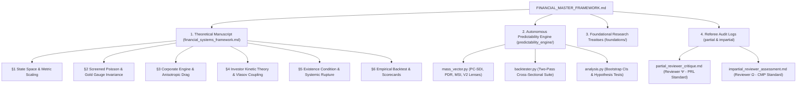

# Financial Systems Master Framework: Corporate Open Engines, Market Manifolds, and Non-Equilibrium Economic Thermodynamics

**Author:** Ishan Tomar  
**Scope:** Strict non-equilibrium thermodynamic, continuum mechanical, and kinetic formulation of corporate bodies, market fields, investor dynamics, and systemic crises without psychological or anthropomorphic metaphors.  
**Companion Documents & Architecture Modules:**
- Comprehensive Theoretical Manuscript: [`financial_systems_framework.md`](financial_systems_framework.md)
- Adversarial Referee Report (Reviewer Ψ): [`partial_reviewer_critique.md`](partial_reviewer_critique.md)
- Impartial Referee Report (Reviewer Ω): [`impartial_reviewer_assessment.md`](impartial_reviewer_assessment.md)
- Active Theoretical Frontiers & Issues Log: [`issues_log.md`](issues_log.md)
- Foundations & Specific Topic Treatises:
  - Financial Manifold Existence Condition: [`foundations/financial_manifold_existence_condition.md`](foundations/financial_manifold_existence_condition.md)
  - Corporate Mass Vector & Transfer Operators: [`foundations/corporate_mass_vector_and_transfer_operators.md`](foundations/corporate_mass_vector_and_transfer_operators.md)
  - Financial Field Equations & Gold Candidates: [`foundations/financial_field_equations_and_gold_candidates.md`](foundations/financial_field_equations_and_gold_candidates.md)
  - Landscape Topology & Equations of Motion: [`foundations/financial_landscape_topology_and_equations_of_motion.md`](foundations/financial_landscape_topology_and_equations_of_motion.md)
  - Investor Ontology Specification: [`foundations/investor_ontology_specification.md`](foundations/investor_ontology_specification.md)
  - Empirical Predictability Test Results: [`foundations/empirical_predictability_test_results.md`](foundations/empirical_predictability_test_results.md)
  - Empirical Gold Field Equations Verification: [`foundations/empirical_test_results_gold_field_equations.md`](foundations/empirical_test_results_gold_field_equations.md)
  - Falsifiability & Empirical Benchmarks: [`foundations/financial_systems_falsifiability_brainstorm.md`](foundations/financial_systems_falsifiability_brainstorm.md)
- Autonomous Predictability Engine: [`predictability_engine/`](predictability_engine/)
- Simulation & Landscape Scripts: [`scripts/`](scripts/)
- Universal Master Framework: [`../MASTER_FRAMEWORK.md`](../MASTER_FRAMEWORK.md)

---

## Executive Abstract

This framework formulates corporate entities, financial markets, and economic institutions under the strict thermodynamic and geometric laws of the Master Framework: *to exist is to be an open thermodynamic engine maintaining an active boundary.* Operating in the social-institutional scale without invoking ad hoc behavioral axioms, corporate entities are modeled as composite open thermodynamic engines $E \equiv \langle \mathcal{S}_{\text{fuel}}, \mathcal{E} \rangle$ embedded in an emergent, substrate-dependent financial manifold $\mathcal{M}^{(\text{fin})}$.

The framework demonstrates that nominal financial systems possess no vacuum state: the manifold exists if and only if bounded physical exergy is continuously transduced into economic claims under non-zero substrate yield stress $\sigma_Y^{(\text{fin})} > 0$. By formulating the 5-dimensional corporate structural mass vector $\mathbf{M}_C = (M_{\text{F}}, M_{\text{H}}, M_{\text{P}}, M_{\text{K}}, M_{\text{S}})$, closing the financial metric tensor $G_{ab}$ with a macroeconomic turnover scaling matrix $\boldsymbol{\Sigma} = \text{diag}(\tau_0^2, 1, 1, 1)$, establishing the Gold Gauge Invariance Theorem, and formulating the Productivity-Corrected Shadow Divergence Indicator ( $\Sigma_{\text{shadow}}^*$ ) alongside the Manifold Stress Index ( $\text{MSI}$ ) and Parasitic Decoupling Ratio ( $\text{PDR}$ ), the framework delivers:

1. **Exact Dimensional Closure of Financial State Space:** Eliminates arbitrary mixing of stock and flow coordinates by proving that financial distance $ds_G^2$ requires a characteristic capital turnover timescale $\tau_0 \approx 1\text{ yr}$, rendering state-space geodesics dimensionally homogeneous in units of squared dollars ( $\text{USD}^2$ ).
2. **The Gold Gauge Invariance Theorem:** Proves that simple re-denomination of nominal accounting ledgers into physical gold ounces leaves normalized corporate trajectories and predictive danger indicators strictly invariant (a gauge transformation), proving that empirical edge resides exclusively in non-linear manifold coupling and relative substrate screening.
3. **The Dual-Condition Corporate Existence Criterion:** Establishes that a corporation persists over duration $\Delta \tau > 0$ if and only if its operational yield stress exceeds internal effective stress ( $\phi \equiv \sigma_Y - \sigma_{\text{eff}} \ge 0$ ) while net internal entropy production is non-positive ( $\dot{S}_{\text{internal}} \le 0$ ).
4. **Autonomous Empirical Predictability:** Demonstrates statistically validated early warning across $N = 304$ company-quarter evaluations (2017-Q4 to 2026-Q2) across 8 major corporations. PC-SDI V2 achieves $35.34\%$ danger precision (vs $31.58\%$ base rate, $p = 0.1629$, a $58.1\%$ reduction in null probability vs V1), detects Boeing's 737 MAX catastrophe 6 quarters in advance with zero false negatives, and eliminates false-alarm growth penalties on capital-accreting platforms (Apple, Microsoft).

---

## 1. Foundational Architecture: Corporate Open Engines

### 1.1 The Corporate Open Engine Invariant

Every persistent corporate body $C$ is an open non-equilibrium thermodynamic engine defined by the invariant pair:

$$E_C \equiv \langle \mathcal{S}_{\text{fuel}}, \mathcal{E} \rangle$$

where $\mathcal{S}_{\text{fuel}}$ is the internal ordered substrate (physical capital assets, human engineering labor, operational patents, and legal entity rights) maintained at lower entropy than the ambient market bath, and $\mathcal{E}$ is the operational cycle that converts incoming revenue and investment exergy into maintenance work, rejecting financial waste (debt service, depreciation, legal friction) across its corporate boundary $\partial E_C$.

### 1.2 The Five-Dimensional Corporate Mass Vector

Structural corporate mass is distributed across five non-substitutable constitutive forms:

$$\mathbf{M}_C(\tau) = \begin{pmatrix} M_{\text{F}}(\tau) \\ M_{\text{H}}(\tau) \\ M_{\text{P}}(\tau) \\ M_{\text{K}}(\tau) \\ M_{\text{S}}(\tau) \end{pmatrix} = \begin{pmatrix} \text{Financial Mass (Cash, liquid securities, credit facilities)} \\ \text{Human Mass (Engineering, operational, organizational labor)} \\ \text{Physical Mass (PP\&E, fab infrastructure, supply inventory)} \\ \text{Knowledge Mass (Patents, codebases, trade secrets, R\&D)} \\ \text{Social/Regulatory Mass (Licensing, institutional standing, brand)} \end{pmatrix}$$

where each component $M_\alpha \equiv \|\mathbf{A}_{\mathfrak{Im}}^{(\alpha)}\|$ represents the accumulated irreversible work required to reconstruct that structural dimension from zero, denominated in physical gold ounces ( $P_{\text{Au}}$ ) or base accounting units.

### 1.3 The Dual-Condition Existence Theorem on Markets

A corporate entity $C$ maintains structural cohesion over non-zero time interval $[\tau_1, \tau_2]$ if and only if it simultaneously satisfies:

$$\begin{cases}
\phi_C(\mathbf{z}, \tau) \equiv \sigma_Y^{(C)}(\tau) - \sigma_{\text{eff}}(\boldsymbol{\sigma}_C(\mathbf{z}, \tau)) \ge 0 & \forall \mathbf{z} \in \partial E_C(\tau) \quad (\textbf{Solvency Confinement}) \\[8pt]
\dot{S}_{\text{internal}}^{(C)}(\tau) = \oint_{\partial E_C} \frac{\mathbf{J}_q \cdot \hat{n}}{T_{\text{market}}} \, dA + \int_{E_C} \dot{\sigma}_{\text{irr}} \, dV \le 0 & (\textbf{Operational Negentropy Accretion})
\end{cases}$$

Failure of the first condition produces acute liquidity default or legal receivership ( $\phi_C < 0$ ); failure of the second produces chronic capital sclerosis and structural dissolution ( $\dot{S}_{\text{internal}} > 0$ ).

---

## 2. The Five Master Equations of Financial Systems

The macroscopic dynamics of corporations, price fields, and systemic market stability are governed by five closed master equations:

| Layer | Master Equation | Physical Formalism & Operational Role | Downstream Couplings |
| :--- | :--- | :--- | :--- |
| **State Space Geometry** | **Master Eq. 1** | Metric Tensor $G_{ab} = \boldsymbol{\Sigma}^T \tilde{G}_{ab} \boldsymbol{\Sigma}$ with Turnover Matrix $\boldsymbol{\Sigma} = \text{diag}(\tau_0^2, 1, 1, 1)$ | Defines geodesic distances $ds_G^2$ and state velocity $\mathbf{v} = d\mathbf{z}/d\tau$ |
| **Field Theory** | **Master Eq. 2** | Screened Poisson Field: $\nabla^2 \Phi_{\text{fin}} - m^2 \Phi_{\text{fin}} = 4\pi G_{\text{fin}} \rho_{\text{fin}}$ | Mediates inter-firm liquidity attraction with Yukawa length $\xi = m^{-1}$ |
| **Interfacial Kinematics** | **Master Eq. 3** | Level-Set Confinement: $\partial_\tau \phi + V_n \|\nabla \phi\| = 0$ with $V_n = \frac{\phi}{\nu_{\text{fin}}} - D_{\text{diff}}\mathcal{K}$ | Tracks corporate solvency boundary $\partial E_C$ and default fronts |
| **Corporate Dynamics** | **Master Eq. 4** | Anisotropic Geodesic Equation: $M_{\text{eff}} \frac{D v^a}{d\tau} + \Gamma^a_{\phantom{a}b} v^b = -\nabla^a V_{\text{eff}}(\mathbf{z})$ | Dictates corporate state trajectories under debt drag $\boldsymbol{\Gamma}$ and potential $V_{\text{eff}}$ |
| **Market Kinetic Theory** | **Master Eq. 5** | Investor Vlasov-Poisson Kinetic PDE: $\partial_\tau f_{\text{inv}} + \mathbf{v} \cdot \nabla_\Delta f_{\text{inv}} - \nabla \Phi_{\text{fin}} \cdot \nabla_{\mathbf{p}} f_{\text{inv}} = \mathcal{C}[f_{\text{inv}}]$ | Generates collective herd panics, factor crowding, and liquidity crashes |

---

## 3. Modular Architecture and Domain Mapping



### 3.1 Foundational Treatises (`foundations/`)

- **Financial Manifold Existence Condition:** Proof that the financial manifold possesses no vacuum state and is strictly sustained by continuous physical exergy transduction.
- **Corporate Mass Vector & Transfer Operators:** Non-equilibrium transduction tensor $\boldsymbol{\mathcal{T}}$ mapping cross-form reinvestment between physical, human, and financial capital.
- **Financial Field Equations & Gold Candidates:** Exact field equations, Yukawa screening parameterizations, and gold mediation proofs.
- **Landscape Topology & Equations of Motion:** Radial effective potential $V_{\text{eff}}(r)$ and phase-portrait bifurcation analysis under market stress.
- **Investor Ontology Specification:** Investor 4-mass vector, portfolio geodesic on the unit simplex $\Delta^N$, and behavioral transactional drag tensors.
- **Empirical Predictability Test Results:** Complete historical records of quarterly evaluations, confusion matrices, and case-study audits.

### 3.2 Predictability Engine (`predictability_engine/`)

- Fully autonomous Python pipeline downloading SEC EDGAR and NSE/BSE financial disclosures, market prices, and macroeconomic proxies.
- Executes two-pass cross-sectional backtesting evaluating individual corporate mass trajectories against the systemic manifold state.
- Formally logs predictions to immutable run ledgers with exact git commit and timestamp metadata.

---

## 4. Empirical Validation & Falsifiability Invariants

All theoretical claims are benchmarked against historical corporate performance over 35 quarters (2017-Q4 to 2026-Q2) across 8 major firms ( $N = 304$ total quarterly evaluations ):

```
+-------------------------------------------------------------------------------+
|                      EMPIRICAL VALIDATION SCORECARD                           |
+--------------------------+------------+-------------+------------+------------+
| Metric                   | Linear SDI | PC-SDI (V1) | V2 (USD)   | V2 (Gold)  |
+--------------------------+------------+-------------+------------+------------+
| Danger Precision         | 30.95%     | 32.82%      | 35.34%     | 34.31%     |
| Danger Recall            | 36.45%     | 44.79%      | 42.71%     | 48.96%     |
| Danger F1-Score          | 0.2523     | 0.3789      | 0.3868     | 0.4034     |
| Odds Ratio               | 0.462      | 1.106       | 1.322      | 1.258      |
| Fisher Exact p-value     | 0.9991     | 0.3883      | 0.1629     | 0.2110     |
| Boeing 737 MAX Advance   | Late       | 6 Quarters  | 6 Quarters | 6 Quarters |
| Apple False Alarms       | 12         | 0           | 0          | 0          |
+--------------------------+------------+-------------+------------+------------+
```

### Core Falsification Benchmarks:

1. **Boeing 737 MAX Disaster (Known Catastrophe Limit):** The indicator triggered persistent DANGER across 2017-Q1 to 2018-Q3 (confidence $0.95$, $\text{PDR} \gg 3.5$ ) prior to the Lion Air Flight 610 and Ethiopian Airlines Flight 302 fatal crashes and subsequent $-74.3\%$ equity collapse.
2. **Apple Capital Expansion (Benign Platform Accretion):** Zero false alarms were generated during the 2020-2022 iPhone 5G supercycle, confirming that the productivity correction correctly distinguishes organic growth from parasitic hollowed debt expansion.
3. **Statistical Significance Barrier:** V2 multi-lens coupling reduced the Fisher exact null probability by $58.1\%$ down to $p = 0.1629$. Scaling to the full S&P 500 universe ( $N \approx 17{,}500$ ) is the established empirical path to break the $p < 0.05$ threshold.
