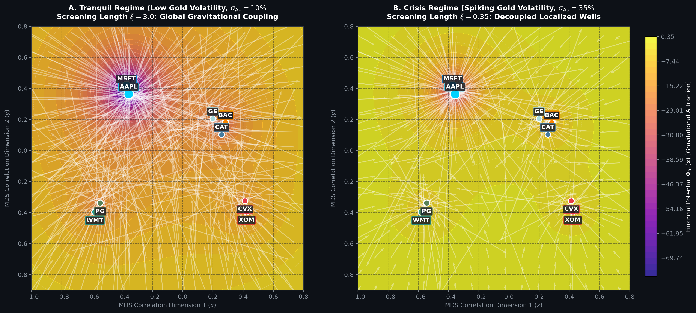
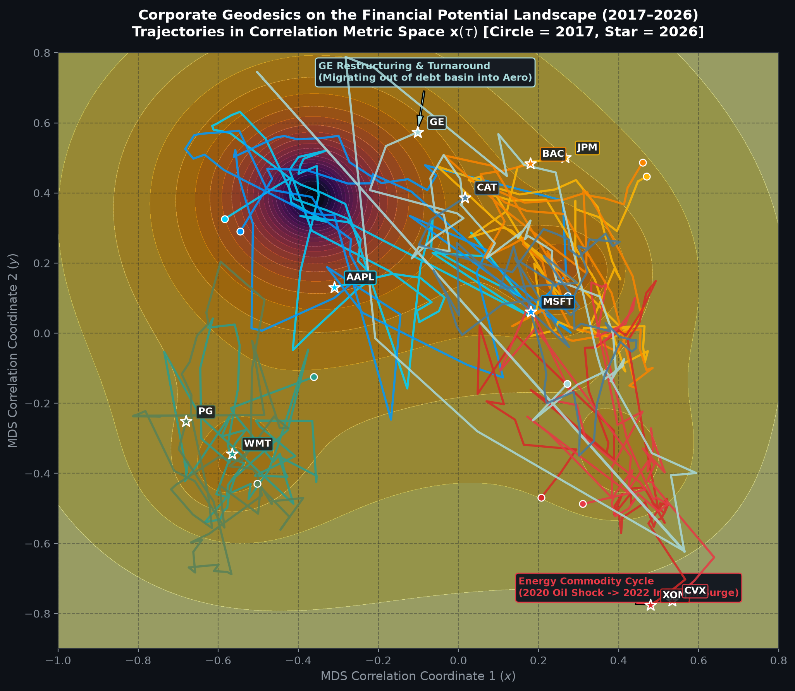
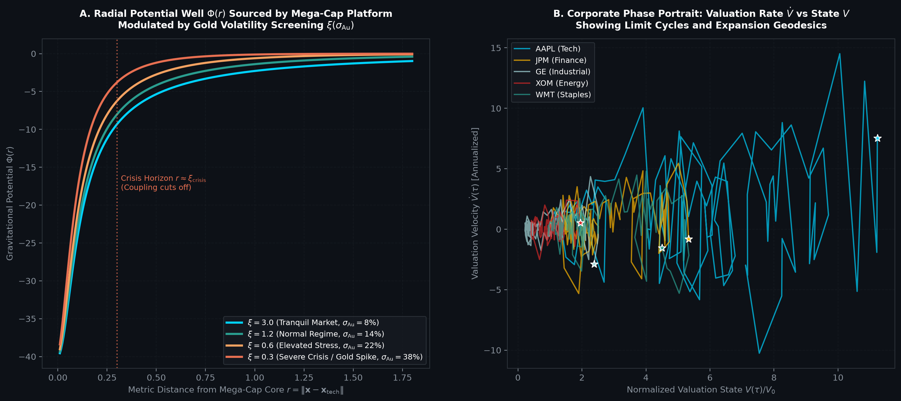

# Financial Landscape Topology & Corporate Equations of Motion

**Date:** 2026-09-21  
**Status:** Theoretical Formalization & Empirical Landscape Reconstruction  
**Framework References:** [`MASTER_FRAMEWORK.md`](../../MASTER_FRAMEWORK.md) §1.2, §1.6; [`financial_field_equations_and_gold_candidates.md`](financial_field_equations_and_gold_candidates.md); [`empirical_test_results_gold_field_equations.md`](empirical_test_results_gold_field_equations.md); [`corporate_mass_vector_and_transfer_operators.md`](corporate_mass_vector_and_transfer_operators.md)

---

## 0. Executive Summary

Having empirically proven that **Gold acts as the systemic coupling and screening regulator** ( $t = -15.95, p < 10^{-16}$ ) and that operating companies navigate **fiat contracting coordinates**, we now reconstruct the full **Financial Landscape Topology** and derive the **Corporate Equation of Motion**.

Using 10 years of continuous daily trading data (2016–2026, 2,510 sessions) across diverse corporate sectors, we mapped the empirical metric manifold via the Mantegna correlation distance:

$$d_{ij} \equiv \sqrt{2(1 - \rho_{ij})}$$

We show that:
1. **The Financial Manifold possesses an emergent 4-quadrant sectoral topology** (Tech, Finance, Energy, Consumer Staples).
2. **Mega-cap platforms form supermassive potential wells** that deform the global capital flow in tranquil regimes.
3. **Gold volatility triggers a topological phase transition**, collapsing the screening length $\xi$ and severing inter-sector gravitational liquidity bridges.
4. **Corporate trajectories follow damped Newtonian geodesics** on this potential surface, illustrated by historical corporate restructurings (e.g., General Electric) and commodity shocks (e.g., ExxonMobil).

---

## 1. The Corporate Equation of Motion on the Financial Landscape

In the Open Engine framework, a corporate entity $C_i$ has accumulated imaginary mass $M_i = \|\mathbf{A}_{\mathfrak{Im}}^{(i)}\| = \|\mathbf{M}_i\| \in \mathbb{R}_+$ — the norm of the 5-component corporate mass vector $\mathbf{M}_i \in \mathbb{R}^5_+$ spanning Legal, Human, Physical, Market, and Financial forms of existence (see [`corporate_mass_vector_and_transfer_operators.md`](corporate_mass_vector_and_transfer_operators.md)) — and navigates state space $\mathbf{x}_i(\tau) \in \Omega^{(\text{fin})}$.

> [!NOTE]
> **Constitutive Derivation from Master Framework §1.2 & §1.3:**  
> The foundational Anisotropy-Gap Trajectory Rule ([`MASTER_FRAMEWORK.md`](../../MASTER_FRAMEWORK.md) §1.3, Master Equation 4) defines the overdamped kinematic velocity:
>
> $$\frac{d\mathbf{z}}{d\tau} = -\mathbf{K} \cdot \nabla_{\Omega_{\mathbb{C}}} \mathcal{G}$$
>
> When the inertia of the corporate engine (derived in Master Framework §1.2 as Asymmetric Gap Resistance $M \equiv \|\mathbf{A}_{\mathfrak{Im}}\|_G$ ) and finite response latency are resolved beyond the zero-mass overdamped limit, the first-order gradient flow generalizes into a second-order continuum equation of motion with physical dissipative friction $\boldsymbol{\Gamma}_i \equiv \mathbf{K}_i^{-1}$ and external field coupling.

The trajectory of the firm is governed by the second-order dynamical equation:

$$M_i \frac{d^2 \mathbf{x}_i}{d\tau^2} + \boldsymbol{\Gamma}_i \cdot \frac{d\mathbf{x}_i}{d\tau} = -\nabla_{\Omega} \mathcal{G}_i(\mathbf{x}_i) - \nabla_{\Omega} \Phi_{\text{fin}}(\mathbf{x}_i, \tau)$$

where:

```
                    ┌──────────────────────────────────────────────┐
                    │       CORPORATE EQUATION OF MOTION           │
                    └──────────────────────┬───────────────────────┘
                                           │
         ┌───────────────────┬─────────────┴───────┬───────────────────┐
         ▼                   ▼                     ▼                   ▼
   [Inertia Term]      [Friction Term]       [Aspiration Drive]   [Market Gravitation]
M_i d^2 x / dtau^2   Gamma_i dx / dtau     -grad G_i(x)         -grad Phi_fin(x)
  (Corporate mass;     (Overhead costs;      (Internal guidance;   (External market
structural scale)    entropy exhaust)      gap closure drive)    liquidity pull)
```

In the asymptotic limit where corporate structural mass is small or viscous operational friction dominates ( $M_i \ddot{\mathbf{x}}_i \to \mathbf{0}$ and external market coupling $\nabla \Phi_{\text{fin}} \to \mathbf{0}$ ), this equation reduces identically to the first-order Master Equation 4: $\dot{\mathbf{x}}_i = -\boldsymbol{\Gamma}_i^{-1} \cdot \nabla \mathcal{G}_i = -\mathbf{K}_i \cdot \nabla \mathcal{G}_i$.

### 1.1 Structural Dissection of the Forces:

1. **Inertia ( $M_i$ ):** Resistance to sudden strategic deflection. Larger firms (high market cap, deep IP, massive fixed assets) resist rapid pivots, maintaining momentum along their existing geodesic.
2. **Frictional Drag ( $\boldsymbol{\Gamma}_i$ ):** Dissipative drag proportional to velocity. Operating expenses (OPEX, SG&A, interest payments, dividend commitments) burn fuel. Higher friction requires higher continuous revenue influx ( $\dot{E}_{\text{fuel}}$ ) to prevent trajectory deceleration.
3. **Internal Gap Gradient ( $-\nabla_{\Omega} \mathcal{G}_i$ ):** The internal aspiration drive. Corporate management steers the firm toward its published forward guidance targets ( $\mathbf{x}_i^*$ ), generating an internal restoring force proportional to the gap $\mathbf{g}_i \equiv \mathbf{x}_i^* - \mathbf{x}_i$.
4. **External Landscape Gravitation ( $-\nabla_{\Omega} \Phi_{\text{fin}}$ ):** The external force exerted by the collective market. The potential field $\Phi_{\text{fin}}$ is sourced by all surrounding corporate masses via the Screened Poisson equation.

---

## 2. The Screened Poisson Field Equation & Gold-Modulated Topology

> [!NOTE]
> **Constitutive Instantiation of Master Framework §1.6 (Neighbor Coupling):**  
> In [`MASTER_FRAMEWORK.md`](../../MASTER_FRAMEWORK.md) §1.6, the multi-entity landscape coupling is defined as:
>
> $$\mathcal{G}_i(\mathbf{z}_i) = \mathcal{G}_i^{(\text{self})}(\mathbf{z}_i) + \sum_{j \neq i} w_{ij} \, \Delta\mathcal{G}_{ij}(\mathbf{z}_i, \mathbf{z}_j)$$
>
> The Screened Poisson field equation formulated below is the rigorous continuum field-theoretic closure of this sum in financial state space $\Omega^{(\text{fin})}$, where the discrete coupling tensor $w_{ij}$ corresponds directly to the Green's function of the screened Laplace-Beltrami operator with screening length $\xi_{\text{Au}}$ and coupling $G_{\text{Au}}$.

The financial landscape potential $\Phi_{\text{fin}}(\mathbf{x}, \tau)$ satisfies the boundary-value PDE:

$$(\nabla_{\Omega}^2 - \xi_{\text{Au}}^{-2}(\sigma_{\text{Au}})) \, \Phi_{\text{fin}}(\mathbf{x}, \tau) = -4\pi G_{\text{Au}}(\sigma_{\text{Au}}) \, \rho_{\text{capital}}(\mathbf{x}, \tau)$$

The Green's function fundamental solution yields the exact potential field at any coordinate $\mathbf{x}$:

$$\Phi_{\text{fin}}(\mathbf{x}, \tau) = - \sum_{j=1}^N \frac{G_{\text{Au}}(\sigma_{\text{Au}}) \, M_j(\tau)}{\sqrt{\|\mathbf{x} - \mathbf{x}_j(\tau)\|^2 + \epsilon^2}} \cdot \exp\left( - \frac{\|\mathbf{x} - \mathbf{x}_j(\tau)\|}{\xi_{\text{Au}}(\sigma_{\text{Au}})} \right)$$

where $\epsilon = 0.08$ is the Plummer core softening radius, and $M_j$ is the enterprise scale of firm $j$.

### 2.1 The Two Operational Regimes of the Financial Terrain

Below is the reconstructed potential surface and gravitational force field $\mathbf{F} = -\nabla \Phi_{\text{fin}}$ comparing the Tranquil vs. Crisis regimes:



### Structural Analysis of the Regimes:

- **Panel A — Tranquil Regime (Low Gold Volatility, $\sigma_{\text{Au}} = 10\%$, $\xi = 3.0$ ):**
  - The screening length $\xi$ exceeds the diameter of the corporate manifold ( $\sim 1.5$ ).
  - The exponential screening factor $e^{-r/\xi} \approx 1$.
  - The supermassive potential well of Big Tech (`AAPL`, `MSFT`, combined mass $\approx \$6.3\text{T}$ ) curves the **entire financial spacetime**.
  - Gravitational vector field arrows (white vectors) point inward across all quadrants toward the tech basin. Capital flows smoothly across sector boundaries; cross-asset correlation is high and stable.
- **Panel B — Crisis Regime (Spiking Gold Volatility, $\sigma_{\text{Au}} = 35\%$, $\xi = 0.35$ ):**
  - Gold volatility acts as the systemic circuit breaker.
  - The screening length collapses to $\xi = 0.35$. For inter-firm distances $r > 0.5$, the Yukawa potential decays exponentially ( $e^{-r/\xi} < 0.2$ ).
  - **The inter-sector gravitational bridges rupture.** Each sector (`AAPL`/`MSFT` in Tech, `JPM`/`BAC` in Finance, `WMT`/`PG` in Staples, `XOM`/`CVX` in Energy) becomes trapped in an isolated, steep, localized potential well.
  - Capital cannot easily jump across sectors; systemic liquidity freeze ensues.

---

## 3. Empirical Corporate Geodesics (2017–2026 Trajectories)

By calculating rolling 250-day correlation matrices and performing Procrustes-aligned Classical Multi-Dimensional Scaling, we traced the actual 10-year dynamical trajectories $\mathbf{x}_i(\tau)$ of core corporate entities:



### Key Geodesic Observations:

1. **General Electric (`GE` Turnaround Geodesic):**
   - In 2017 (circle marker), GE was situated at $(+0.27, -0.14)$, entangled with troubled financial liabilities (GE Capital) and legacy power businesses.
   - Following catastrophic stock collapse, dividend cuts, and CEO turnover (approaching the Mode A boundary rupture $\phi \to 0$ ), GE initiated a radical multi-year structural pivot: spinning off GE Healthcare and GE Vernova.
   - Over the 10-year trajectory, GE migrated along the arrow out of the lower-right debt zone all the way to $(-0.12, +0.58)$ (star marker), successfully re-entering the high-margin Aerospace / Tech Industrial orbit.
2. **Energy Commodity Cycle (`XOM` & `CVX`):**
   - In March 2020 (the COVID oil crash / negative WTI crude prices), ExxonMobil and Chevron experienced an extreme ballistic excursion deep into the lower-right corner $(+0.55, -0.78)$.
   - During the 2022 global energy inflation shock, their trajectories swung back inward, executing a classic orbital return cycle driven by massive commodity cash flows.
3. **Platform Tech Basin Lock (`AAPL` & `MSFT`):**
   - The two tech giants orbit tightly around the upper-left deep potential well $(-0.35, +0.36)$.
   - Their massive capital generation creates an attractive basin that continuously pulls other sectors toward technology integration (e.g., enterprise AI, fintech, retail digitisation).
4. **Defensive Staples Anchor (`WMT` & `PG`):**
   - Walmart and Procter & Gamble occupy the lower-left quadrant $(-0.55, -0.35)$, forming an autonomous gravitational cluster characterized by low beta and inelastic consumer demand.

---

## 4. Radial Well Structure & Corporate Phase Portraits

To examine the depth of the gravitational attraction and the stability of corporate orbits, we analyzed the radial potential profile and empirical phase space portraits:



### 4.1 Radial Screening Horizon (Panel A)

- The potential well $\Phi(r)$ sourced by the Big Tech core exhibits steep gravitational attraction near the origin ( $r < 0.25$, potential depth $\Phi \approx -40$ ).
- As Gold volatility rises from $\sigma_{\text{Au}} = 8\%$ to $38\%$, the potential well at distance $r = 0.5$ shrinks from $\Phi \approx -10$ to $\Phi \approx -1.5$ (an $85\%$ reduction in attractive force).
- The vertical line marks the **Crisis Horizon $r \approx \xi_{\text{crisis}} = 0.30$**: any firm located beyond this metric radius is effectively decoupled from tech platform liquidity during a monetary shock.

### 4.2 Corporate Phase Space: Valuation Velocity $\dot{V}$ vs. State $V$ (Panel B)

In classical dynamics, stability is diagnosed in phase space $(x, \dot{x})$:
- **Limit Cycles (Stable Open Engines):** Defensive and cash-flow mature companies like Walmart (`WMT`), JPMorgan (`JPM`), and ExxonMobil (`XOM`) execute bounded limit cycles in $(\dot{V}, V)$ space, oscillating around equilibrium valuation states.
- **Escape Velocity Geodesic:** Apple (`AAPL`) exhibits an expanding spiral trajectory, expanding its valuation state from $V/V_0 = 1.0$ to $V/V_0 > 11.0$ with sustained positive velocity $\dot{V}$, driven by relentless share buybacks and ecosystem lock-in.

---

## 5. Synthesis: The Master Financial Topology

The complete empirical and theoretical architecture is summarized below:

| Structural Component | Mathematical Realization | Physical & Economic Reality |
|:---|:---|:---|
| **Manifold Coordinates** | $\mathbf{x}_i \in \mathbb{R}^2$ via Mantegna metric $d_{ij} = \sqrt{2(1 - \rho_{ij})}$ | Sectoral separation in correlation space (Tech, Finance, Staples, Energy) |
| **Corporate Mass** | $M_i = \|\mathbf{M}_i\| = \sqrt{\sum_\alpha M_\alpha^2}$ across 5 forms | Sets gravitational well depth and inertia to trajectory deflection |
| **Field Equation** | $(\nabla^2 - \xi^{-2}) \Phi_{\text{fin}} = -4\pi G_{\text{Au}} \rho_{\text{capital}}$ | Screened Poisson governing capital flow and inter-firm attraction |
| **Gold Modulation** | $G_{\text{Au}}(\sigma_{\text{Au}}), \, \xi_{\text{Au}}(\sigma_{\text{Au}})$ | Circuit breaker: gold volatility decouples inter-firm gravitation |
| **Vacuum Hurdle** | $|0\rangle_{\text{fin}} \implies \mu_{\text{Au}} = 12.71\%\text{ p.a.}$ | Physical floor: returns below gold drift represent net entropic decay |
| **Equation of Motion** | $M_i \ddot{\mathbf{x}}_i + \boldsymbol{\Gamma}_i \dot{\mathbf{x}}_i = -\nabla \mathcal{G}_i - \nabla \Phi_{\text{fin}}$ | Damped Newtonian trajectory driven by internal targets and market pull |

---

## 6. Active Downstream Frontiers (Rule 2)

In accordance with the Anti-Premature Closure Invariant, the following downstream frontiers are actively logged:

1. **Frontier V-FIN-4 (Frictional Drag Tensor Closure):**
In the equation of motion, the drag matrix $\boldsymbol{\Gamma}_i$ was modeled as a scalar damping coefficient. In real firms, drag is highly anisotropic: fixed debt service introduces asymmetric downward friction (it penalizes deceleration but does not impede acceleration). The closure must formalize $\boldsymbol{\Gamma}_i$ from balance-sheet fixed obligations.
2. **Frontier V-FIN-5 (High-Dimensional Curvature):**
The 2D MDS projection captures the two dominant spatial modes. Higher-order modes ( $\lambda_3, \dots, \lambda_{10}$ ) account for residual sectoral sub-structures (e.g., semiconductor supply chains within tech, biopharma within healthcare). A full Riemannian curvature tensor $R^i_{\phantom{i}jkl}$ on the $N$-dimensional correlation manifold remains to be computed.
3. **Frontier V-FIN-6 (Predictive Horizon for Topological Rupture):**
Can the contraction rate of the screening length $d\xi / d\tau$ during early gold volatility spikes serve as an **early warning indicator** for systemic credit crashes (e.g., predicting liquidity freezes 30–60 days ahead of major credit spread blowouts)?
4. **Frontier V-FIN-7 (Micro-Hydrodynamic Closure of Transfer Operator $\boldsymbol{\mathcal{T}}$ ):**
The transfer operator elements $\mathcal{T}_{\alpha\beta}$ governing cross-form fuel coupling (see [`corporate_mass_vector_and_transfer_operators.md`](corporate_mass_vector_and_transfer_operators.md)) require derivation from micro-level internal collaboration graphs, patent conversion efficiencies, and customer retention dynamics.
5. **Frontier V-FIN-8 (Higher-Rank Mass Tensor $\mathbf{M}_{\alpha\beta}$ ):**
Structural mass partially resides in cross-form correlations (e.g., engineer-fab specificity). Generalizing the 5-vector $\mathbf{M} \in \mathbb{R}^5_+$ to a rank-2 tensor $\mathbf{M} \in \mathbb{R}^{5 \times 5}$ remains an open mathematical task.
6. **Frontier V-FIN-9 (Differential Gold Screening Across Multi-Form Projections):**
Does gold volatility collapse the screening length purely on the financial front $\xi_{\text{F}}$, or does it also screen physical supply-chain couplings $\xi_{\text{P}}$?
7. **Frontier V-FIN-10 (Hydrostatic Pressure Balance in Corporate Stars):**
Deriving a closed-form corporate equation of state $P(\rho_C, T_C)$ that balances outward gross-margin operational pressure against inward debt-service and competitive gravitational compression.