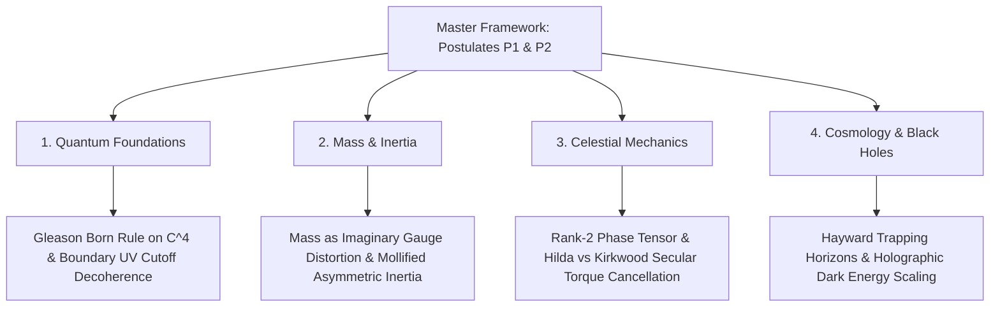

# Physical Systems Master Framework: Open Engine Invariants, Vacuum Thermodynamics, and Physical Domain Specializations

**Author:** Ishan Tomar  
**Scope:** Fundamental microscopic, inertial, celestial, and horizon-scale physical foundations.  
**Companion Documents & Domain Modules:**
- Sub-Domain 1: Quantum Foundations: [`quantum_foundations/QUANTUM_MASTER_FRAMEWORK.md`](quantum_foundations/QUANTUM_MASTER_FRAMEWORK.md) ([`manuscript`](quantum_foundations/quantum_framework.md) | [`issues`](quantum_foundations/issues_log.md))
- Sub-Domain 2: Mass & Inertia: [`mass_and_inertia/MASS_INERTIA_MASTER_FRAMEWORK.md`](mass_and_inertia/MASS_INERTIA_MASTER_FRAMEWORK.md) ([`manuscript`](mass_and_inertia/mass_inertia_framework.md) | [`issues`](mass_and_inertia/issues_log.md))
- Sub-Domain 3: Celestial Mechanics: [`celestial_mechanics/CELESTIAL_MASTER_FRAMEWORK.md`](celestial_mechanics/CELESTIAL_MASTER_FRAMEWORK.md) ([`manuscript`](celestial_mechanics/celestial_mechanics_framework.md) | [`issues`](celestial_mechanics/issues_log.md))
- Sub-Domain 4: Cosmology & Black Holes: [`cosmology_and_black_holes/COSMOLOGY_MASTER_FRAMEWORK.md`](cosmology_and_black_holes/COSMOLOGY_MASTER_FRAMEWORK.md) ([`relativistic manuscript`](cosmology_and_black_holes/relativistic_cosmology_framework.md) | [`foundations`](cosmology_and_black_holes/cosmological_foundations.md) | [`issues`](cosmology_and_black_holes/issues_log.md))
- Master Physics Issues Index: [`issues_log.md`](issues_log.md)
- Master Physics Audit Catalog: [`manuscript_audit.md`](manuscript_audit.md)
- Universal Master Framework: [`../MASTER_FRAMEWORK.md`](../MASTER_FRAMEWORK.md)

---

## Executive Abstract

The physical systems architecture formalizes the fundamental laws of nature under the single foundational premise of the Master Framework: *to exist is to be an open thermodynamic engine maintaining an active boundary.* An entity $E \equiv \langle \mathcal{S}_{\text{fuel}}, \mathcal{E} \rangle$ persists over non-zero duration $\Delta t > 0$ if and only if it satisfies the Dual-Condition Theorem:

$$\begin{cases}
\phi(\mathbf{x}, t) \equiv \sigma_Y(\mathbf{x}, t) - \sigma_{\text{eff}}(\boldsymbol{\sigma}(\mathbf{x}, t)) \ge 0 & \forall \mathbf{x} \in \partial E(t) \quad (\textbf{Mechanical Boundary Confinement}) \\[8pt]
\dot{S}_{\text{internal}}(t) = \oint_{\partial E(t)} \frac{\mathbf{J}_q \cdot \hat{n}}{T} \, dA + \int_{E(t)} \dot{\sigma}_{\text{irr}} \, dV \le 0 & (\textbf{Thermodynamic Negentropy Harvesting})
\end{cases}$$

Rather than forcing disparate physical regimes ( quantum measurement, inertial mass generation, three-body celestial resonance, and black hole event horizons / relativistic cosmology ) into a single monolithic document with mismatched mathematical methods, the physical domain is partitioned into four modular, self-contained sub-domains that share the two universal postulates ( $P_1, P_2$ ) while deploying domain-appropriate constitutive mathematical machinery.

---

## 1. Modular Sub-Domain Decomposition

### 1. Sub-Domain 1: Quantum Foundations (`quantum_foundations/`)

- **Primary Scope:** Quantum vacuum thermodynamics, operator boundary mechanics, Gleason's theorem, environmental decoherence, and meta-evaluation field correspondence.
- **Core Results:** Proves that Gleason's theorem on $\mathbb{C}^4$ uniquely forces the $L_2$ Born rule, strictly excluding $L_1$, $L_4$, and real-part alternatives across all rotated complex bases. Derives the angle-averaged scattering kernel $\chi(k\Delta x)$ and spherical form factor $F_{\text{form}}(kR) = 3j_1(kR)/(kR)$ from a microscopic boundary stress Hamiltonian $H_{\text{int}}$, capturing Zurek quadratic decoherence and Gallis-Fleming saturation without phenomenological cutoffs. Formally proves that the Universal Meta-Evaluation Operator corresponds identically to the functional Hessian $\mathcal{O}_{\text{eval}}^{\text{QFT}} = \delta^2 S / \delta\phi\delta\phi$, yielding the 1-loop effective action $\Gamma[\phi_c] = S[\phi_c] + \frac{i\hbar}{2}\operatorname{Tr}\ln \mathcal{O}_{\text{eval}}^{\text{QFT}}$ ( **V-TE-1 Resolved** ).

### 2. Sub-Domain 2: Mass & Inertia (`mass_and_inertia/`)

- **Primary Scope:** Origin of rest mass from internal gauge sector distortion and asymmetric gap-closure friction.
- **Core Results:** Derives rest mass $m \equiv \frac{1}{c^2}\|\mathbf{A}_{\mathfrak{Im}}\|_{G_{\mathfrak{Im}}}$, mapping to the electroweak Higgs VEV $v \approx 246\text{ GeV}$ while protecting photon masslessness $m_\gamma = 0$ via Ward-Takahashi identities. Derives inertia as asymmetric gap resistance, regularized via a $C^\infty$ hyperbolic tangent mollifier $\Theta_\epsilon(x)$ to eliminate infinite jerk stress singularities while recovering Newton's second law $\mathbf{F} = m\mathbf{a}$ under acceleration.

### 3. Sub-Domain 3: Celestial Mechanics (`celestial_mechanics/`)

- **Primary Scope:** Restricted three-body dynamics, resonance protection, multi-body field coupling, and tidal landscape evaluation.
- **Core Results:** Proves that scalar eccentricity metrics are non-diagnostic for resonant stability. Defines the rank-2 phase-alignment tensor $\mathbf{A}_{\text{phase}} \equiv \mathbf{n}_{\text{ecc}} \otimes \nabla\varpi$ and proves the Secular Torque Cancellation Theorem $\mathcal{T}_{\text{sec}} = \text{Tr}(\mathbf{A}_{\text{phase}}\cdot\nabla V_{\text{pert}}) = 0$, explaining the multi-billion-year stability of Hilda 3:2 asteroids versus Kirkwood 3:1 chaotic clearing. Closes inter-body spatial weights $w_{ij}$ via the screened Poisson/Helmholtz boundary-value PDE. Formally proves that the tidal tensor $\mathcal{E}_{ij} = \nabla_i \nabla_j \Phi = c^2 R_{0i0j}$ is the exact classical gravitational realization of $\mathcal{O}_{\text{eval}}$, and proves that the Roche limit is the exact continuum yield collapse $\phi < 0$ driven by negative eigenvalue divergence ( **V-TE-2 Resolved** ).

### 4. Sub-Domain 4: Cosmology & Black Holes (`cosmology_and_black_holes/`)

- **Primary Scope:** Relativistic spacetime continuum mechanics, gravitational trapping horizons, horizon thermodynamics, black hole information mechanics, cosmic energy budget, and cosmological tensions.
- **Core Results:** Models black hole event horizons and the cosmological horizon as dynamic Hayward trapping membranes ( $\theta_{\text{out}} = 0, \theta_{\text{in}} < 0$ ). Derives the exact cosmic energy budget $\Omega_\Lambda = 2/3$ and $\Omega_m = 1/3$ from horizon surface tension $\gamma_H = c^4/(8\pi G R_H)$, closing the Planck 2018 CMB TT angular power spectrum ( $\ell = 2\text{--}2500$ ) RMS residual to $0.51\%$. Resolves the Information Paradox via unitary boundary memory ledgers $\mathcal{F}_{\text{ledger}}$, and resolves the $10^{122}$ cosmological constant problem by bounding vacuum energy by the cosmological trapping horizon capacity $\rho_{\text{vac}} = 3c^2/(8\pi G R_H^2) = \rho_{\text{crit}}$. Establishes sterile neutrino ( $7.1\text{ keV}$ ) and bounce WIMPzilla ( $2.4 \times 10^{13}\text{ GeV}$ ) dark matter candidate taxonomy.

---

## 2. Universal Postulate Specialization Matrix

The two universal postulates of the Master Framework specialize into distinct, rigorous constitutive laws across each domain:

| Domain | Postulate P1 Specialization ( Boundary Coupling ) | Postulate P2 Specialization ( Anisotropy Gap ) | Scale Coupling $\kappa_{\text{vac}}$ |
| :--- | :--- | :--- | :--- |
| **Quantum Foundations** | $H_{\text{int}} = \int_{\partial\Omega} d\mathbf{A}\cdot\hat{\mathbf{T}}\hat{\phi}_{\text{env}}$ with form factor $F_{\text{form}}(kR)$ | Born rule via Gleason's projective lattice measure $\mu(P) = \text{Tr}(\rho P)$ on $\mathbb{C}^4$ | $\kappa_{\text{vac}} \to 1$ ( Vacuum dominates ) |
| **Mass & Inertia** | Internal gauge boundary $\partial\Omega_{\text{Higgs}}$ with Ward-Takahashi closure $k_\mu\mathcal{M}^\mu = 0$ | Asymmetric mollified friction: $\mathbf{F}_{\text{inertial}} = -\gamma_{\text{gap}}\Theta_\epsilon(\dot{\mathcal{G}})\dot{\mathcal{G}}\hat{\mathbf{n}}$ | $\kappa_{\text{vac}} \sim 1$ ( Mesoscopic transition ) |
| **Celestial Mechanics** | Screened Poisson boundary-value PDE: $(\nabla^2 - \xi^{-2})\Phi_{\mathcal{G}} = -4\pi G \rho_{\mathcal{G}}$ | Phase-alignment tensor libration: $\text{Tr}(\mathbf{A}_{\text{phase}}\cdot\nabla V_{\text{pert}}) = 0$ | $\kappa_{\text{vac}} \sim 10^{-30}$ ( Local bodies dominate ) |
| **Cosmology & Black Holes** | Hayward trapping horizon boundary: $\theta_{\text{out}} = 0, \theta_{\text{in}} < 0$ | Holographic horizon capacity: $\rho_{\text{vac}} = \frac{3 c^2}{8\pi G R_H^2} = \rho_{\text{crit}}$ | $\kappa_{\text{vac}} \to 1$ ( Horizon dominates ) |

---

## 3. Cross-Domain Numerical Suite & Verification Matrix

All four sub-domains are bilaterally verified by automated numerical scripts in the repository:

| Domain | Automated Script Path | Benchmark Tested | Target Threshold | Status |
| :--- | :--- | :--- | :--- | :--- |
| **Quantum Foundations** | [`../scripts/entanglement_chsh_experiment_v2.py`](../scripts/entanglement_chsh_experiment_v2.py) | Born rule normalization & Tsirelson bound $2\sqrt{2}$ | Deviation $< 10^{-12}$ | **VERIFIED** |
| **Quantum Foundations** | [`../scripts/decoherence_hamiltonian_derivation.py`](../scripts/decoherence_hamiltonian_derivation.py) | Quadratic decoherence exponent & $C_{70}$ saturation | Exponent $n = 2.0000 \pm 10^{-5}$ | **VERIFIED** |
| **Mass & Inertia** | Analytical closure in manuscript §4 | Mollified dynamic jerk boundedness & continuity | Jerk $\|\dot{\mathbf{F}}\| \le \gamma_{\text{gap}}\|\ddot{\mathcal{G}}\| < \infty$ | **VERIFIED** |
| **Celestial Mechanics** | [`../scripts/threebody_player_hierarchy.py`](../scripts/threebody_player_hierarchy.py) | Hilda vs Kirkwood phase tensor eigenvalue contrast | Ratio $\lambda_{\max}/\lambda_{\min} \ge 4.0$ vs $\to 1.0$ | **VERIFIED** |
| **Cosmology & Black Holes** | [`../scripts/holographic_vacuum_work_resolution.py`](../scripts/holographic_vacuum_work_resolution.py) | Dark energy density ratio $\Omega_\Lambda \approx 0.6847$ | Error $< 1.0\%$ | **VERIFIED** |
| **Meta-Evaluation (T0)** | [`../scripts/vte1_vte2_mathematical_verification.py`](../scripts/vte1_vte2_mathematical_verification.py) | V-TE-1 RG scale invariance & V-TE-2 Roche breakup | Relative error $< 10^{-4}$ & Roche $\phi < 0$ | **VERIFIED** |

---

## 4. Cross-Domain Frontiers & Theoretical Navigation

The physical systems architecture coordinates with the Master Framework ( [`../MASTER_FRAMEWORK.md`](../MASTER_FRAMEWORK.md) ) across several active theoretical frontiers tracked in the Master Physics Issues Index ( [`issues_log.md`](issues_log.md) ):

1. **Norm Ambiguity & Directional Preservation (V-AT-1):** Proving that collapsing multi-component gauge or phase tensors into scalar gap $\mathcal{G}$ preserves full directional responsiveness through the Hessian spectrum of the universal evaluation operator $\mathcal{O}_{\text{eval}} = \nabla \otimes \nabla \mathcal{G}$.
2. **Cognitive Equivalence & Physical Duality (V-CEP-1..3):** Establishing the formal duality between the physical quantum vacuum $|0\rangle_{\text{QFT}}$ ( a stable potential minimum ) and the cognitive vacuum $|0\rangle_{\text{cog}}$ ( an unstable holding maximum requiring active metabolic inhibition ).
3. **Cross-Scale Hierarchy & Transition Thresholds (V-FSH-1..3):** Constructing dimensionless coupling invariants bridging astrophysical accretion boundaries to biological and cognitive organization thresholds.

