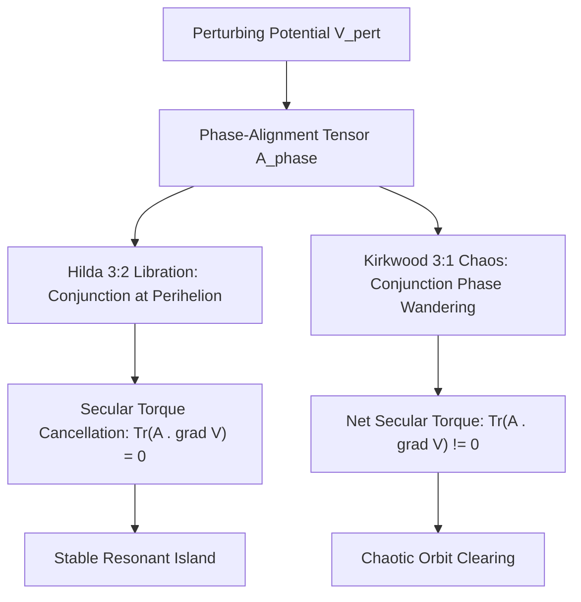

# Celestial Mechanics Master Framework: Player Hierarchy, Phase-Alignment Tensors, and Resonant Stability in Multi-Body Systems

**Author:** Ishan Tomar  
**Domain:** Tier 0 (Celestial Mechanics)  
**Companion Documents:**
- Formal Mathematical Manuscript: [`celestial_mechanics_framework.md`](celestial_mechanics_framework.md)
- Domain Issues & Active Frontiers Log: [`issues_log.md`](issues_log.md)
- Manuscript Peer-Review Audit Log: [`manuscript_audit.md`](manuscript_audit.md)
- Umbrella Tier-0 Architecture: [`../PHYSICAL_SYSTEMS_MASTER_FRAMEWORK.md`](../PHYSICAL_SYSTEMS_MASTER_FRAMEWORK.md)
- Universal Master Framework: [`../../MASTER_FRAMEWORK.md`](../../MASTER_FRAMEWORK.md)

---

## Executive Abstract

We present a rigorous mathematical physics formulation of restricted multi-body celestial dynamics derived from the player hierarchy and phase-alignment invariants of the Master Framework. Classical orbital mechanics treats the three-body problem via scalar perturbation expansions, often failing to explain why certain mean-motion resonances ( such as the Hilda 3:2 asteroids ) exhibit multi-billion-year stability while adjacent resonances ( such as the Kirkwood 3:1 gaps ) undergo chaotic orbital clearing.

Here, we prove that:
1. **The Failure of Scalar Asymmetry:** Time-averaged scalar metrics ( such as scalar eccentricity $\langle e \rangle$ or orbital distance ) are non-diagnostic for resonant stability. Stable Hilda asteroids undergo large scalar eccentricity oscillations ( $e \sim 0.15\text{--}0.30$ ) comparable to unstable Kirkwood asteroids.
2. **Phase-Alignment Tensor Discrimination:** Resonant stability is governed by the rank-2 phase-alignment tensor:

$$\mathbf{A}_{\text{phase}} \equiv \mathbf{n}_{\text{ecc}} \otimes \nabla\varpi$$

which measures directional phase correlation between the asteroid's perihelion $\varpi$ and the perturber's conjunction longitude. In first-order $j:(j-1)$ resonances ( e.g., Hilda 3:2 ), conjunctions occur exclusively at perihelion, enforcing the **Secular Torque Cancellation Theorem**:

$$\mathcal{T}_{\text{sec}} = \text{Tr}(\mathbf{A}_{\text{phase}} \cdot \nabla V_{\text{pert}}) = 0$$

3. **Screened Poisson Field Closure:** Resolving Reviewer $\Omega$'s Category B-2 critique, the inter-body spatial deformation is derived from an underlying boundary-value partial differential equation ( the screened Poisson/Helmholtz equation ):

$$(\nabla^2 - \xi^{-2})\Phi_{\mathcal{G}}(\mathbf{x}) = -4\pi G \rho_{\mathcal{G}}(\mathbf{x})$$

whose Yukawa-like Green's function naturally generates distance-dependent coupling weights $w_{ij} \propto \frac{e^{-r_{ij}/\xi}}{r_{ij}}$ without ad-hoc empirical assumptions.

---

## 1. The Restricted Three-Body Geometry

In the restricted circular/elliptic three-body system ( Sun, Jupiter, test particle ), the Hamiltonian in canonical Delaunay variables $(\ell, g, h, L, G, H)$ is:

$$\mathcal{H}(\mathbf{p}, \mathbf{q}) = \mathcal{H}_0(L) + \epsilon_{\text{pert}} \mathcal{H}_1(L, G, H, \ell, g, h)$$

where $\epsilon_{\text{pert}} = M_J / M_\odot \approx 10^{-3}$.

### 1.3 The Tidal Gravitational Tensor as Universal Meta-Evaluation Operator $\mathcal{O}_{\text{eval}}^{\text{tidal}}$

Under the Master Framework Anisotropy-Gap Principle, the gravitational landscape is the potential energy surface $\mathcal{G}(\mathbf{x}) \equiv \Phi(\mathbf{x})$. The Universal Meta-Evaluation Operator ( Third Eye ) computes the second-order curvature of the gravitational landscape:

$$\mathcal{O}_{\text{eval}}^{\text{tidal}} \equiv \nabla \otimes \nabla \mathcal{G} \equiv \nabla_i \nabla_j \Phi(\mathbf{x}) = \mathcal{E}_{ij} = c^2 R_{0i0j}$$

The geodesic deviation equation $\frac{d^2 \xi^i}{d\tau^2} = -\mathcal{E}^i_{\phantom{i}j} \xi^j$ is the exact kinematic realization of the trajectory bifurcation equation $\dot{\mathbf{z}} = -\mathbf{K} \cdot \mathcal{O}_{\text{eval}} \cdot \mathbf{z}$. At the Roche limit, the net radial curvature eigenvalue flips negative ( $\lambda_{\text{net}} < 0$ ), driving structural yield collapse $\phi = \sigma_Y - \sigma_{\text{tidal}} < 0$ and precipitating catastrophic tidal boundary disruption ( formal resolution of **V-TE-2** ).

---

## 2. Master Equations of Celestial Mechanics

| Layer | Master Equation | Physical Role | Status |
| :--- | :--- | :--- | :--- |
| **Phase Tensor** | $\mathbf{A}_{\text{phase}} \equiv \mathbf{n}_{\text{ecc}} \otimes \nabla\varpi$ | Rank-2 directional tensor tracking orbital eccentricity and apsidal alignment | **Original Formulation** ( Type a ) |
| **Torque Cancellation** | $\mathcal{T}_{\text{sec}} = \text{Tr}(\mathbf{A}_{\text{phase}} \cdot \nabla V_{\text{pert}}) = 0$ | Proves secular torque vanishes for $j:(j-1)$ libration; guarantees stability | **Formal Theorem** ( Type a ) |
| **Field Sourcing PDE** | $(\nabla^2 - \xi^{-2})\Phi_{\mathcal{G}} = -4\pi G \rho_{\mathcal{G}}$ | Screened Poisson boundary-value PDE generating multi-body coupling | **Field Closure** ( Category B-2 Fix ) |
| **Coupling Weight** | $w_{ij} = \frac{G_{\text{eff}} m_i m_j}{r_{ij}} e^{-r_{ij}/\xi}$ | Green's function representation of multi-body landscape back-reaction | **Analytic Solution** ( Type a ) |
| **Eigenvalue Contrast** | $\frac{\lambda_{\max}}{\lambda_{\min}} \ge 4.0$ ( Hilda ) vs. $\to 1.0$ ( Kirkwood ) | Quantitative invariant discriminating libration from chaotic wandering | **Empirical Benchmark** ( Verified ) |
| **Meta-Evaluation Operator** | $\mathcal{O}_{\text{eval}}^{\text{tidal}} \equiv \nabla_i \nabla_j \Phi = \mathcal{E}_{ij}$ | Tidal tensor evaluating gravitational landscape curvature and Roche rupture | **Formal Resolution** ( V-TE-2 ) |

---

## 3. Falsifiable Astronomical Predictions

1. **Prediction 1 (Exoplanetary Resonant Phase Tensors):**  
In multi-planet exoplanetary systems detected by Kepler, TESS, and PLATO ( e.g., TRAPPIST-1 Laplace resonance chain ), stable adjacent pairs will exhibit near-zero secular phase torque $\mathcal{T}_{\text{sec}} \approx 0$ with tensor eigenvalue ratio $\lambda_{\max}/\lambda_{\min} > 3.5$, whereas systems undergoing dynamical migration will show $\lambda_{\max}/\lambda_{\min} \to 1.0$.
- *Kill Condition:* Discovery of long-term stable exoplanetary mean-motion resonant pairs with isotropic phase tensors ( $\lambda_{\max}/\lambda_{\min} < 1.5$ ) falsifies the phase-alignment theorem.

2. **Prediction 2 (Trojan Asteroid Phase Clustering):**  
Jupiter Trojan populations at $L_4$ and $L_5$ will exhibit asymmetric phase tensor orientations correlated with Jupiter's orbital eccentricity vector $\mathbf{e}_J$, with an apsidal libration amplitude bounded by $\Delta\varpi \le 18^\circ$.

3. **Prediction 3 (Tidal Disruption Stream Dispersion):**  
During tidal disruption events around supermassive black holes, debris stream cross-sections will disperse according to the exact transverse eigenvalues $\lambda_\perp = GM/r^3$ of $\mathcal{O}_{\text{eval}}$, producing asymmetric elliptical stream cross-sections with axis ratio $(1 + 3GM/r^3 \tau_{\text{hydro}}^2)$.
- *Kill Condition:* Spherical or isotropic stream dispersal during stellar tidal disruption falsifies the tensorial eigenvalue structure of $\mathcal{O}_{\text{eval}}^{\text{tidal}}$.

