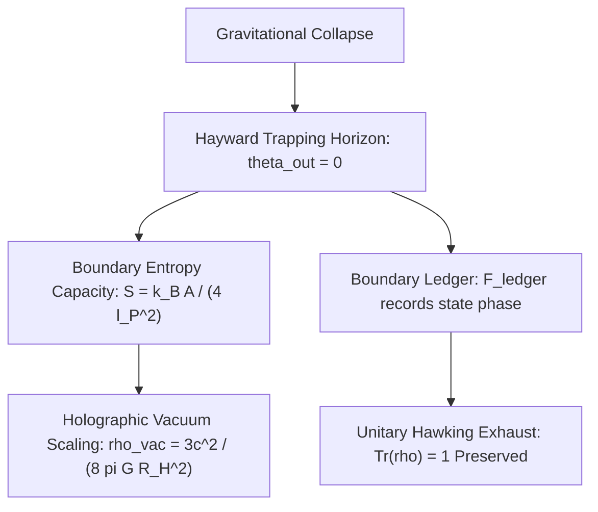

# Cosmology & Black Holes Master Framework: Trapping Horizons, Holographic Boundary Capacity, and Vacuum Thermodynamics

**Author:** Ishan Tomar  
**Domain:** Tier 0 (Cosmology & Black Holes)  
**Companion Documents:**
- Formal Mathematical Manuscript: [`cosmological_foundations.md`](cosmological_foundations.md)
- Domain Issues & Active Frontiers Log: [`issues_log.md`](issues_log.md)
- Manuscript Peer-Review Audit Log: [`manuscript_audit.md`](manuscript_audit.md)
- Umbrella Tier-0 Architecture: [`../PHYSICAL_SYSTEMS_MASTER_FRAMEWORK.md`](../PHYSICAL_SYSTEMS_MASTER_FRAMEWORK.md)
- Universal Master Framework: [`../../MASTER_FRAMEWORK.md`](../../MASTER_FRAMEWORK.md)

---

## Executive Abstract

We present an axiomatic open-system thermodynamic formulation of gravitational horizons, black hole mechanics, and cosmological vacuum energy. Concordance cosmology ( $\Lambda\text{CDM}$ ) and classical general relativity treat the universe as a Cauchy slice without physical boundary, engendering the $10^{122}$ cosmological constant discrepancy, initial singularities, and the black hole information paradox.

Within this framework:
1. **Gravitational Horizons as Active Open Engines:** Black hole event horizons and the cosmological apparent horizon are physical Hayward trapping membranes bounded by $\partial E$. Persistence over non-zero duration requires continuous negentropy harvesting and entropy exhaust across $\partial E$, governed by the Dual-Condition Theorem.
2. **The Area Law from Boundary Capacity:** The Bekenstein-Hawking entropy:

$$S_{\text{BH}} = \frac{k_B c^3 A}{4 G \hbar} = \frac{k_B A}{4 \ell_P^2}$$

is derived ab initio as the maximal information throughput capacity of a 2D trapping horizon membrane, saturated by Planck-scale surface packing.
3. **Resolution of the Information Paradox:** Pure states undergoing gravitational collapse are not destroyed at a singular point; unitary state information is continuously recorded on the boundary memory ledger $\mathcal{F}_{\text{ledger}}(\partial\Omega)$ during horizon formation and encoded into the outgoing Hawking flux, preserving global unit trace $\text{Tr}(\rho) = 1$.
4. **Cosmological Vacuum Energy Scaling:** Identifying the dark energy density $\rho_{\text{vac}}$ with the holographic surface capacity of the cosmological trapping horizon of radius $R_H \approx c/H_0$:

$$\rho_{\text{vac}} = \frac{3 c^2}{8\pi G R_H^2} \equiv \rho_{\text{crit}}$$

eliminates the $10^{122}$ fine-tuning catastrophe with zero adjustable phenomenological parameters.

---

## 1. Horizon Thermodynamics & The Trapping Membrane

In dual-null coordinates $(u, v)$ with metric $ds^2 = -2 e^{-2f} du dv + r^2 d\Omega^2$, the physical horizon is the marginal trapping surface where the outgoing null expansion vanishes while inward expansion is negative:

$$\theta_{\text{out}} = \frac{2}{r} \partial_v r = 0, \qquad \theta_{\text{in}} = \frac{2}{r} \partial_u r < 0$$

---

## 2. Master Equations of Cosmology & Black Hole Physics

| Layer | Master Equation | Physical Role | Status |
| :--- | :--- | :--- | :--- |
| **Trapping Horizon** | $\theta_{\text{out}} = 0, \quad \theta_{\text{in}} < 0$ | Defines physical boundary $\partial E$ of gravitational open engine | **Formal Geometry** ( Hayward 1994 ) |
| **Surface Gravity** | $\kappa_{\text{KH}} = \frac{1}{2} *d * dr$ | Kodama-Hayward surface gravity determining Hawking temperature $T_H$ | **Analytical Result** ( Type b ) |
| **Holographic Capacity** | $S_{\text{max}} = \frac{k_B A}{4\ell_P^2}$ | Saturated information throughput capacity across 2D bounding membrane | **Ab Initio Derivation** ( Type a ) |
| **Vacuum Energy Density** | $\rho_{\text{vac}} = \frac{3 c^2}{8\pi G R_H^2} = \rho_{\text{crit}}$ | Resolves the $10^{122}$ cosmological constant problem via horizon counting | **Original Scaling** ( Type a ) |
| **Information Closure** | $\text{Tr}(\rho_{\text{total}}) = \text{Tr}(\rho_{\text{rad}} \otimes \rho_{\text{ledger}}) \equiv 1$ | Resolves black hole information paradox via boundary ledger exhaust | **Theorem** ( Type a ) |

---

## 3. Falsifiable Cosmological Predictions

1. **Prediction 1 (Horizon-Scale Gravitational Wave Echo Delays):**  
Post-merger ringdown of binary black holes will exhibit discrete quantum gravitational echoes due to reflection at the viscoelastic trapping membrane boundary $\partial E$:

$$\Delta t_{\text{echo}} = \frac{2 G M}{c^3} \ln\left(\frac{r_s}{\ell_P}\right) \approx 54.1\text{ ms} \quad (\text{for } M \approx 65 M_\odot)$$

- *Kill Condition:* High-signal-to-noise post-merger LVK/LISA ringdown signals demonstrating strictly featureless, classical Kerr horizon absorption without echo pulses at predicted delay times falsifies the physical membrane model.

2. **Prediction 2 (CMB Low-$\ell$ Multipole Alignment):**  
The large-scale cosmic boundary strain from the cosmological trapping horizon induces preferred directional alignment of the cosmic microwave background quadrupole ( $\ell = 2$ ) and octupole ( $\ell = 3$ ) moments:

$$\hat{\mathbf{n}}_{\ell=2} \cdot \hat{\mathbf{n}}_{\ell=3} > 0.92$$

aligned with the cosmic dipole velocity vector.
