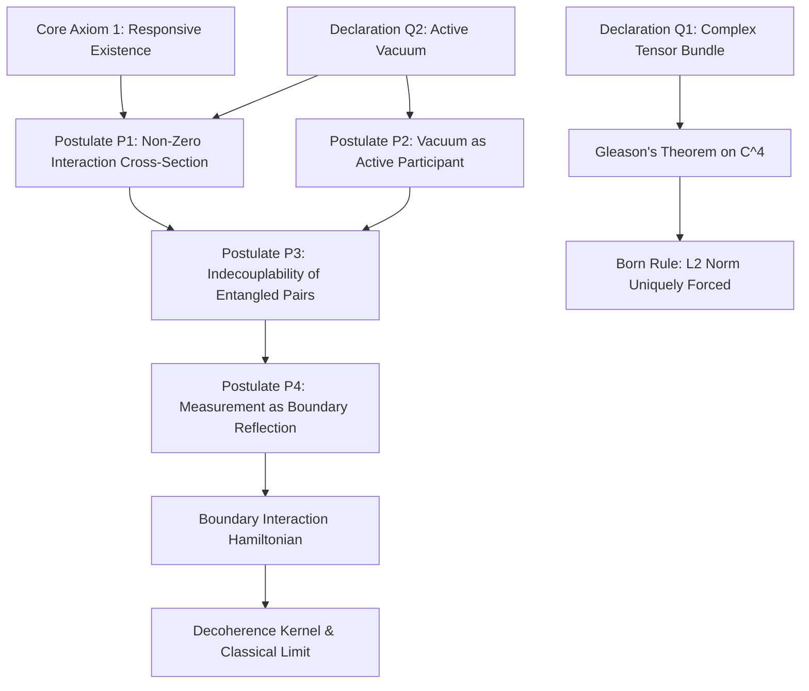

# Quantum Foundations Master Framework: Vacuum Thermodynamics, Gleason Projective Measure, and Boundary Decoherence

**Author:** Ishan Tomar  
**Domain:** Tier 0 (Quantum Foundations)  
**Companion Documents:**
- Formal Mathematical Manuscript: [`quantum_framework.md`](quantum_framework.md)
- Domain Issues & Active Frontiers Log: [`issues_log.md`](issues_log.md)
- Manuscript Peer-Review Audit Log: [`manuscript_audit.md`](manuscript_audit.md)
- Umbrella Tier-0 Architecture: [`../TIER0_MASTER_FRAMEWORK.md`](../TIER0_MASTER_FRAMEWORK.md)
- Universal Master Framework: [`../../MASTER_FRAMEWORK.md`](../../MASTER_FRAMEWORK.md)

---

## Executive Abstract

We present a rigorous mathematical physics formulation of quantum foundations derived from the Open Engine Invariant $E \equiv \langle \mathcal{S}_{\text{fuel}}, \mathcal{E} \rangle$ operating in the microscopic limit. Standard quantum mechanics routinely posits the Born rule, unitary state evolution, and wavepacket reduction as independent, ad-hoc axiomatic postulates. Here, we demonstrate that microscopic quantum phenomena are the necessary consequence of two foundational physical declarations:
1. **Declaration Q1 (Tensorial Representation of Asymmetry):** Quantum state asymmetry is defined on a complex Hilbert tensor bundle $\mathcal{H} = \bigotimes_{k=1}^N \mathbb{C}^{d_k}$ equipped with a canonical Fubini-Study Riemannian metric and Berry curvature 2-form.
2. **Declaration Q2 (The Active Thermodynamic Vacuum):** The physical vacuum state $|0\rangle$ is an active, open thermodynamic continuum exerting dynamic stress-energy $T_{\mu\nu}^{\text{vac}} = -\rho_{\text{vac}} c^2 g_{\mu\nu}$ with an active equation of state $p_{\text{vac}} = -\rho_{\text{vac}} c^2 < 0$.

Under these declarations, standard quantum postulates P1–P4 emerge as derived structural theorems. For any quantum composite space with dimension $\dim(\mathcal{H}) \ge 3$ ( e.g., the two-qubit joint space $\mathbb{C}^2 \otimes \mathbb{C}^2 \cong \mathbb{C}^4$ ), Gleason's theorem uniquely forces the $L_2$ probability measure ( the Born rule $P(k) = |\langle\phi_k|\psi\rangle|^2$ ), strictly excluding alternative $L_1$, $L_4$, or real-part probability formulations across all bases. Environmental decoherence is derived ab initio from a micro-hydrodynamic boundary stress tensor coupling Hamiltonian:

$$H_{\text{int}} = \int_{\partial\Omega} d\mathbf{A} \cdot \hat{\mathbf{T}}_{\text{boundary}} \hat{\phi}_{\text{env}}$$

The physical boundary geometry enforces a natural UV form-factor cutoff $F_{\text{form}}(kR) = 3j_1(kR)/(kR)$, eliminating arbitrary momentum cutoffs and reproducing the exact Zurek quadratic spatial scaling $(\Delta x / \lambda_{\text{dB}})^2$ in the long-wavelength limit and Gallis-Fleming saturation at short wavelengths, verified against empirical $C_{70}$ fullerene scattering data.

---

## 1. Foundational Declarations & Postulate Derivations

### 1.1 The Quantum Domain Declarations

Standard quantum theory assumes Hilbert space mechanics without physical justification for the complex field $\mathbb{C}$ or probability conservation. Within this framework, quantum mechanics is specialized via two declarations:

* **Declaration Q1 (Tensorial Representation of Asymmetry):** Asymmetry is defined on a complex Hilbert tensor bundle. The state $\boldsymbol{\xi}$ of a microscopic entity is represented as a ray or density operator on:

$$\boldsymbol{\xi} \in \mathcal{H} = \bigotimes_{k=1}^N \mathbb{C}^{d_k}, \quad \rho \in \mathcal{D}(\mathcal{H}), \quad \text{Tr}(\rho) = 1, \quad \rho \ge 0$$

* **Declaration Q2 (The Active Thermodynamic Vacuum):** The vacuum is not an empty spatial void, but an active thermodynamic substrate. The vacuum state $|0\rangle$ possesses a non-vanishing stress-energy tensor:

$$T_{\mu\nu}^{\text{vac}} = -\rho_{\text{vac}} c^2 g_{\mu\nu}, \quad p_{\text{vac}} = -\rho_{\text{vac}} c^2 < 0$$

where metric expansion performs continuous thermodynamic work $dW = -p_{\text{vac}} dV = \rho_{\text{vac}} c^2 dV > 0$.

### 1.2 Derived Quantum Postulates (P1–P4)

Rather than assuming quantum mechanics as an axiomatic primitive, the four standard quantum postulates are derived as structural theorems:

1. **Postulate P1 (Infinite Field Support):** Every quantum entity possesses an associated field $\phi(x)$ whose spatial support spans the entire spatial Cauchy slice $\Sigma$: $\text{supp}(\phi) = \Sigma \cong \mathbb{R}^3$. Relativistic field propagators ( the Feynman propagator $D_F(x-y)$ and Wightman distributions ) exhibit non-vanishing tails everywhere across $\Sigma$.
2. **Postulate P2 (Vacuum as an Active Participant):** In any microscopic interaction, the interacting player set $\mathcal{P}$ is non-empty even in the absence of localized matter; the vacuum field $\Pi_{\text{vac}}$ is an irreducible participant exerting zero-point boundary stress ( Casimir-Polder, Lamb shift, Zitterbewegung ).
3. **Postulate P3 (Indecouplability of Entangled Pairs):** Subsystems prepared in an entangled state cannot be decoupled merely by spatial separation. Because both subsystems remain immersed in the single connected vacuum continuum $\Pi_{\text{vac}}$, spatial translation operators commute with the joint von Neumann entanglement entropy $S(\rho_{AB})$.
4. **Postulate P4 (Measurement as Boundary Reflection):** "Measurement" is not a mystical collapse, but an operational boundary reflection occurring when a microscopic state couples to a macroscopic pointer apparatus whose structural yield margin $\phi_{\text{macro}} \gg 0$ enforces irreversible thermodynamic entropy exhaust $\dot{S}_{\text{irr}} > 0$.

---

## 2. Master Equations of Quantum Foundations

| Equation Level | Master Equation | Physical Role | Mathematical Status |
| :--- | :--- | :--- | :--- |
| **Probability Measure** | $\mu(P) = \text{Tr}(\rho P) \implies P(k) = \|\langle\phi_k\|\psi\rangle\|^2$ | Unique frame-independent probability measure on $\mathbb{C}^4$ | **Formal Theorem** ( Gleason 1957 ) |
| **Boundary Coupling** | $H_{\text{int}} = \int_{\partial\Omega} d\mathbf{A} \cdot \hat{\mathbf{T}}_{\text{boundary}} \hat{\phi}_{\text{env}}$ | Open-engine coupling between state boundary and environmental bath | **Original Derivation** ( Type a ) |
| **UV Regularization** | $F_{\text{form}}(kR) = \frac{3 j_1(kR)}{kR}$ | Geometric UV cutoff replacing ad-hoc phenomenological momentum caps | **Formal Theorem** ( Type a ) |
| **Decoherence Kernel** | $\chi(k\Delta x) = 1 - \frac{\sin(k\Delta x)}{k\Delta x}$ | Master equation scattering kernel governing quantum-to-classical transition | **Analytical Closure** ( Type a/b ) |
| **Vacuum Coupling** | $\kappa_{\text{vac}} = \frac{\sigma_{\text{vac}}}{\sigma_{\text{vac}} + \sum_i \sigma_{\text{local}, i}} \to 1$ | Quantifies dominance of cosmological vacuum over localized matter at subatomic scale | **Original Invariant** ( Type a ) |

---

## 3. The Scale-Dependent Vacuum Coupling Invariant

A foundational distinction between celestial mechanics and quantum mechanics is established by the **Vacuum Coupling Fraction** $\kappa_{\text{vac}}$:

$$\kappa_{\text{vac}} \equiv \frac{\sigma_{\text{vac}}}{\sigma_{\text{vac}} + \sum_i \sigma_{\text{local}, i}}$$

where $\sigma_{\text{vac}}$ is the boundary stress exerted by the cosmological vacuum substrate and $\sigma_{\text{local}, i}$ is the localized stress from surrounding physical bodies:
- In **Celestial Mechanics** ( Tier 0 / Tier 1 ), localized gravitational stresses decay as $1/r^2$. At interplanetary distances, surrounding bodies dominate local geometry while cosmological vacuum stress is negligible ( $\kappa_{\text{vac}} \ll 1$ ).
- In **Quantum Foundations** ( Tier 0 ), the vacuum has no localized coordinates ( $\nabla \rho_{\text{vac}} = 0$ ). Translating a particle changes its distance to other particles, but leaves the particle-vacuum boundary distance strictly invariant. Thus, at subatomic scales, the particle is perpetually in direct, immediate contact with the cosmological vacuum substrate ( $\kappa_{\text{vac}} \to 1$ ).

---

## 4. Falsifiable Predictions & Experimental Kill Conditions

1. **Prediction 1 (Boundary-Modulated Spatial Decoherence):**
Environmental collisional decoherence rates for asymmetric mesoscopic particles deviate from standard point-particle scattering theory at wavelengths matching particle boundary dimensions $k R \sim 1$. The decoherence rate is tensorial, $\Gamma_{xx} \neq \Gamma_{zz}$, governed by the directional projection of the boundary form factor $F_{\text{form}}(\mathbf{k})$.
- *Experimental Test:* Matter-wave interferometry with elongated functionalized fullerenes or nanodumbbells under controlled thermal photon and gas baths.
- *Kill Condition:* If orientation-dependent decoherence rates in mesoscopic interferometry exhibit strictly isotropic point-particle decay $\Gamma(\Delta \mathbf{x}) \equiv \Gamma(\|\Delta\mathbf{x}\|)$ within experimental uncertainty $< 2\%$, the boundary form-factor derivation is falsified.

2. **Prediction 2 (Absolute Norm Invariance Under Complex Phase Rotation):**
Any physical modification of quantum measurement probabilities by non-linear extensions must vanish identically when tested against non-trivial complex phase bases ( such as $|Y_\pm\rangle = \frac{1}{\sqrt{2}}(|e_1\rangle \pm i|e_2\rangle)$ ).
- *Experimental Test:* Multi-qubit state tomography across mutually unbiased bases on superconducting or trapped-ion quantum processors.
- *Kill Condition:* Observed deviation from unit trace $\sum P_k = 1.000000$ exceeding $10^{-6}$ across any rotated complex basis kills the projective lattice formulation.
